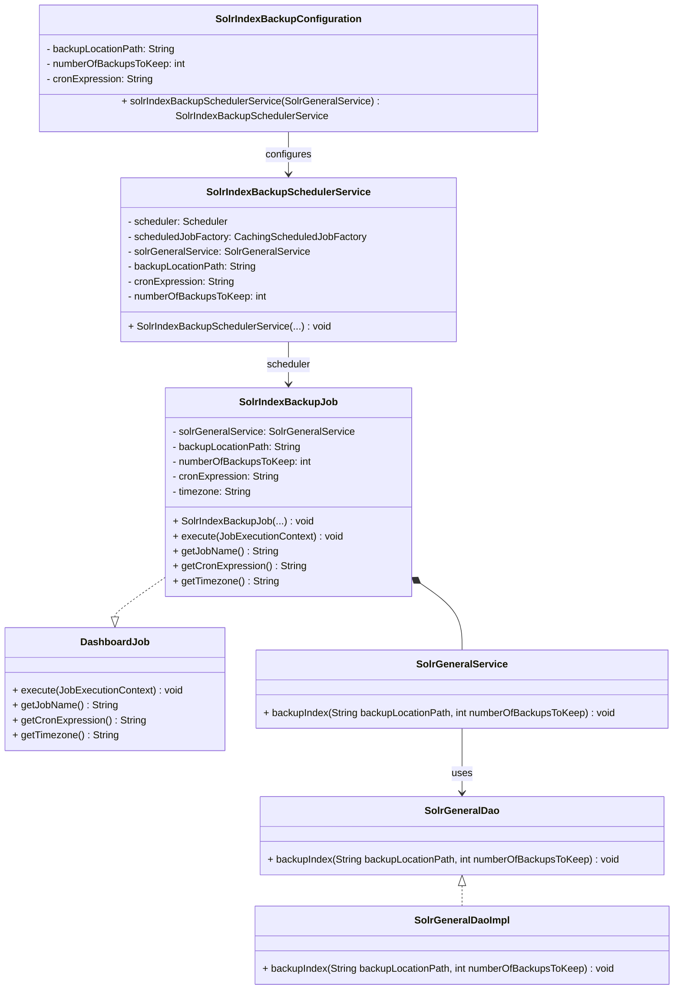

# Solr Automated Backup Mechanism

This document details the automated Solr backup mechanism within the Ikasan platform, specifically focusing on how it's configured and executed via `SolrIndexBackupConfiguration` and `SolrIndexBackupJob`. Regular backups are essential for data recovery and maintaining the integrity of your Solr indexes.

## Overview

The Ikasan dashboard automates Solr index backups through a scheduled job. This ensures that snapshots of your Solr data are regularly created and managed without manual intervention.

## `SolrIndexBackupJob` - The Backup Executor

The core component responsible for executing the Solr backup is the `SolrIndexBackupJob`. This class implements the `DashboardJob` interface, indicating it's a scheduled task managed by the Ikasan dashboard's scheduler.

When `SolrIndexBackupJob` is triggered, its `execute` method performs the following:
1.  It utilizes an injected `SolrGeneralService` instance.
2.  It calls the `solrGeneralService.backupIndex(backupLocationPath, numberOfBackupsToKeep)` method.

This `backupIndex` method, as described in the general Solr backup documentation, is responsible for interacting with the Solr instance's `/replication` handler to initiate the actual backup command.

## Class Diagram



## `SolrIndexBackupConfiguration` - Managing Backup Settings

The `SolrIndexBackupConfiguration` class is a Spring `@Component` that orchestrates the setup of the automated Solr backup. It reads various properties to configure the `SolrIndexBackupJob` and its scheduling.

The following properties can be configured, typically in an `application.properties` file:

*   **`solr.backup.enabled`**:
    *   Type: `boolean`
    *   Default: `true`
    *   Description: Set to `false` to disable the automated Solr index backup entirely.
*   **`solr.backup.location`**:
    *   Type: `String`
    *   Description: The absolute file system path on the Solr server where the backup archives will be stored. This path must be accessible and writable by the Solr process.
    *   Example: `/opt/solr/backups/ikasan_core`
*   **`solr.backup.number.to.keep`**:
    *   Type: `int`
    *   Default: `2`
    *   Description: The number of most recent backup copies Solr should retain at the `solr.backup.location`. Older backups exceeding this number will be automatically purged by Solr.
*   **`solr.backup.cron.expression`**:
    *   Type: `String`
    *   Default: `0 0/30 * * * ? *` (every 30 minutes)
    *   Description: A Quartz cron expression that defines the schedule for when the `SolrIndexBackupJob` should run.

### Example Configuration

```properties
# Enable Solr automated backups
solr.backup.enabled=true
# Specify the directory where Solr backups will be stored
solr.backup.location=/var/solr/data/ikasan_core_backups
# Keep the last 5 backup copies
solr.backup.number.to.keep=5
# Schedule the backup to run once every day at 2 AM
solr.backup.cron.expression=0 0 2 * * ?
```

## End-to-End Backup Process

1.  **Application Startup**: When the Ikasan dashboard application starts, Spring loads the `SolrIndexBackupConfiguration`.
2.  **Job Scheduling**: If `solr.backup.enabled` is `true`, `SolrIndexBackupConfiguration` creates a `SolrIndexBackupSchedulerService`. This service then registers and schedules an instance of `SolrIndexBackupJob` with the dashboard's scheduler, using the provided `solr.backup.cron.expression`.
3.  **Scheduled Execution**: At each scheduled interval defined by the cron expression, the `SolrIndexBackupJob` is executed.
4.  **Backup Initiation**: Inside the `SolrIndexBackupJob.execute()` method, the `SolrGeneralService.backupIndex()` method is called with the configured `solr.backup.location` and `solr.backup.number.to.keep` values.
5.  **Solr Interaction**: The `SolrGeneralService` translates this call into an HTTP request to the target Solr core's `/replication` handler, issuing the `command=backup`.
6.  **Backup Creation and Retention**: The Solr instance creates a new index snapshot at the specified location and manages the retention of old backups according to the `numberOfBackupsToKeep` parameter.

This automated process ensures that your Solr indexes are regularly backed up, providing a robust mechanism for data recovery.

## Restoring a Solr Backup

While the backup process is automated, restoring a Solr index from a backup is typically a manual operation.

1.  **Identify the Backup**: Locate the desired backup directory within the `solr.backup.location` path. Each backup is usually a timestamped directory containing the index files.

2.  **Stop the Ikasan Dashboard but keep Solr running**:
    *   **Stopping the dashboard**: Typically this is achieved by calling `ikasan.sh stop-dashboard`.
    
3.  **Run the restore process**: The restore process is `curl -u <solr-username>:<solr-password> "http://<solr-host>:<solr-port>/solr/ikasan/replication?command=restore&name=<name-of-backup-to-restore-from>&location=<full-path-to-solr-backup-directory>"`

4.  **Check the status of the restore**: `curl -u <solr-username>:<solr-password> "http://<solr-host>:<solr-port>/solr/ikasan/replication?command=restorestatus"`

5. **Verify Restoration**: Once Solr is running, verify that the data has been restored correctly by querying the Solr core.

6. **Once the restore is complete, start the Ikasan Dashboard**:
    *   **Starting the dashboard**: Typically this is achieved by calling `ikasan.sh start-dashboard`.


**Important Considerations**:

*   **Data Loss**: Any data indexed into Solr *after* the chosen backup was created will be lost.
*   **Configuration Files**: This restoration process primarily restores the index data. Configuration files (like `solrconfig.xml`, `schema.xml`) are typically not part of the index backup and should be managed separately.

