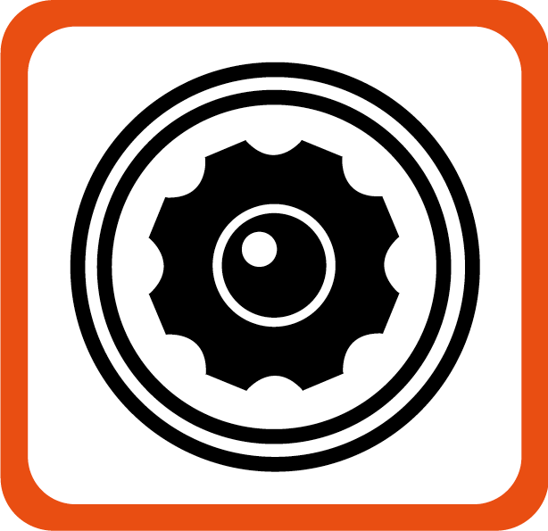
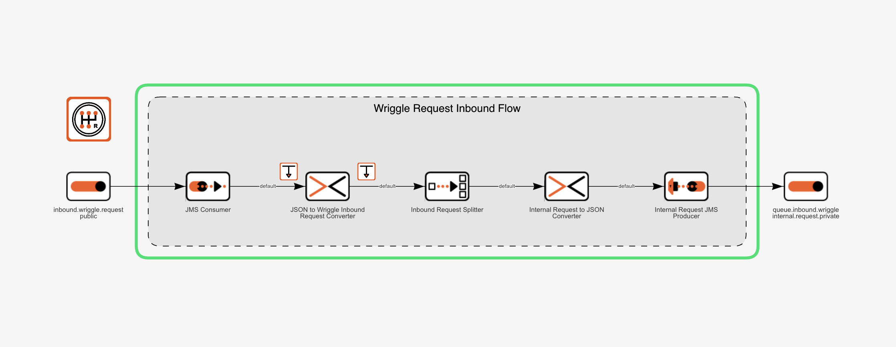
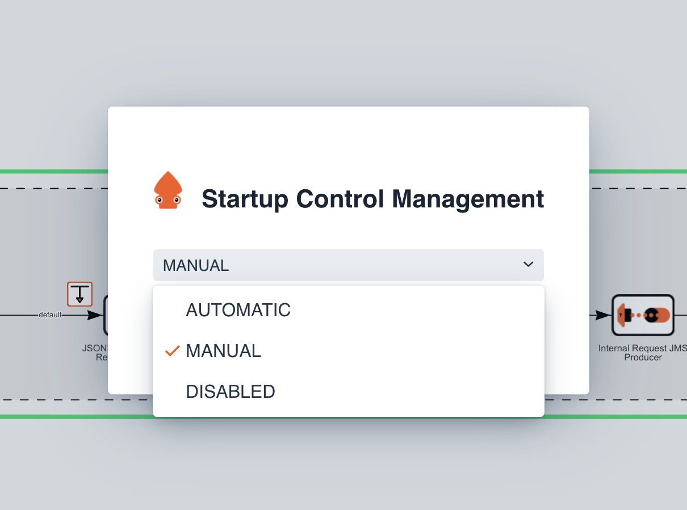
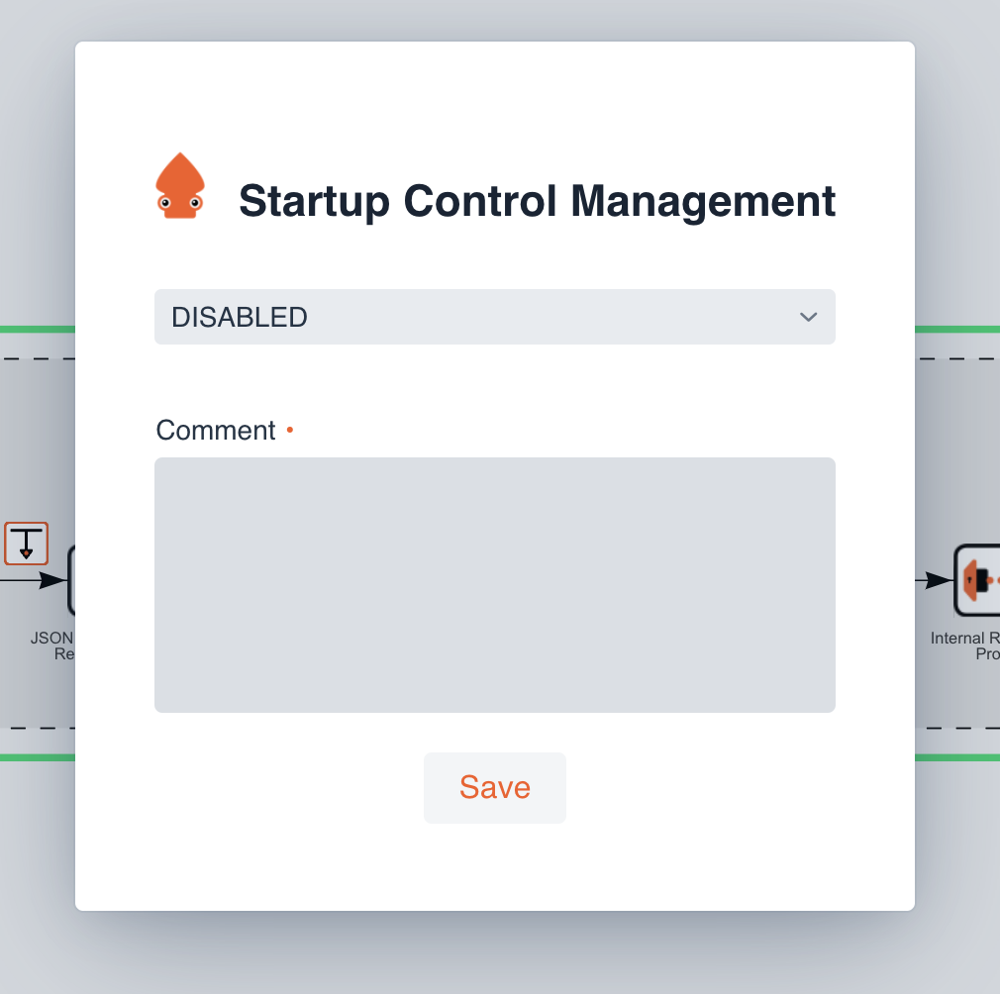
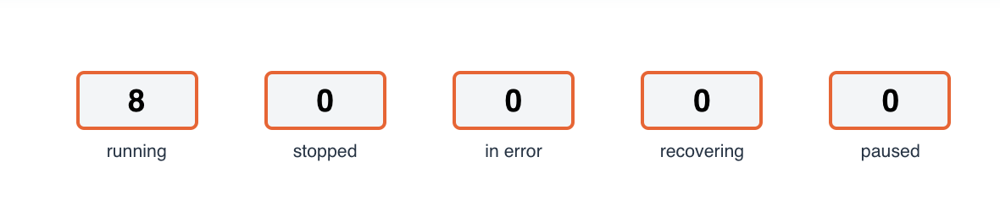
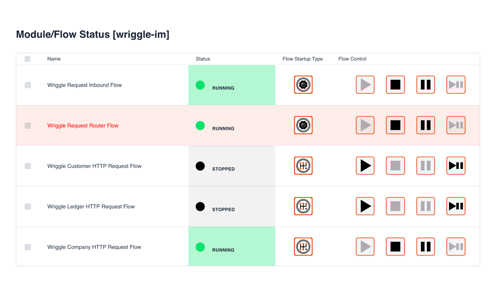

# Ikasan Visualisation Dashboard Flow Start Up Type Management

Ikasan support 3 different types of flow start up types:

- Manual
- Automatic
- Disabled

### Manual
Flows set with a start up type of 'Manual' are required to be started manually. When the module JVM is restarted any flows with a 'Manual' restart
will remained stopped until they are manually restarted.
 
 
 
 
 
 
 
 
 
 

### Automatic
Flows set with a start up type of 'Automatic' will restart automatically when the module JVM is restarted.
 
 
 
 
 
 
 
 
 
 
 
### Disabled
Flows set with a start up type of 'Disabled' cannot be started. A comment is required when a flow's start up is set to disabled.
 
 
 
 
 
 
 
 
 
 
 
 
### Managing the Flow Start Up from Flow Visualisations
The Ikasan Dashboard visualisation screens will display the start up icon to the top left corner of the flow that is being displayed (NB. the icon will only appear for modules whose version is greater than IKASAN-3.0.2).  

In order to change the flow startup type, double click on the start up icon. The following screen will be presented.

Select the desired start up type and press the 'Save' button. When setting the start up type to 'Disabled' it is required that a comment is set as seen in the screen shot below.

### Bulk Managing the Flow Start Up from Flow Visualisations

It is possible to manage the flow start up types for an entire module. In order to do this click on any of the status icons that appear at the top of a module visualisation.

Once selected the following screen will appear. Flow startup types can be individually set by double clicking on the icon associated with each flow. If multiple flows are selected (check boxes) and a startup type icon double clicked on, all selected flows will have the startup type that is chosen set on it.   

