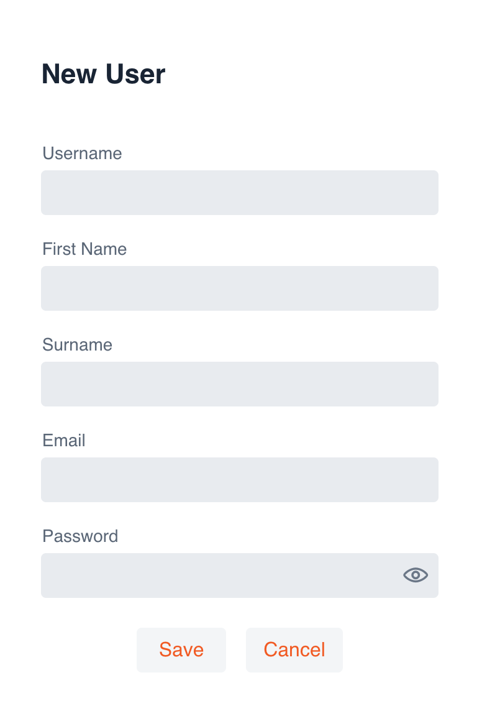
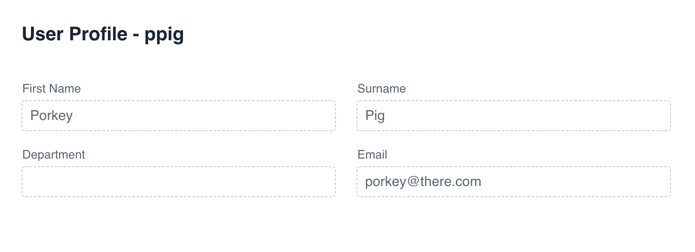

# Ikasan Visualisation Dashboard Security - User Management
The user management screen provides a view on all Ikasan users. These users may have been configured locally, or sourced from an LDAP server. Users can be narrowed by using the filtering provided in the column headers of the user grid on this screen. New local users can be added by clicking on the '+' button in the right hand corner of the screen.

When the '+' button is selected the 'New User' dailog will open. Populate all fields and press 'Save'. The user will be prompted to change their password when they first log in.

By double clicking on any 'User' records in the grid, the 'User Details' screen will open. This screen is broken into a number of sections.

### User Details Section
This contains basic read only details of the user.

### User Roles Section
The user role section displays roles that the user has been assigned. Roles for the given user can be administered in this section too. Roles can be deleted by clicking the 'trash can' icon next to the roles.
Roles can be assigned to the user by selecting the 'Add Role' button.

### Dashboard Activity Section
The dashboard activity section displays any audit items that have been captured when the user has been interacting with the dashboard. 

### LDAP Groups Section
This section displays all LDAP groups that the user belongs to. This is only relevant if Ikasan has been configured against an LDAP srver.

### Security Changes Section
The security changes section provides an audit trail of all changes to the selected users security settings.

