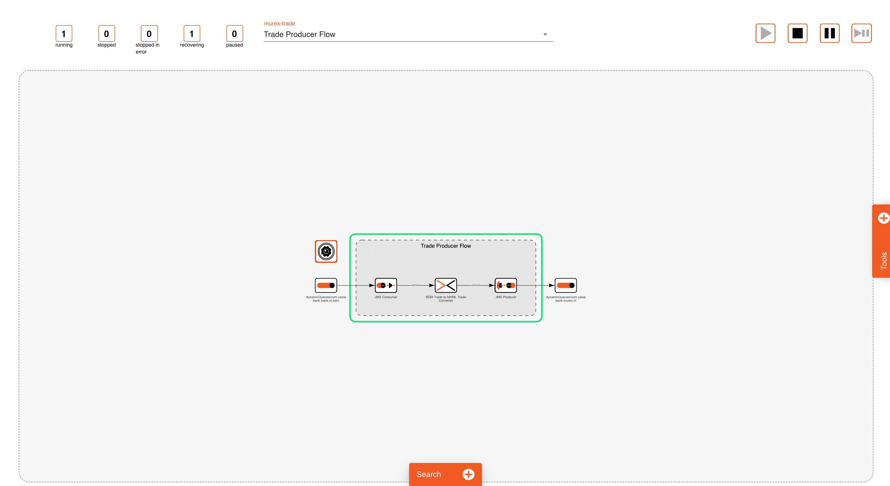
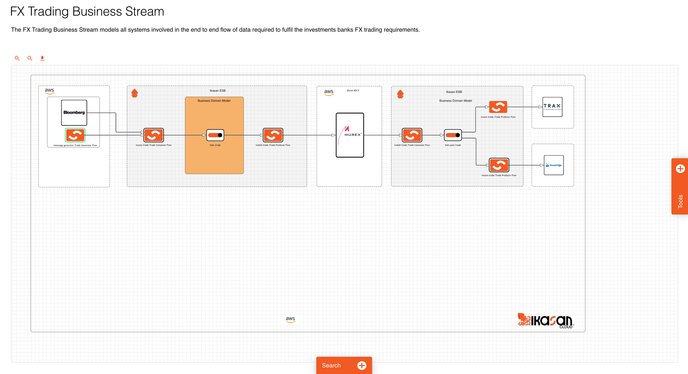
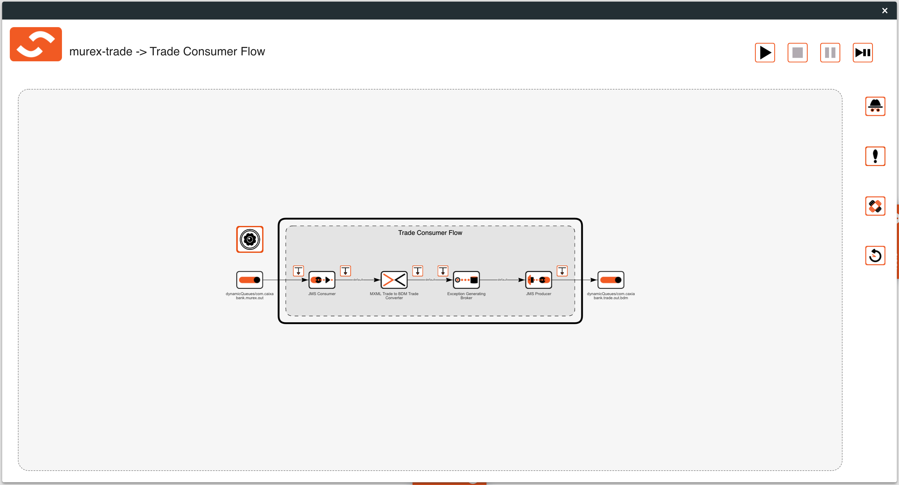
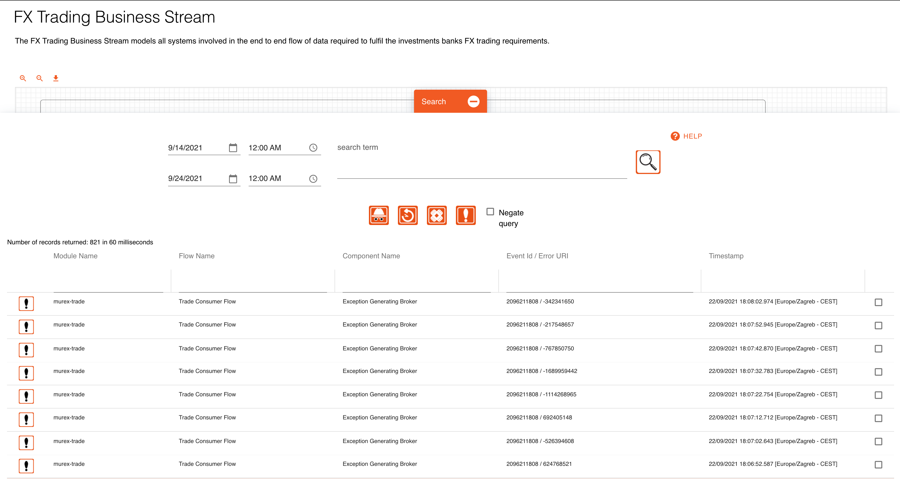
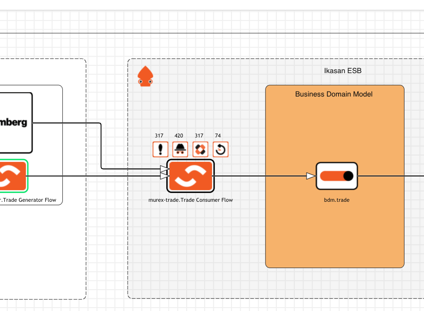
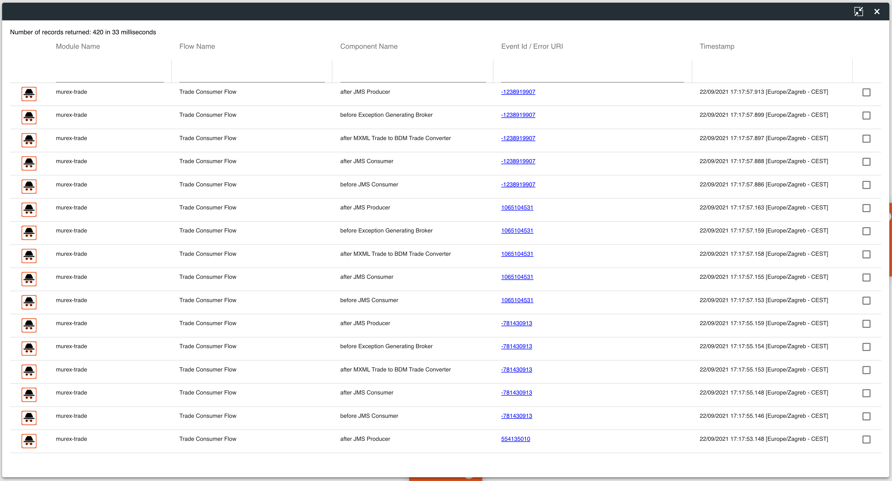

# Module, Flow and Business Stream Visualisations
Each Ikasan module has a built in feature that allows the module to descibe itself and publish details of itself to the Ikasan Dashboard. With this information the dashboard is able to construct a graphical representation of the module as well as providing runtime functionality that allows for the module to be controlled and configured from the dashboard. 

### Module and Flow Visualisations
The dashboard landing page provide access to all module visualisations. Once a user has navigated to a module visualisation they able to view all components within each flow, manage the configuration of those that are configurable. They can also stop/start/pause flows.

Othef features include the ability for wiretaps and flow start up controls to be managed. 
- [Wiretap Management](./wiretap-management.md)
- [Start Up Control Management](./startup-control-management.md)

### Business Stream Visualisations
On top module and flow visualisations, Ikasan provides a feature where end to end business streams can be defined using the [business stream designer](./business-stream-designer.md).

Once a business stream has been defined in the designer, it provides an interactive view of all runtime elements within the business stream. 

Users can double click on any flow in a business stream in order to inspect the components with in the flow and manage all runtime elements with the flow. 

User can also search for events that have occured within the business stream. For example a business identifier could be searched for to determine whether it has reached all intended systems.  

The search results are rendered to the diagram at the points that they were encountered in the business stream along with an even count.

A list of search results can also be presented if a user chooses so.

