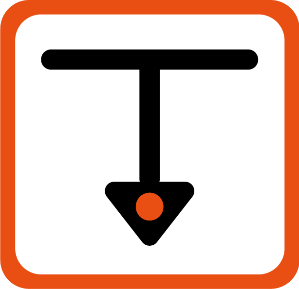
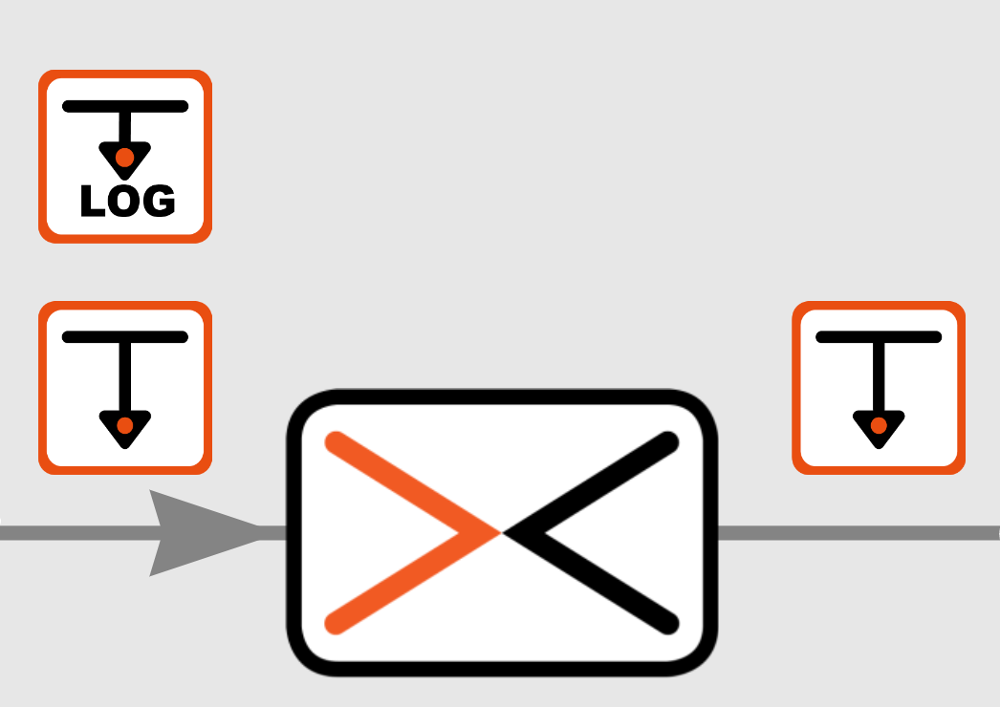
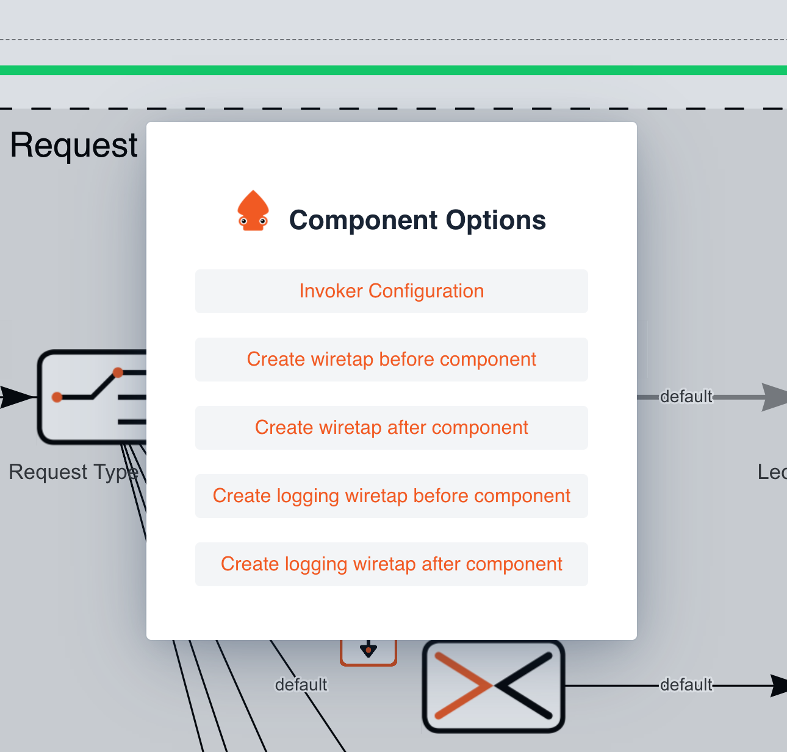
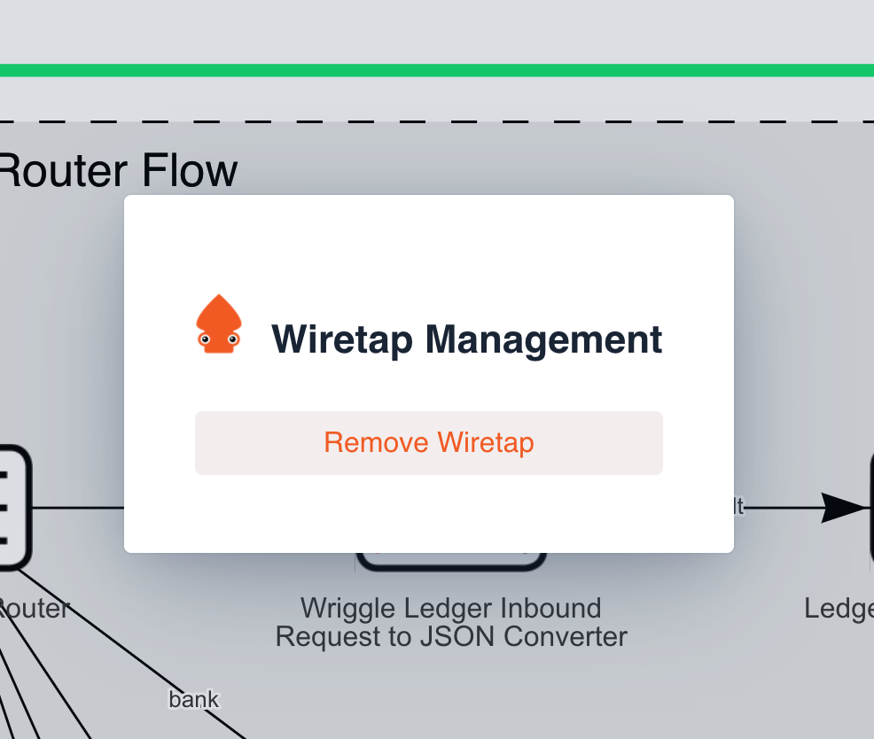

# Ikasan Visualisation Dashboard Wiretap Management

A wiretap represents an EAI concept in which data events can be captured for the purpose of testing, monitoring or troubleshooting. Ikasan 
supports dynamic wiretaps that can be added to a flow of data, at runtime, from within the Ikasan Dashboard. Wiretaps are added and removed 
from within the visualisation screens within the dashboard.
 
Ikasan supports 2 different kinds of wiretaps. 
 
 
 Indexed wiretaps that are written to Ikasan's underlying text index, which can subsequently be searched for in the Ikasan Dashboard.
 
  
 
 
Log wiretaps that record the data event in the module log file, of the module that the wiretap was added to.
 
 
 
 
 
Wiretaps are added to components and can be added 'BEFORE' or 'AFTER' the component. Icons appear along side the component with those
appearing to the left of the component, denoting a wiretap 'BEFORE' the component execution, and those to the right denoting a wiretap 'AFTER' the component execution. 
 
 
 
 

### Adding a wiretap
In order to add a wiretap to a component, navigate to the visualisation screen of the component you would like to add the wiretap to. Double click on the component and you will be presented with the 'Component Options' screen. You will be able to choose to add: 
 - An indexed wiretap before the component.
 - An indexed wiretap after the component.
 - A log wiretap before the component.
 - A log wiretap after the component.
  Once a wiretap is added an icon will appear next to the component.
   
 
### Removing a wiretap
 In order to remove a wiretap, navigate to the visualisation screen of the component you would like to remove the wiretap from. Double click on the wiretap icon that you wish to remove and you will be presented with the 'Wiretap Management' screen. Click the 'Remove Wiretap' button and the wiretap will be removed.

