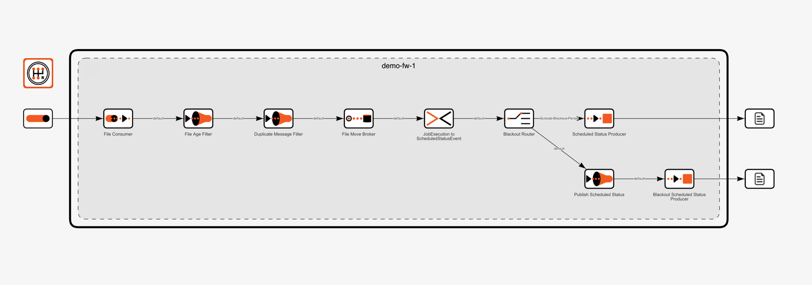
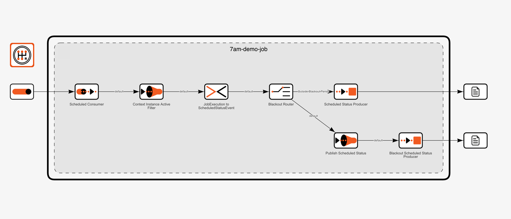
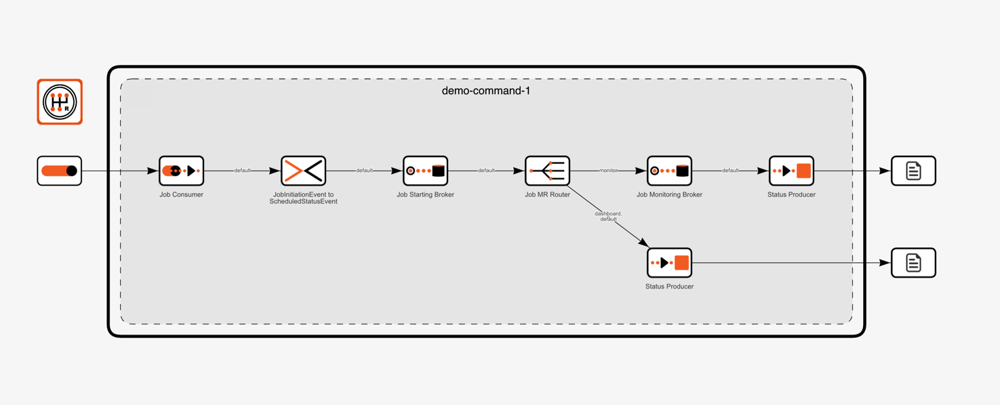
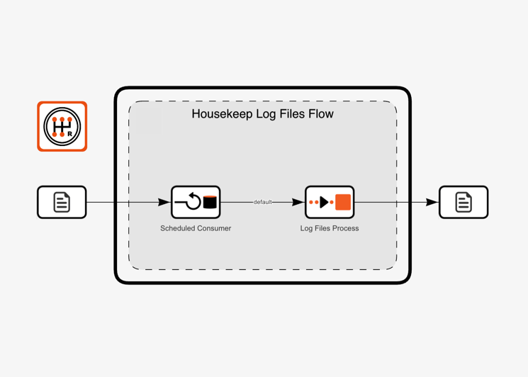
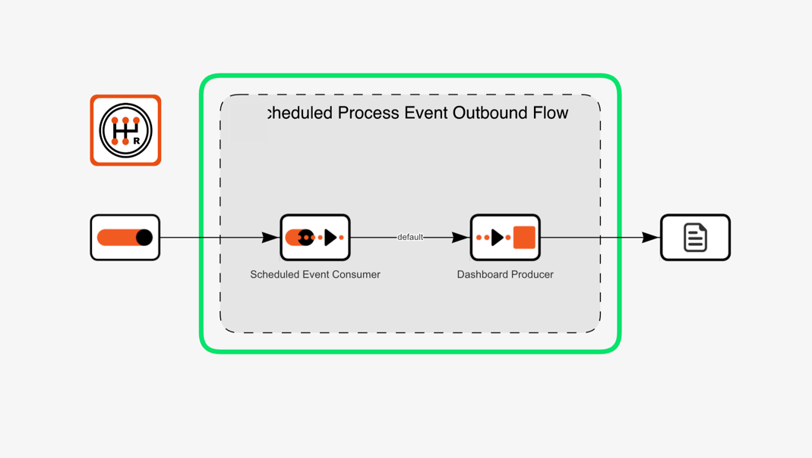

# Ikasan Enterprise Scheduler Agent

## Introduction
The `Ikasan Enterprise Scheduler Agent` is a standard `Ikasan Enterprise Service Bus` module that has been extended to
provide `No Code` features to the `Ikasan` platform.

The Ikasan Enterprise Scheduler code base can be found [here](../../../ootb/module/scheduler-agent/docs/readme.md).

### What is No Code?
No code, also known as `no-code` or `zero-code`, refers to a software development approach that allows users to create applications 
or software solutions without writing traditional programming code. Instead of manually writing lines of code, no-code platforms 
provide visual interfaces and pre-built components that users can use to design, customize, and assemble applications through 
drag-and-drop or other simple interactions.

The no-code movement aims to democratize software development and make it accessible to individuals with little to no programming experience. 
With no-code platforms, people from various backgrounds, including business analysts, subject-matter experts, and non-technical users, 
can participate in creating software solutions for their specific needs.

Key characteristics of no-code platforms include:

- **Visual Development**: Users design applications by arranging visual components and defining their behaviors through a graphical interface, eliminating the need for writing code manually.
- **Pre-built Components**: No-code platforms often come with a library of pre-built components and templates that users can customize to suit their requirements.
- **Integration Capabilities**: No-code platforms usually offer integration options to connect with other systems, databases, or APIs without requiring custom code.
- **Rapid Prototyping**: With the simplicity of no-code development, users can quickly create prototypes and iterate on their applications.
- **User-Friendly**: No-code tools are designed to be user-friendly, making them accessible to individuals with diverse technical backgrounds.

### How is No Code Achieved in the Ikasan Enterprise Scheduler Platform?
[Job Plan Template](../dashboard/job-plans/job-plan-templates.md) are managed from with the `Ikasan Enterprise Scheduler Dashboard` in order
to define how a `Job Plan` and its jobs are to be executed. Once the `Job Plan` is complete, the relevant agents are provisioned via the 
[Agent Job Provision Service](../rest/agent-job-provision-service.md). The `Agent Job Provision Service` de-activates the agent module
and provides job configurations to the agent, before re-activating the modules. Upon activation, a flow is created for each job and the
agent is ready to perform the jobs on behalf of any future `Job Plan Instances` that are created.

## Ikasan Enterprise Scheduler Agent Job Flows
The following flow descriptions outline each of the flows that are created for each job type.

### File Watcher Job Flow
For each `File Watcher Job` in a `Job Plan`, an individual `File Watcher Job Flow` is created on the relevant agent that
the job is targeted to. This flow is responsible for polling on a regular interval, for the arrival of a file on the file system
of the agent host, and reporting its arrival back to the `Ikasan Enterprise Scheduler Dashboard`.

The below diagram outlines the components and the flow of control that supports the `File Watcher Job`. 

#### File Watcher Job Flow Components
The flow comprises the following components, that when combined, fulfil the functional requirements
of the `File Watcher Job`.

Details of the `File Watcher Job` data model can be found [here](../job-orchestration/model/scheduler-job-data-model.md#file-event-driven-jobs).

| Component                                       | Description                                                                                                                                                                                                                                                                                                                                                                                                                                                                                                        |
|-------------------------------------------------|--------------------------------------------------------------------------------------------------------------------------------------------------------------------------------------------------------------------------------------------------------------------------------------------------------------------------------------------------------------------------------------------------------------------------------------------------------------------------------------------------------------------|
| File Consumer                                   | An instance of a [Local File Consumer](../../../component/endpoint/quartz-schedule/localFileConsumer.md) that is responsible for detecting the arrival of a file on the file system. It polls the file system on a cron defined polling schedule.                                                                                                                                                                                                                                                                  |
| File Age Filter                                 | An instance of a [Filter](../../../component/filter/Readme.md) that detects the age of the file and only allows events to flow if the file has been on the file system for a period of time.                                                                                                                                                                                                                                                                                                                       |
| Duplicate Message Filter                        | An instance of a [Filter](../../../component/filter/Readme.md) that allows an event to be raised once only upon the arrival of a file.                                                                                                                                                                                                                                                                                                                                                                             |
| File Move Broker                                | An implementation of a [Broker](../../../spec/component/src/main/java/org/ikasan/spec/component/endpoint/Broker.java) that will move the received file to a certain location if it is configured to do so.                                                                                                                                                                                                                                                                                                         |
| JobExecution to ScheduledProcessEvent Converter | An implementation of a [Converter](../../../spec/component/src/main/java/org/ikasan/spec/component/transformation/Converter.java) that is responsible for converting a [CorrelatedFileList](../../../component/endpoint/utility-endpoint/src/main/java/org/ikasan/component/endpoint/filesystem/messageprovider/CorrelatedFileList.java) to a [ContextualisedScheduledProcessEvent](../../../spec/service/scheduled/src/main/java/org/ikasan/spec/scheduled/event/model/ContextualisedScheduledProcessEvent.java). |
| Blackout Router                                 | An implementation of a [SingleRecipientRouter](../../../spec/component/src/main/java/org/ikasan/spec/component/routing/SingleRecipientRouter.java) that is responsible for determining if the current execution time falls within a blackout window. If is does the message is forwarded to the `Publish Scheduled Status Filter` otherwise it is published to the `Scheduled Status Producer`.                                                                                                                    |
| Scheduled Status Producer                       | A [BigQueueProducer](../../../component/endpoint/big-queue/src/main/java/org/ikasan/component/endpoint/bigqueue/producer/BigQueueProducer.java) that published the [ContextualisedScheduledProcessEvent](../../../spec/service/scheduled/src/main/java/org/ikasan/spec/scheduled/event/model/ContextualisedScheduledProcessEvent.java) to the agent outbound queue.                                                                                                                                                |
| Publish Scheduled Status Filter                 | An instance of a [Filter](../../../component/filter/Readme.md) that determines if the scheduler agent should send the [ContextualisedScheduledProcessEvent](../../../spec/service/scheduled/src/main/java/org/ikasan/spec/scheduled/event/model/ContextualisedScheduledProcessEvent.java) to the Ikasan Enterprise Scheduler Dashboard.                                                                                                                                                                            |
| Blackout Scheduled Status Producer              | A [BigQueueProducer](../../../component/endpoint/big-queue/src/main/java/org/ikasan/component/endpoint/bigqueue/producer/BigQueueProducer.java) that published the [ContextualisedScheduledProcessEvent](../../../spec/service/scheduled/src/main/java/org/ikasan/spec/scheduled/event/model/ContextualisedScheduledProcessEvent.java) to the agent outbound queue.                                                                                                                                                |

### Scheduled Job Flow
For each `Scheduled Job` in a `Job Plan`, an individual `Scheduled Job Flow` is created on the relevant agent that
the job is targeted to. This flow is responsible for firing a time based event, and notifying `Ikasan Enterprise Scheduler Dashboard`
when that event has occurred.

The below diagram outlines the components and the flow of control that supports the `Scheduled Job`.

#### Scheduled Job Flow Components
The flow comprises the following components, that when combined, fulfil the functional requirements
of the `Scheduled Job`.

Details of the `Scheduled Job` data model can be found [here](../job-orchestration/model/scheduler-job-data-model.md#quartz-scheduled-event-driven-jobs).

| Component | Description                                                                                                                                                                                                                                                                                                                                                                                                                                                  |
|-----------|--------------------------------------------------------------------------------------------------------------------------------------------------------------------------------------------------------------------------------------------------------------------------------------------------------------------------------------------------------------------------------------------------------------------------------------------------------------|
| Scheduled Consumer          | An instance of a [CorrelatingScheduledConsumer](../../../component/endpoint/quartz-schedule/src/main/java/org/ikasan/component/endpoint/quartz/consumer/CorrelatingScheduledConsumer.java) that fires time based events based on [Quartz Cron Expression](http://www.quartz-scheduler.org/documentation/quartz-2.3.0/tutorials/crontrigger.html) that fires triggers that contain a correlating identifier that represents the job plan instance identifier. |
| Context Instance Active Filter          | An instance of a [Filter](../../../component/filter/Readme.md) that checks that there is a corresponding job plan instance that is active for the correlation identifier. See [ContextInstanceFilter](../../../ootb/module/scheduler-agent/jar/src/main/java/org/ikasan/ootb/scheduler/agent/module/component/filter/ContextInstanceFilter.java) for details of the implementation.                                                                          |
| JobExecution to ScheduledProcessEvent Converter          | An implementation of a [Converter](../../../spec/component/src/main/java/org/ikasan/spec/component/transformation/Converter.java) that is responsible for converting a [JobExecutionContext](https://www.quartz-scheduler.org/api/2.1.7/org/quartz/JobExecutionContext.html) to a [ContextualisedScheduledProcessEvent](../../../spec/service/scheduled/src/main/java/org/ikasan/spec/scheduled/event/model/ContextualisedScheduledProcessEvent.java).       |
| Blackout Router          | An implementation of a [SingleRecipientRouter](../../../spec/component/src/main/java/org/ikasan/spec/component/routing/SingleRecipientRouter.java) that is responsible for determining if the current execution time falls within a blackout window. If is does the message is forwarded to the `Publish Scheduled Status Filter` otherwise it is published to the `Scheduled Status Producer`.                                                              |
| Scheduled Status Producer          | A [BigQueueProducer](../../../component/endpoint/big-queue/src/main/java/org/ikasan/component/endpoint/bigqueue/producer/BigQueueProducer.java) that published the [ContextualisedScheduledProcessEvent](../../../spec/service/scheduled/src/main/java/org/ikasan/spec/scheduled/event/model/ContextualisedScheduledProcessEvent.java) to the agent outbound queue.                                                                                          |
| Publish Scheduled Status Filter          | An instance of a [Filter](../../../component/filter/Readme.md) that determines if the scheduler agent should send the [ContextualisedScheduledProcessEvent](../../../spec/service/scheduled/src/main/java/org/ikasan/spec/scheduled/event/model/ContextualisedScheduledProcessEvent.java) to the Ikasan Enterprise Scheduler Dashboard.                                                                                                                      |
| Blackout Scheduled Status Producer          | A [BigQueueProducer](../../../component/endpoint/big-queue/src/main/java/org/ikasan/component/endpoint/bigqueue/producer/BigQueueProducer.java) that published the [ContextualisedScheduledProcessEvent](../../../spec/service/scheduled/src/main/java/org/ikasan/spec/scheduled/event/model/ContextualisedScheduledProcessEvent.java) to the agent outbound queue.                                                                                          |

### Command Execution Job Flow
For each `Command Execution Job` in a `Job Plan`, an individual `Command execution Job Flow` is created on the relevant agent that
the job is targeted to. This flow is responsible starting an external process that represents the work that 
is done by the scheduler. The `Command Execution Job` notifies the `Ikasan Enterprise Scheduler Dashboard` when the job starts and
also monitors the process until it is complete. Once the job is complete the `Ikasan Enterprise Scheduler Dashboard` is notified of
success or failure outcome of the job.

The below diagram outlines the components and the flow of control that supports the `Command Execution Job`.

#### Components
The flow comprises the following components, that when combined, fulfil the functional requirements
of the `Command Execution Job`.

Details of the `Command Execution Job` data model can be found [here](../job-orchestration/model/scheduler-job-data-model.md#command-execution-jobs).

| Component                                             | Description                                                                                                                                                                                                                                                                                                                                                                                                                                                                                                            |
|-------------------------------------------------------|------------------------------------------------------------------------------------------------------------------------------------------------------------------------------------------------------------------------------------------------------------------------------------------------------------------------------------------------------------------------------------------------------------------------------------------------------------------------------------------------------------------------|
| Job Consumer                                          | A [BigQueueConsumer](../../../component/endpoint/big-queue/src/main/java/org/ikasan/component/endpoint/bigqueue/consumer/BigQueueConsumer.java) that consumes a [SchedulerJobInitiationEvent](../../../spec/service/scheduled/src/main/java/org/ikasan/spec/scheduled/event/model/SchedulerJobInitiationEvent.java) from the agent dedicated inbound job queue.                                                                                                                                                        |
| JobInitiationEvent to ScheduledProcessEvent Converter | An implementation of a [Converter](../../../spec/component/src/main/java/org/ikasan/spec/component/transformation/Converter.java) that is responsible for converting a [SchedulerJobInitiationEvent](../../../spec/service/scheduled/src/main/java/org/ikasan/spec/scheduled/event/model/SchedulerJobInitiationEvent.java) to a [ContextualisedScheduledProcessEvent](../../../spec/service/scheduled/src/main/java/org/ikasan/spec/scheduled/event/model/ContextualisedScheduledProcessEvent.java).                   |
| Job Starting Broker                                   | An implementation of a [Broker](../../../spec/component/src/main/java/org/ikasan/spec/component/endpoint/Broker.java) that is responsible for starting the process that executes the job and enriching the [ContextualisedScheduledProcessEvent](../../../spec/service/scheduled/src/main/java/org/ikasan/spec/scheduled/event/model/ContextualisedScheduledProcessEvent.java) with details of the process that was started.                                                                                           |
| Job MR Router                                         | A [RecipientListRouter](../../../component/router/multirecipient/src/main/java/org/ikasan/component/router/multirecipient/RecipientListRouter.java) that routes the [ContextualisedScheduledProcessEvent](../../../spec/service/scheduled/src/main/java/org/ikasan/spec/scheduled/event/model/ContextualisedScheduledProcessEvent.java) to the `Status Producer` to update the `Ikasan Enterprise Scheduler Dashboard` with the job starting status and the `Job Monitoring Broker` to monitor the underlying process. |
| Job Monitoring Broker                                 | An implementation of a [Broker](../../../spec/component/src/main/java/org/ikasan/spec/component/endpoint/Broker.java) that is responsible for monitoring the process associated with the job and enriching the [ContextualisedScheduledProcessEvent](../../../spec/service/scheduled/src/main/java/org/ikasan/spec/scheduled/event/model/ContextualisedScheduledProcessEvent.java) with details of the outcome of the job.                                                                                             |
| Status Producer                                       | A [BigQueueProducer](../../../component/endpoint/big-queue/src/main/java/org/ikasan/component/endpoint/bigqueue/producer/BigQueueProducer.java) that published the [ContextualisedScheduledProcessEvent](../../../spec/service/scheduled/src/main/java/org/ikasan/spec/scheduled/event/model/ContextualisedScheduledProcessEvent.java) to the agent outbound queue.                                                                                                                                                    |

## Ikasan Enterprise Scheduler Agent Utility Flows
There are 2 utility flows in an `Ikasan Enterprise Scheduler Agent`.

### Log Housekeeping Flow

#### Components
The flow comprises the following components, that when combined, fulfil the functional requirements
of the `Log Housekeeping`.

| Component | Description                                                                                                                                                                                                                                                                                                                                                                                          |
|-----------|------------------------------------------------------------------------------------------------------------------------------------------------------------------------------------------------------------------------------------------------------------------------------------------------------------------------------------------------------------------------------------------------------|
| Scheduled Consumer          | An instance of a [ScheduledConsumer](../../../component/endpoint/quartz-schedule/src/main/java/org/ikasan/component/endpoint/quartz/consumer/ScheduledConsumer.java) that fires time based events based on [Quartz Cron Expression](http://www.quartz-scheduler.org/documentation/quartz-2.3.0/tutorials/crontrigger.html). For the purpose of housekeeping this job will fire on regular intervals. |
| Log Files Process          | An instance of a [HousekeepLogFilesProcess](../../../ootb/module/scheduler-agent/jar/src/main/java/org/ikasan/ootb/scheduler/agent/module/component/endpoint/producer/HousekeepLogFilesProcess.java) that cleans up and archives process log files depending upon the values provided on the [HousekeepLogFilesProcessConfiguration](../../../ootb/module/scheduler-agent/jar/src/main/java/org/ikasan/ootb/scheduler/agent/module/component/endpoint/producer/configuration/HousekeepLogFilesProcessConfiguration.java).|

All values are configurable from the agent properties file:

| Property Name                              | Description                                                             |
|--------------------------------------------|-------------------------------------------------------------------------|
| housekeep.log.files.process.log-folder     | The folder that the process logs are written to.                        |
| housekeep.log.files.process.ttl.days       | An Integer representing the number of days to retain process log files. |
| housekeep.log.files.process.should-archive | A boolean flag to indicate if the process logs should be archived.      |
| housekeep.log.files.process.should-move    | A boolean flag to indicate if the process logs should be moved.         |
| housekeep.log.files.process.move-folder    | String value representing the folder to move the archived logs to.      |

### Scheduled Process Event Outbound Flow

#### Components
The flow comprises the following components, that when combined, fulfil the functional requirements
of sending [ContextualisedScheduledProcessEvent](../../../spec/service/scheduled/src/main/java/org/ikasan/spec/scheduled/event/model/ContextualisedScheduledProcessEvent.java)
to the `Ikasan Enterprise Scheduler Dashboard`.

| Component | Description                                                                                                                                                                                                                                                                                                                                                                                                                                                    |
|-----------|----------------------------------------------------------------------------------------------------------------------------------------------------------------------------------------------------------------------------------------------------------------------------------------------------------------------------------------------------------------------------------------------------------------------------------------------------------------|
| Scheduled Event Consumer          | A [BigQueueConsumer](../../../component/endpoint/big-queue/src/main/java/org/ikasan/component/endpoint/bigqueue/consumer/BigQueueConsumer.java) that consumes a [ContextualisedScheduledProcessEvent](../../../spec/service/scheduled/src/main/java/org/ikasan/spec/scheduled/event/model/ContextualisedScheduledProcessEvent.java) from the agent outbound job queue.                                                                                         |
| Dashboard Producer          | A [ScheduledProcessEventRestProducer](../../../ootb/module/scheduler-agent/jar/src/main/java/org/ikasan/ootb/scheduler/agent/module/component/endpoint/producer/ScheduledProcessEventRestProducer.java) that is responsible for publishing [ContextualisedScheduledProcessEvents](../../../spec/service/scheduled/src/main/java/org/ikasan/spec/scheduled/event/model/ContextualisedScheduledProcessEvent.java) to the `Ikasan Enterprise Scheduler Dashboard`. |

