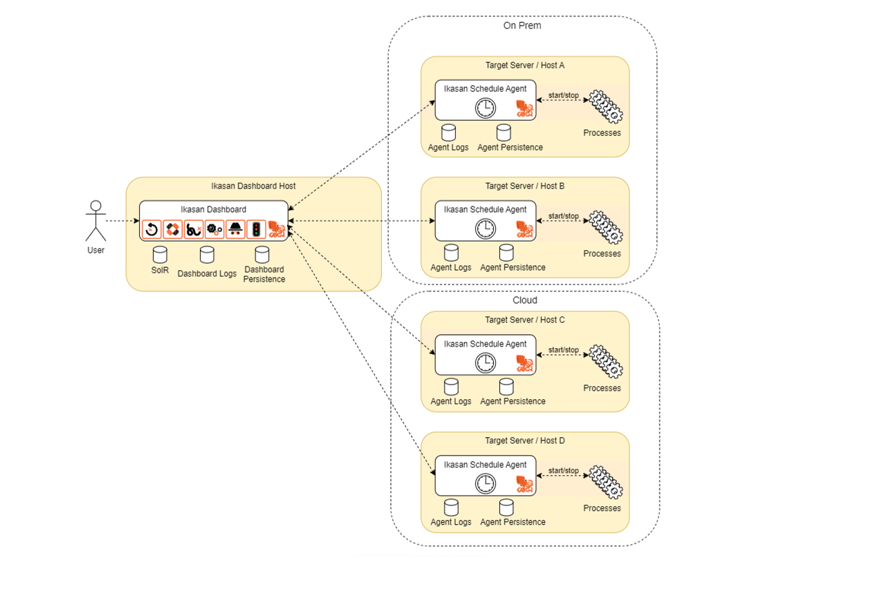
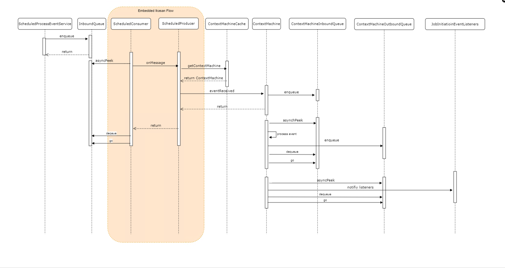
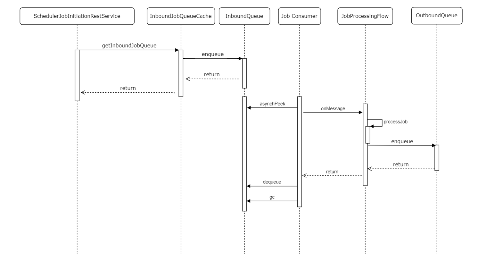
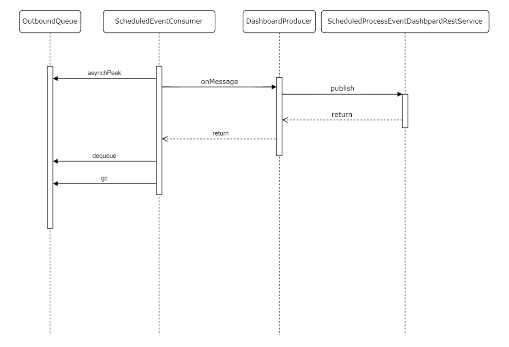

# Ikasan Enterprise Scheduler - Architecture
## Introduction
Ikasan Enterprise Scheduler is a distributed software system. The Ikasan Enterprise Scheduler
Dashboard provides management and orchestration features, and Ikasan Enterprise Scheduler
Agents executes jobs and reports their states back to the dashboard. It is capable of running in
both on-prem and cloud environments, or hybrid on-prem/cloud environments.

## What is a Distributed Software System
A distributed software system is a collection of interconnected software components or applications that work together as a unified system to perform tasks or deliver services. Unlike traditional monolithic or centralized systems where all the processing happens on a single server or computer, a distributed software system splits the workload among multiple nodes, which can be geographically dispersed, interconnected through a network.

In a distributed software system, each node or server operates independently and communicates with other nodes to exchange data, share resources, and collaborate on tasks. The system's architecture is designed to distribute the processing and computing load across various nodes, which offers several benefits, including:

- **Scalability**: Distributed systems can easily accommodate increasing demand by adding more nodes to handle the workload, allowing for horizontal scaling.
- **Fault Tolerance**: Due to the decentralized nature of distributed systems, they can continue functioning even if some nodes fail or become unavailable, reducing the risk of system downtime.
- **Performance**: By distributing tasks across multiple nodes, distributed systems can achieve higher processing speeds and improved overall performance.
- **Flexibility**: Different components of the system can be developed and updated independently, making it easier to adapt and evolve the system over time.

## Understanding the Ikasan Enterprise Scheduler Architecture
The Ikasan Enterprise Scheduler Architecture comprises two distinct software elements.

### Ikasan Enterprise Scheduler Dashboard
The [Ikasan Enterprise Scheduler Dashboard](./dashboard/readme.md) is at the heart of the Ikasan Enterprise
Scheduler and fulfils the following functions:
- It provides features that allow for job plans to be managed.
- It provides features and services that allows for job plan instances to be monitored. See [here](./rest/job-plan-instance-status.md) for details of the services that allow for job plan instances to be monitored. 
- It acts as the orchestration engine for all job plan instances. See [here](./job-orchestration/core/job-plan-orchestration.md) for more details of the job plan orchestration. 
- It manages the lifecycle of all job plan instances. See [here](./job-orchestration/core/job-plan-lifecycle.md) for more details of the job plan instance lifecycle.
- It provides features and services that allow job plans to be provisioned. See [here](./rest/job-plan-provision-service.md) for details of the exposed job plan provision service.
- It provides services that allow job plans to be exported. See [here](./rest/job-plan-export-service.md) for details of the job plan export services.
- It provides services that allow for the underlying queuing technology to be monitored. See [here](./rest/big-queue-services-dashboard.md) for details of how to monitor the BiqQueue destinations.

### Ikasan Enterprise Scheduler Agent
The [Ikasan Enterprise Scheduler Agent](./agent/readme.md) will be numerous within a deployment of the Ikasan Enterprise Scheduler and each agent
instance fulfils the following functions:
- It provides a set of [services](./rest/agent-job-provision-service.md) that allow for [scheduler jobs](./job-orchestration/model/scheduler-job-data-model.md) to be provisioned on the agent. This uses the [JobProvisionServiceImpl](../../ootb/module/scheduler-agent/jar/src/main/java/org/ikasan/ootb/scheduler/agent/module/service/JobProvisionServiceImpl.java) in order to de-activate the agent, reconfigure the jobs and re-activate it.
- It executes the above-mentioned scheduler jobs and reports the state of the executed jobs back to the Ikasan Enterprise Scheduler Dashboard.
- It receives [SchedulerJobInitiationEvents](../../spec/service/scheduled/src/main/java/org/ikasan/spec/scheduled/event/model/SchedulerJobInitiationEvent.java) from the Ikasan Enterprise Scheduler Dashboard in order to execute jobs. These events are received via the [scheduler job initiation service](./rest/scheduler-job-initiation-service.md) once the [orchestration engine](./job-orchestration/core/job-plan-orchestration.md) has determined that the job can run.
- It performs [housekeeping](./agent/readme.md#log-housekeeping-flow) of logs created when jobs executions occur. 

The diagram below provides a logical view of the components within the Ikasan Enterprise Scheduler and how they relate
to one another.

*Ikasan Enterprise Scheduler Architecture Diagram*

## Understanding Ikasan Enterprise Scheduler Inter Process Communications and How Reliability is Achieved.
At the external boundaries of all components within the Ikasan Enterprise Scheduler are rest services that facilitate the
inter process communications.
- [Ikasan Enterprise Scheduler Dashboard Inbound Service](./rest/scheduled-process-event-service.md)
- [Agent Inbound Service](./rest/scheduler-job-initiation-service.md)
 
These services have a very simple responsibility, they take the inbound message and immediately write that to an inbound [BigQueue](https://github.com/ikasanEIP/bigqueue)
filesystem backed queue. If the inbound endpoints are not successful in writing the inbound message to the inbound queue, an exception
is returned to the calling client, which subsequently attempts to call the inbound service again.

### Ikasan Enterprise Scheduler Dashboard Inbound
Assuming that the inbound [ContextualisedScheduledProcessEvent](../../spec/service/scheduled/src/main/java/org/ikasan/spec/scheduled/event/model/ContextualisedScheduledProcessEvent.java)
has been successfully written to the InboundQueue, a very simple embedded Ikasan Flow reads the inbound message from
the InboundQueue, resolves the relevant [ContextMachine](./job-orchestration/core/job-plan-orchestration.md) from the [ContextMachineCache](./job-orchestration/core/context-machine-cache.md)
which subsequently writes the inbound message to the dedicated job plan instance inbound queue. The embedded Ikasan flow
adheres to the general Ikasan transactional semantics and will retry writing the inbound message to the dedicated job plan instance inbound queue in the case of an error. Once
the inbound message is on the dedicated job plan instance inbound queue, the ContextMachine will take the inbound message and determine
if any jobs can be initiated upon receipt of that message, and subsequently notify the outbound job initiation event
listeners. Once all of this is successfully completed, the inbound message is removed from the dedicated job plan instance inbound queue.

The below sequence diagram demonstrates the interactions that fulfil this end to end reliable consumption of inbound [ContextualisedScheduledProcessEvents](../../spec/service/scheduled/src/main/java/org/ikasan/spec/scheduled/event/model/ContextualisedScheduledProcessEvent.java)
received by the Ikasan Enterprise Scheduler Dashboard.

*Ikasan Enterprise Scheduler Dashboard inbound sequence diagram*

### Ikasan Enterprise Scheduler Agent Inbound
The Ikasan Enterprise Scheduler Agent achieves its inbound reliability in a very similar
manner to the dashboard. The inbound rest service simply receives a [SchedulerJobInitiationEvents](../../spec/service/scheduled/src/main/java/org/ikasan/spec/scheduled/event/model/SchedulerJobInitiationEvent.java) from the Ikasan Enterprise Scheduler Dashboard in order to execute jobs. These events are received via the [scheduler job initiation service](./rest/scheduler-job-initiation-service.md) once the [orchestration engine](./job-orchestration/core/job-plan-orchestration.md)
and resolves the relevant inbound job queue and publishes to that queue. The relevant job flow
then reads the messages and executes the job. Once the job is complete, the [ContextualisedScheduledProcessEvent](../../spec/service/scheduled/src/main/java/org/ikasan/spec/scheduled/event/model/ContextualisedScheduledProcessEvent.java) is
written to the outbound queue, and the inbound message removed from the inbound job queue.

The below sequence diagram demonstrates the interactions that fulfil this end to end reliable consumption of inbound [SchedulerJobInitiationEvents](../../spec/service/scheduled/src/main/java/org/ikasan/spec/scheduled/event/model/SchedulerJobInitiationEvent.java)
received by the Ikasan Enterprise Scheduler Agent.

*Ikasan Enterprise Scheduler Agent inbound sequence diagram*

### Ikasan Enterprise Scheduler Agent Outbound
The Ikasan Enterprise Scheduler Agent achieves its outbound reliability by simply reading the outbound  [ContextualisedScheduledProcessEvent](../../spec/service/scheduled/src/main/java/org/ikasan/spec/scheduled/event/model/ContextualisedScheduledProcessEvent.java)
from the OutboundQueue and writes it to the Ikasan Enterprise Scheduler Dashboard via an exposed rest service. Once successful the outbound
message is removed from the OutboundQueue otherwise the delivery to the dashboard is re-attempted.

*Ikasan Enterprise Scheduler Agent outbound sequence diagram*