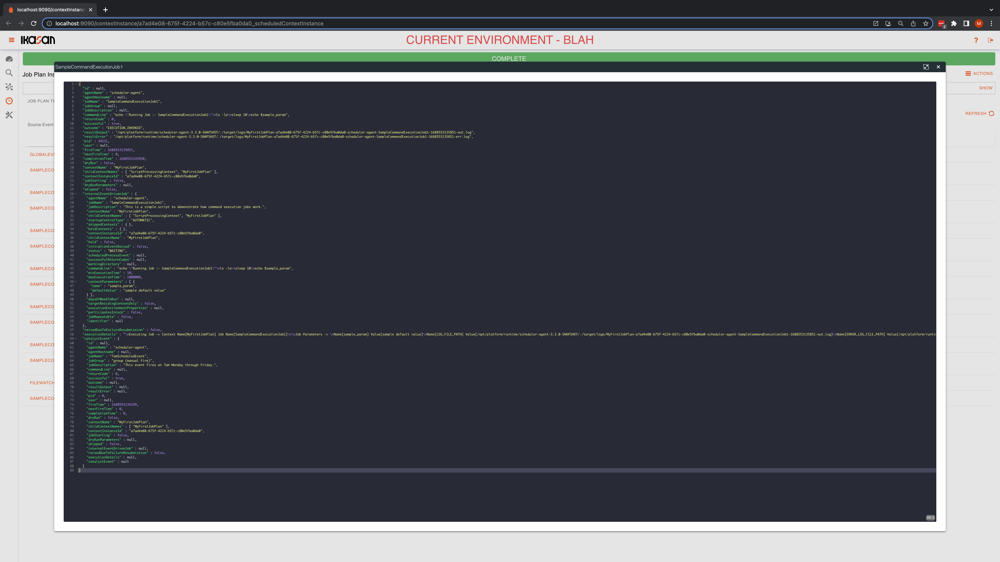
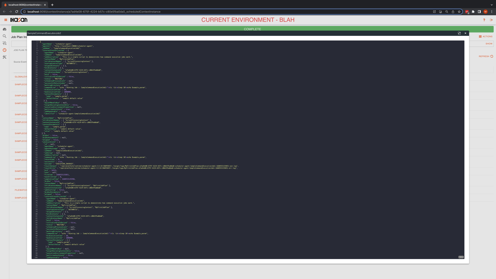

# Ikasan Enterprise Scheduler - Job Plan Instance Audit Tab
The Ikasan Enterprise Scheduler provides full audit features relating to a `Job Plan Instance`. The events are chronologically
listed and it is possible to see which events act as the catalyst for other jobs to be initiated.

Users can click on the source events of the raise events to inspect the contents of the events. 

A short video demonstrating the use of the features on this tab can be found [here](https://youtu.be/fNkxqlL8ihU).

*Ikasan Enterprise Scheduler Dashboard job plan instance audit tab*

If a user selects the source event the following dialog is displayed.

*Ikasan Enterprise Scheduler Dashboard scheduled event dialog*

If a user selects the raise event the following dialog is displayed.

*Ikasan Enterprise Scheduler Dashboard job initiation event dialog*