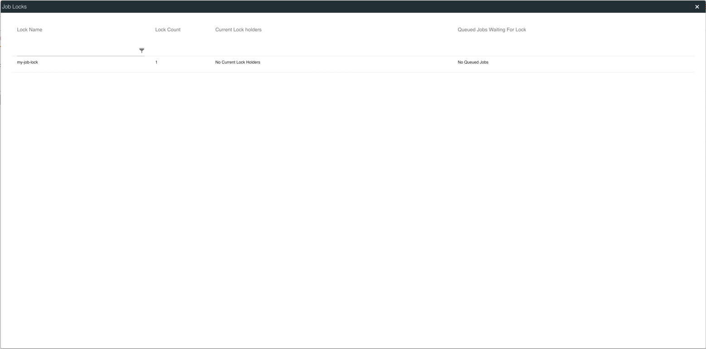
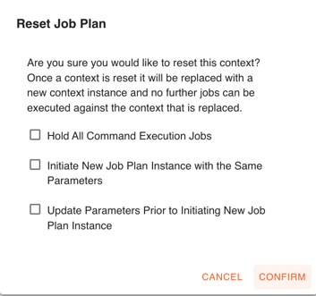
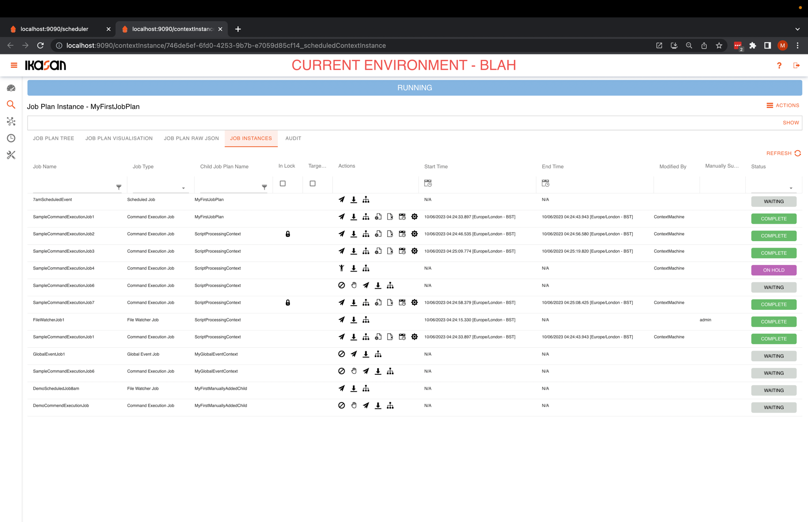

# Ikasan Enterprise Scheduler - Job Plan Instance Management
A Job Plan Instance is an instantiation of a Job Plan. More details of a Job Plan can be found [here](../job-plans/job-plan-templates.md).

## Job Plan Instance Actions Menu
The `Job Plan Instance Actions Menu` provides access to various functionalities that allow for the management of a `Job Plan Instance`.

*Ikasan Enterprise Scheduler Dashboard job plan instance action menu*

### Job Locks
Clicking the `Job Locks` menu item opens the `Job Plan Instance Job Locks Status` dialog. From here the current status of any locked or queued jobs can be monitored. 

*Ikasan Enterprise Scheduler Dashboard job plan instance job lock status dialog*

### Hold All Command Execution Jobs
Clicking the `Hold All Command Execution Jobs` menu item places all waiting `Command Execution` jobs withing the `Job Plan Instance` on hold. `Command Execution` jobs
that are on hold will not run until they are released, even if all upstream catalyst jobs have run.

### Release All Held Jobs
Clicking the `Release All Held Jobs` menu item will release all held `Command Execution` jobs. If a jobs upstream catalyst jobs have all been executed, releasing a
job will cause it to start, otherwise it will wait for the upstream catalyst jobs to complete before executing.

### Disabled Scheduled Jobs
Clicking the `Release All Held Jobs` menu item will disable all `Scheduled Jobs` that have not yet fired within a job plan instance. They will remain disabled
until they are re-enabled. `Scheduled Jobs` that were due to fire while they were disabled will not fire when `Scheduled Jobs` are re-enabled.

### Ignore Job Plan Duration
Clicking the `Ignore Job Plan Duration` menu item will cause the `Job Plan Instance` time to live to be ignored and the `Job Plan Instance` will remain active
until it is manually ended. The following message will appear on the `Job Plan Instance` management screen.

In order to manually end the `Job Plan Instance` an option to do so becomes available in the `Job Plan Instance` action menu.

### Parameters
Clicking the `Parameters` menu item will allow for the management of `Job Plan Instance Parameters`. See [here](../../job-orchestration/core/job-plan-parameters.md)
for more details of job plan parameters.

### Reset Job Plan
Clicking the `Reset Job Plan` menu item will end the current `Job Plan Instance` and create a new instance of that job plan.

The `Reset Job Plan` dialog contains 3 checkboxes as follows:

#### Hold All Command Execution Jobs
If the `Hold All Command Execution Jobs` checkbox is checked, all `Command Execution Jobs` within the new `Job Plan Instance` will be placed on hold when the new instance is created.

#### Initiate New Job Plan Instance with the Same Parameters
If the `Initiate New Job Plan Instance with the Same Parameters` checkbox is checked, the parameters associated with the currently 
running `Job Plan Instance` will be carried over the new instance when it is created.

#### Update Parameters Prior to Initiating New Job Plan Instance
If the `Update Parameters Prior to Initiating New Job Plan Instance` checkbox is checked, a dialog is provided to the user to allow them to
modify the parameters before the new instance is created.

*Ikasan Enterprise Scheduler Dashboard update job plan instance parameters dialog*

## Job Plan Instance Tree View Tab
This Job Plan Instance Tree View Tab provides a intuitive tree rendition of an instance of a Job Plan. The status of the job 
plan can be easily understood as the status of a nested job plan wraps up to its parent, thus allowing for nested errors to be 
easily identified.

Click [here](./job-plan-instance-tree-view-tab.md) for more details on the Job Plan Instance Tree View Tab.

*Ikasan Enterprise Scheduler Dashboard job plan tree view tab*

## Job Plan Instance Visualisation Tab
Click [here](./job-plan-instance-visualisation-tab.md) for more information on the Job Plan Instance Visualisation Tab.

*Ikasan Enterprise Scheduler Dashboard job plan instance visualisation tab*

## Job Plan Instance Job Instances Tab
Click [here](./job-plan-instance-job-instances-tab.md) for more information on the Job Plan Instance Job Instances Tab.

*Ikasan Enterprise Scheduler Dashboard job plan instances tab*

## Job Plan Instance Audit Tab
Click [here](./job-plan-instance-job-audit-tab.md) for more information on the Job Plan Instance Job Audit Tab.

*Ikasan Enterprise Scheduler Dashboard job plan instance audit tab*
