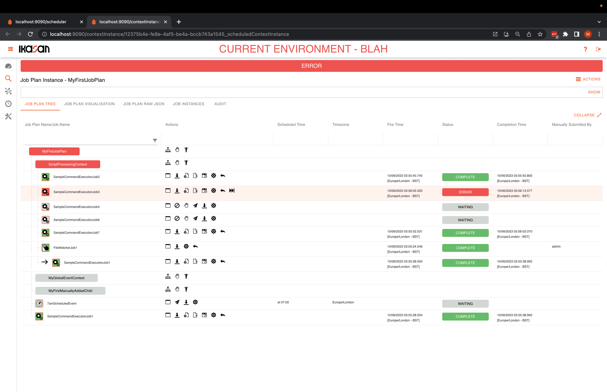
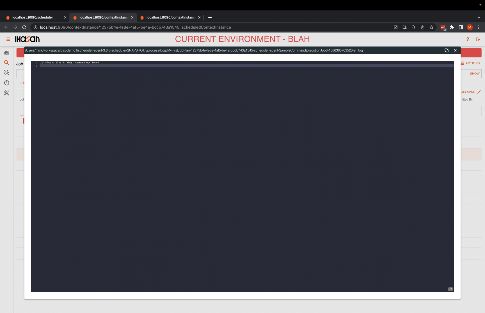

# Ikasan Enterprise Scheduler - Job Plan Instance Tree View Tab

This Job Plan Instance Tree View Tab provides a intuitive tree rendition of an instance of a Job Plan. The status of the job plan 
can be easily understood as the status of a nested job plan wraps up to its parent, thus allowing for nested errors to be
easily identified.

Throughout the tree component there are various actions that can be performed at a node in the tree. Details of these actions
can be found [here](./job-plan-instance-actions.md).

This [instructional video](https://youtu.be/lVdYv0Q5wRY) is available, which demonstrates how to use the Ikasan Enterprise Scheduler
Tree View component.

Clicking on the  icon next to a Command Execution Job instance will open the process log dialog enabling users to be able to 
view any logging that is associated with the underlying job that is being executed.

Clicking on the  icon next to a Command Execution Job instance will open the process error log dialog enabling users to be able to
view any error logging that is associated with the underlying job that is being executed.

Clicking on the  icon next to a Command Execution Job instance will open the process event dialog enabling users to be able to
view the process event that was received from the agent. The process event contains information about the process that was executed by the agent.

Clicking on the  icon next to a Command Execution Job instance will open the process execution dialog enabling users to be able to
view the process execution environment. The process execution environment contains information about thow the process was seeded to run by the agent.

It contains the following information:
- **Executing Job**: Name of the job plan and job being executed.
- **Job Parameters**: Any parameters that are passed to the job to be executed.
- **Process Command**: The actual command that is being executed.

