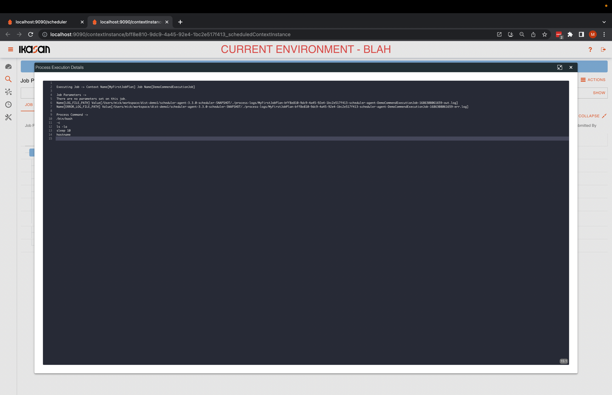

# Ikasan Enterprise Scheduler - Job Plan Instance Tree View Tab

This Job Plan Instance Tree View Tab provides a intuitive tree rendition of a Job Plan. The status of the job plan 
can be easily understood as the status of a nested job plan wraps up to its parent, thus allowing for nested errors to be
easily identified.

Throughout the tree component there are various actions that can be performed at a node in the tree. Details of these actions
can be found [here](./job-plan-instance-actions.md).

This [instructional video](https://youtu.be/lVdYv0Q5wRY) is available, which demonstrates how to use the Ikasan Enterprise Scheduler
Tree View component.

