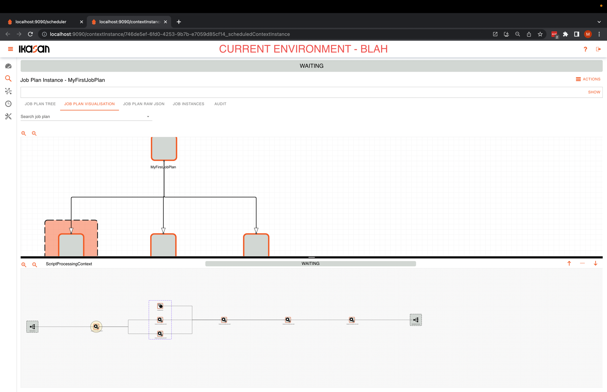

# Ikasan Enterprise Scheduler - Job Plan Instance Visualisation Tab

The Job Plan Instance Visualisation Tab tab provides a visual representation of a job plan instance. The job plan instance contains children
job plan instances, and the children job plan instances contain the jobs. There are  various actions that can be performed
against jobs within the visualisation screens. Details of these actions can be found [here](./job-plan-instance-actions.md).

A short video demonstrating the use of the features on this tab can be found [here](https://youtu.be/tjKuJcY798o).

*Ikasan Enterprise Scheduler Dashboard job plan instance visualisation tab*