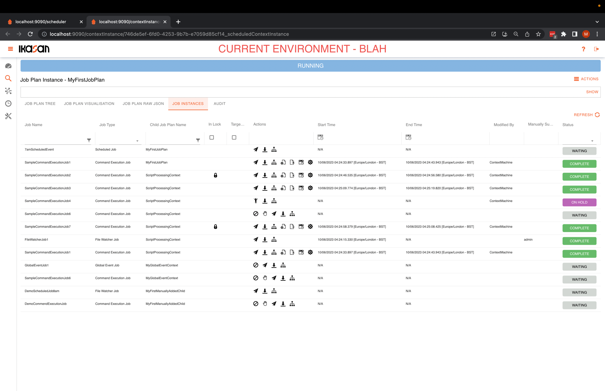
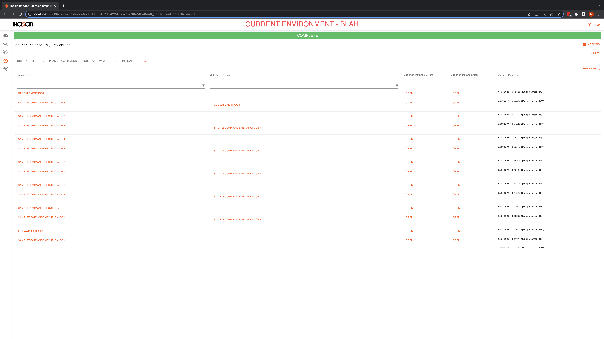

# Ikasan Enterprise Scheduler - Job Plan Instance
A Job Plan Instance is an instantiation of a Job Plan. More details of a Job Plan can be found [here](../job-plans/job-plan-templates.md).

## Job Plan Instance Tree View Tab
[Job Plan Instance Tree View Tab](./job-plan-instance-tree-view-tab.md)

## Job Plan Instance Visualisation Tab
[Job Plan Instance Visualisation Tab](./job-plan-instance-visualisation-tab.md)

## Job Plan Instance Job Instances Tab
[Job Plan Instance Job Instances Tab](./job-plan-instance-job-instances-tab.md)

## Job Plan Instance Audit Tab
[Job Plan Instance Job Audit Tab](./job-plan-instance-job-audit-tab.md)

