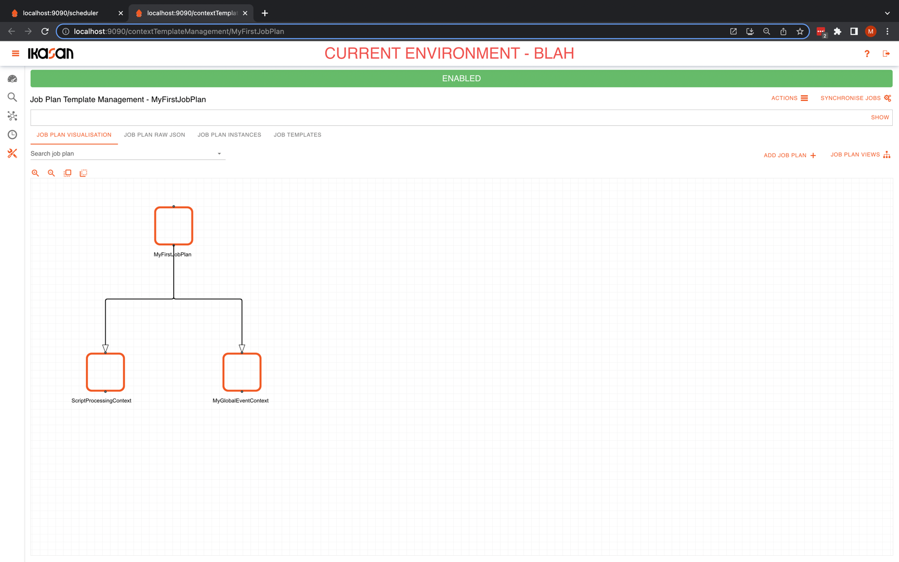
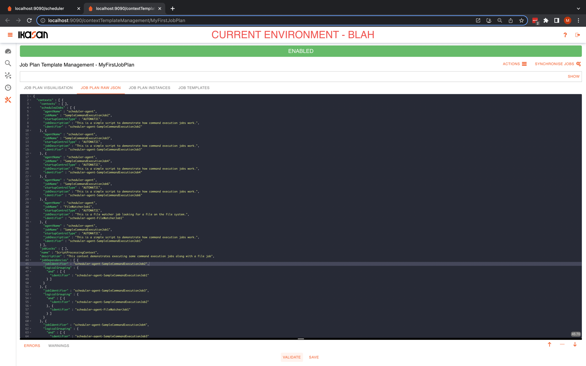
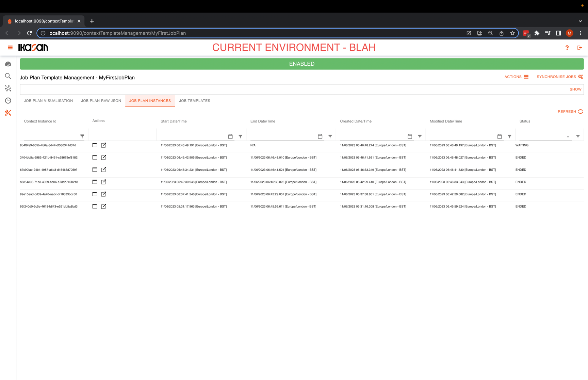
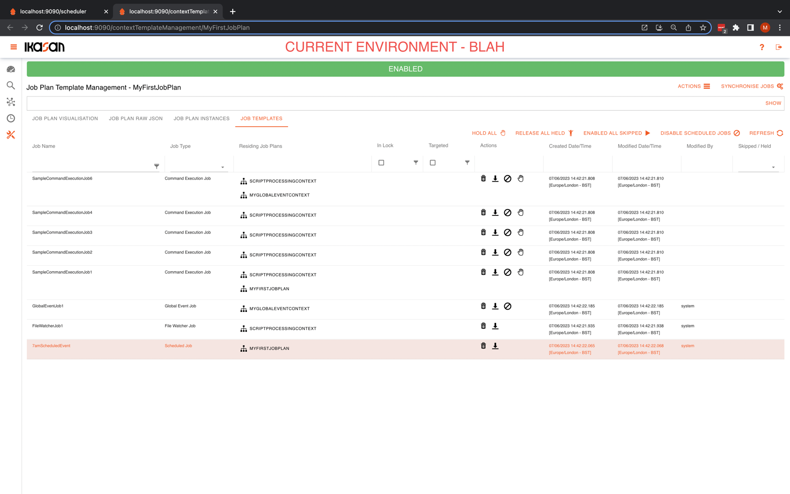
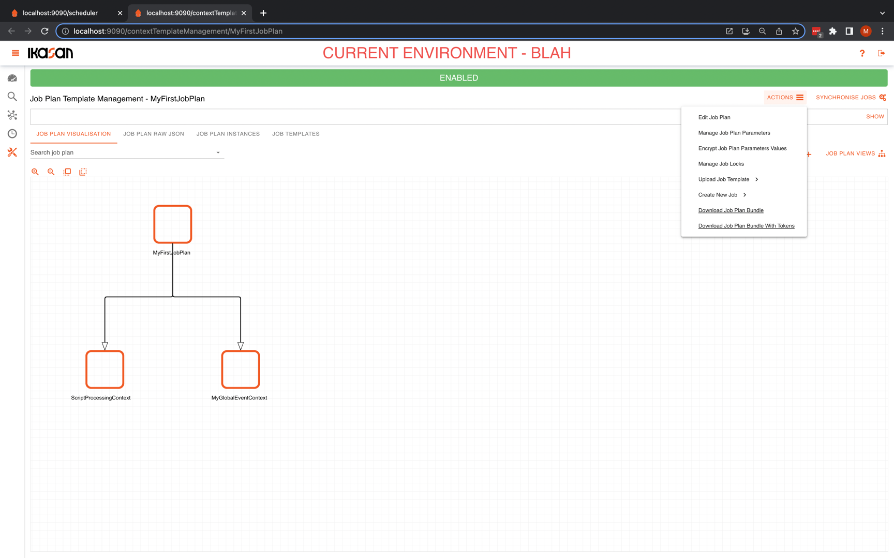
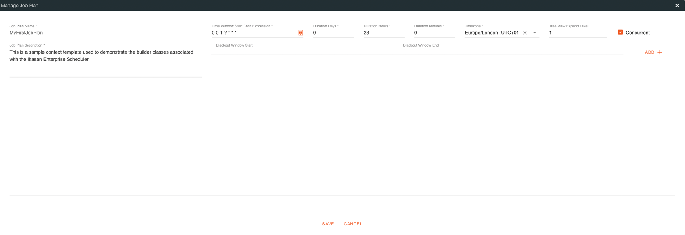
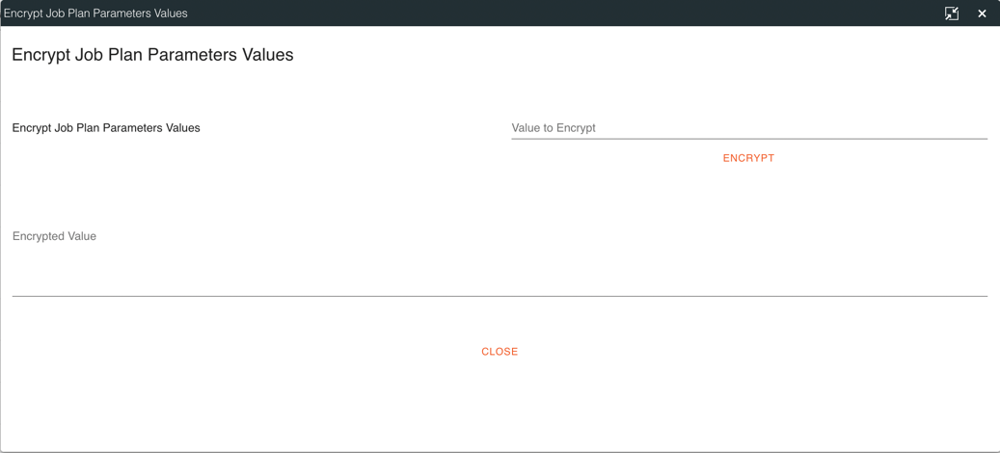
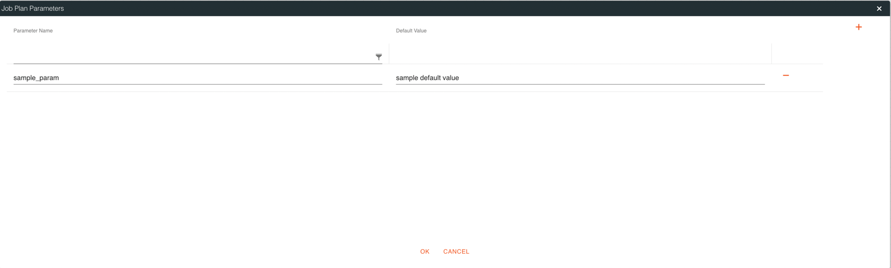
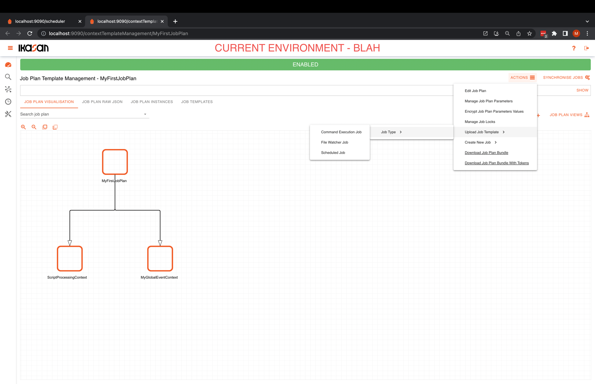
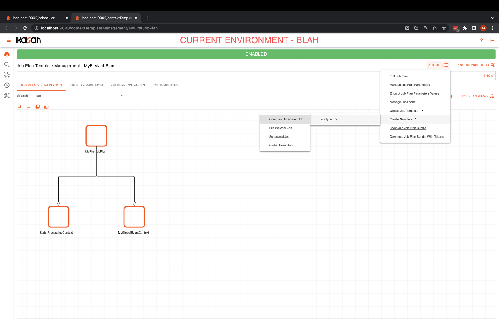

# Ikasan Enterprise Scheduler - Job Plan Templates

## Introduction
The Ikasan Enterprise Scheduler Dashboard provides functionality that manages the [Job Plan Data Model](../../job-orchestration/model/job-plan-data-model.md)
allowing developers and business users to extend and maintain job plans in an intuitive and visual manner.

## Job Plan Visualisation Tab
The job plan visualisation tab provides features that allows user to 
extend and manage job plans using a WYSIWYG design pallet. Use of this tab is elaborated upon [here](./managing-job-plan-templates-using-visualisation.md).

## Job Plan Raw JSON Tab
The job plan raw json tab allows users to manually view and manage a raw job plan in its native JSON format. It provides validation features.

> **Note**
> Any modifications of a job plan will not come into effect until the next new instance of that job plan is created.

## Job Plan Instances Tab
The job plan instances tab provides a view on all instances of the the current job plan. Users are able to access these instances
from the actions that are associated with each job plan instance.
-  - open the job plan instance in a modal dialog.
-  - open the job plan instance in a new tab/window.

## Job Plan Job Templates Tab
The job plan template tab provides a view on all job templates associated with a job plan. Further details of this tab can be found [here](job-templates-tab.md).

## Job Plan Actions
In the job right section of the Job Plan screen you will find the `actions` button which provides access
to all of the actions that can performed against a job plan.

### Editing a Job Plan
This feature allows for an existing job plan to be edited. See  [Job Plan Data Model](../../job-orchestration/model/job-plan-data-model.md)
for more details on the underlying data model.

Details of fields on the form are as follows: 
- `Job Plan Name` - The name of the job plan. This field cannot be changed.
- `Job Plan Description` - Provides an informative description of the job plan.
- `Time Window Start Cron Expression` - This field specifies the time at which a new instance of the job plan will be created. 
- `Duration Days` - This field specifies how many days that the job plan instances will remain active.
- `Duration Hours` - This field specifies how many hours that the job plan instances will remain active.
- `Duration Minutes` - This field specifies how many minutes that the job plan instances will remain active.
- `Timezone` - The timezone that the job plan runs in. The cron expression that controls the start time of the plan will operate in the specified timezone. If it is not specified the cron will run in the default timezone of the server it is running on.
- `Tree View Expand Level` - Defines how deep that job plan instance tree view will expand by default.
- `Concurrent` - Specifies if the job plan can run concurrently. That is, can more than one job plan instance be active at any one point in time?
- `Blackout Windows` - Defines period withing which an instance of the job plan will not be created.

> **Note**
> The duration of the job plan is a combination of the days, hours and minutes specified on the job plan.
> Any modifications of a job plan will not come into effect until the next new instance of that job plan is created.

### Encrypting Job Plan Parameters
This feature allows users to encrypt any sensitive job plan parameters prior to populating them in the underlying configuration.

### Managing Job Plan Parameters
This screen allows users to manage parameters associated with the job plan. Further details of job plan parameters can be found [here](../../job-orchestration/core/job-plan-parameters.md). 

### Managing Job Locks
In order to understand how to manage job locks please click [here](./managing-job-locks.md).

### Uploading Job Templates
This feature allows users to upload JSON versions of a job. See details of the [scheduler job data model](../../job-orchestration/model/scheduler-job-data-model.md)
for details of the valid JSON data formats.

### Creating new Job Templates
In order to understand how to create new Ikasan Enterprise Scheduler jobs please click [here](./create-new-job.md).

