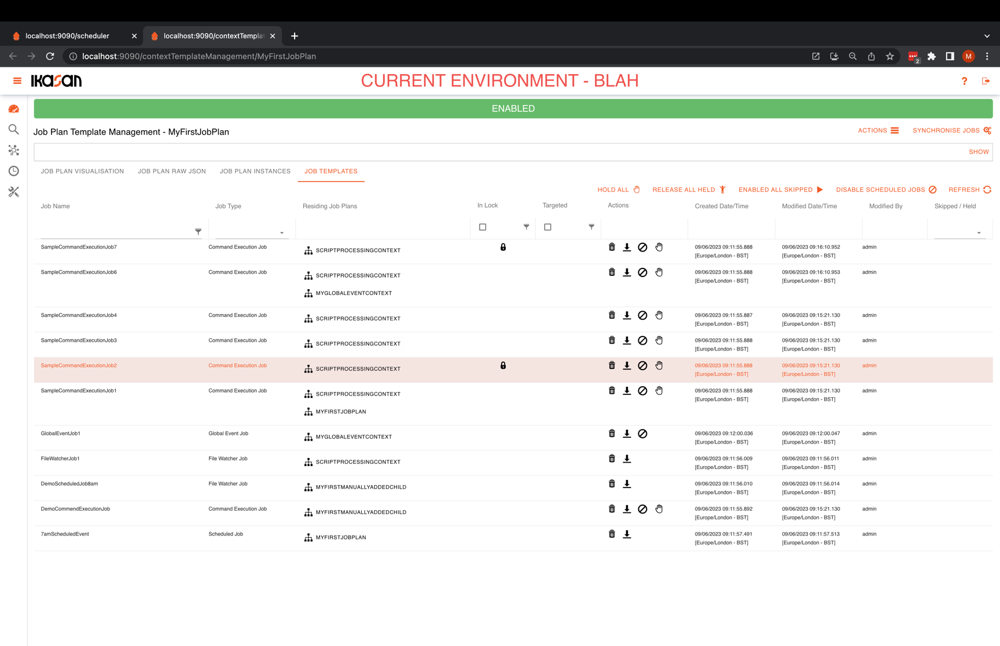
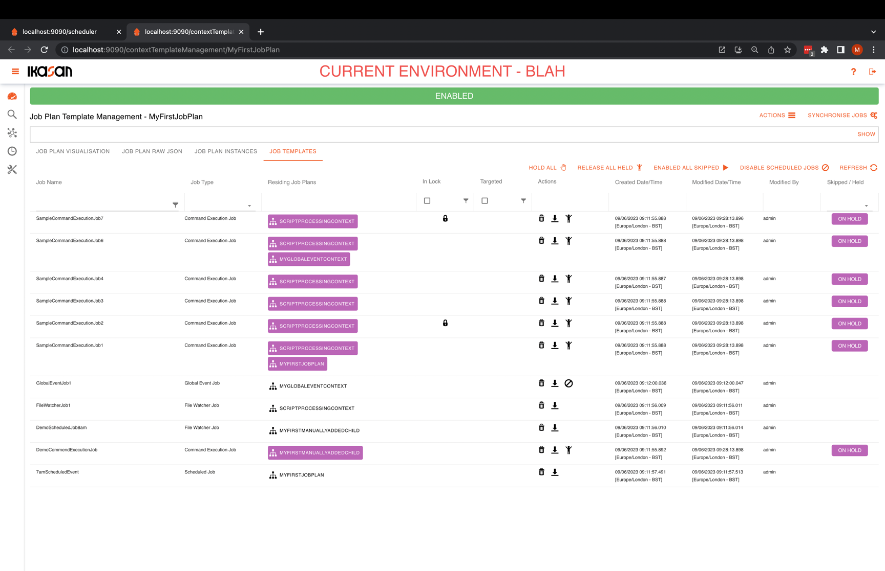
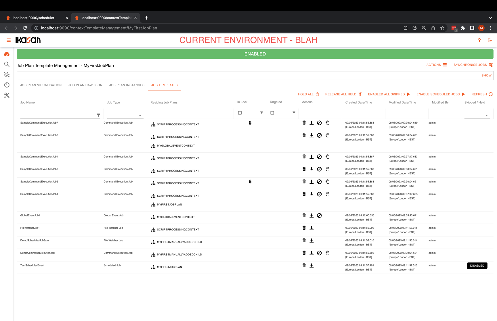

# Ikasan Enterprise Scheduler - Job Templates Tab
The job plan, job template tab allows for all jobs within a job plan to be managed.

This [instructional video](https://youtu.be/MLcXoxZ1AJE) is available, which demonstrates how to use the Ikasan Enterprise Scheduler Job Template Tab.

## Placing All Job Plan Command Execution Jobs on Hold
In order to place all command execution jobs in job plan template, select the `Hold All` button. This marks all command execution jobs
in the job plan template as being `On Hold` and any future instances of the job plan will have the jobs marked `On Hold` set to an `On Hold`
state within the newly created instances. When a job is `On Hold` it will not run until released. Please see details of the 
[context instance lifecycle](../../job-orchestration/core/context-lifecycle.md) to understand the relationship between a job plan
and a job plan instance.

All jobs `On Hold` will reflect this in their status within the job template table.

## Releasing All Job Plan Command Execution Jobs
In the same way all command execution jobs in a job plan template can be held, it is also possible to `Release All Held` jobs. Once confirmed
the job plan template will no longer have any jobs marked to be `On Hold` when the next instance of the job plan template is created.

## Holding and Releasing Individual Command Execution Jobs
It is also possible to hold and release individual command execution jobs using the action icons in the action column.
-  `Hold` a command execution job.
-  `Release` a command execution job that has been held.

## Skipping and Enabling Skipped Command Execution Jobs
Along side each command execution job are action icons that can be clicked in order to `Skip` a command execution job and `Enable`
a command execution job that has been skipped. When a job is skipped in a job plan template, all subsequent instances of the job plan
will have those jobs marked as skipped in the job plan template, set to a `Skipped` state. When that job plan instance runs, the job will
be skipped on the job plan will simply execute the next job(s) downstream from the job that has been skipped.
-  `Skip` a command execution job.
-  `Enable` a command execution job that has been skipped.

There is also a feature that allows users to `Enable All Skipped` command execution jobs in the job plan template.

## Disabling and Enabling all Scheduled Jobs in the Job Plan Template
There may be cases where users wish to prevent any scheduled jobs to run when instances of a job plan template are created. 
The `Disable Scheduled Jobs` button provides this feature.

Any scheduled jobs will have their status marked as `Disabled`.

In order to enable the scheduler jobs click the `Enable Scheduled Jobs` button and when instances of the job plan are created
all scheduler jobs will fire on their normal schedule.
