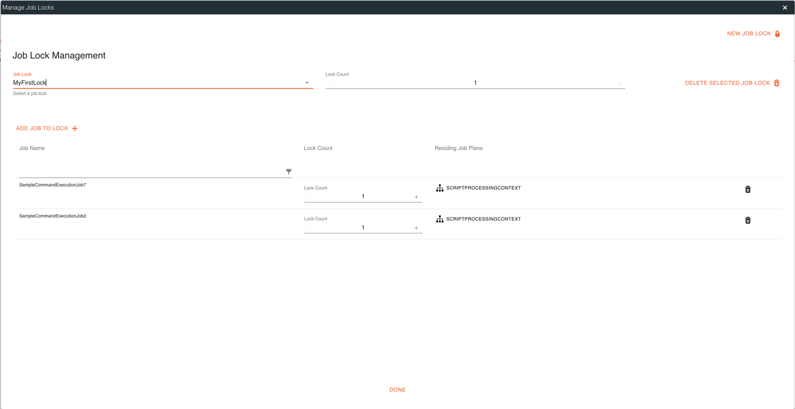
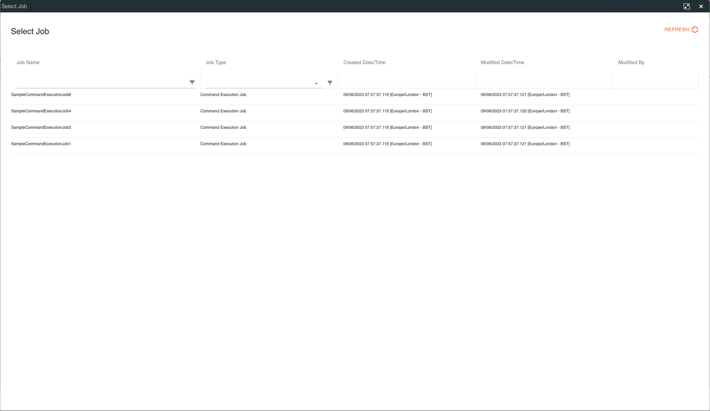
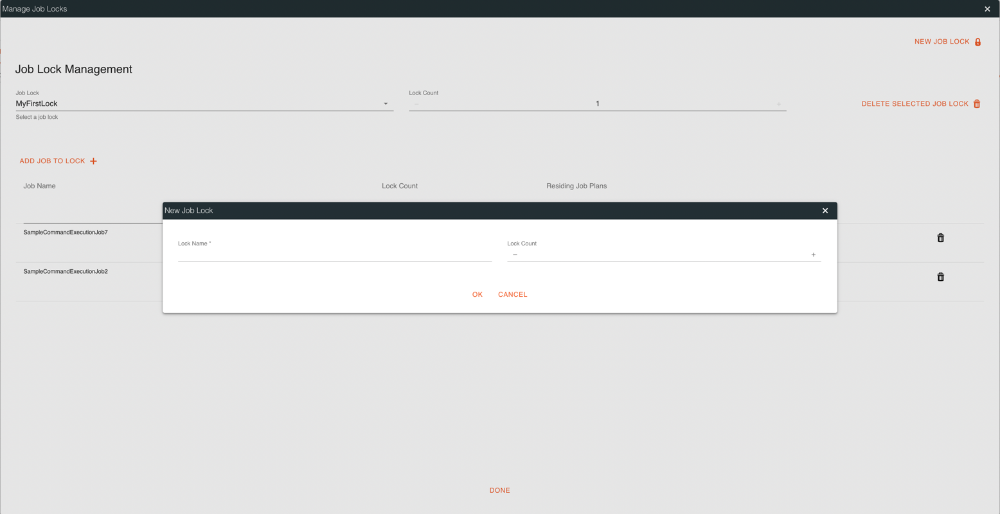
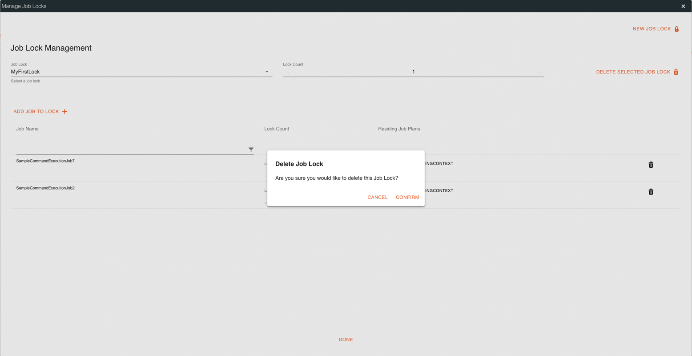

# Ikasan Enterprise Scheduler - Job Locks
`Job Locks` are a mechanism that restricts the way that jobs can execute concurrently. For example it may be the case
that it does not matter which order a group of jobs run in, the only constraint being that only one of them can be running 
at any point in time. This may be desirable where jobs are resource intensive or if a number of jobs access a shared data
set, but only one can work against that dataset at any point in time.

The underlying mechanism works as follows:
- A `Job Lock` has a `Lock Count` associated with it.
- Each individual job associated with a `Job Lock` also has a `Lock Count` associated with it.
- When a job that is part of a `Job Lock` is required to run, the orchestration determines if the `Lock Count` associated with the job will exceed the `Lock Count` associated with the `Job Lock`.
- If the `Lock Count` does not exceed the `Lock Count` of the `Job Lock`, the job is instructed to run and it takes the defined number of locks.
- If the `Lock Count` exceeds the `Lock Count` of the `Job Lock`, the job is queued until jobs holding the lock complete and release their locks. The queued job is then instructed to run.

## Managing Job Locks
In order to manage a `Job Lock`, select the `Job Lock` from the `Job Lock dropdown`. It is then possible to modify the lock count
of the job lock, and add or remove jobs `(click on trash can icon)` from it, as well as modify the lock count associated with each job.

## Adding Jobs to a Job Lock
In order to add a new job to a `Job Lock`, select the `ADD JOB TO LOCK +` button. A new dialog is presented and job can be
selected from the table by double clicking on the job. 

## Creating a New Job Lock
In order to create a new `Job Lock`, select the `New Job Lock` button. A new dialog is presented and the new lock name and lock count entered.
Jobs can then be added to or removed from the new job lock as described above. 

## Deleting a Job Lock
In order to delete an existing `Job Lock` select the `Job Lock` from the `Job Lock dropdown` and press the `DELETE SELECTED JOB LOCK` button.
