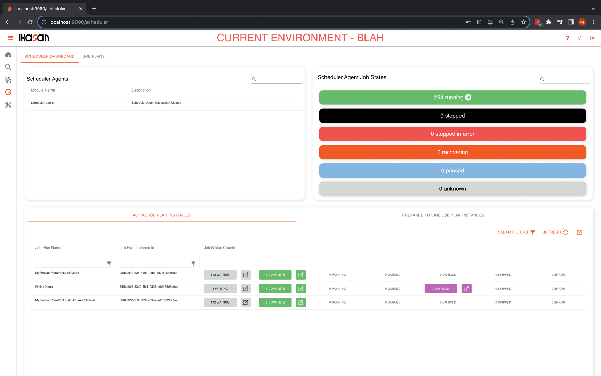
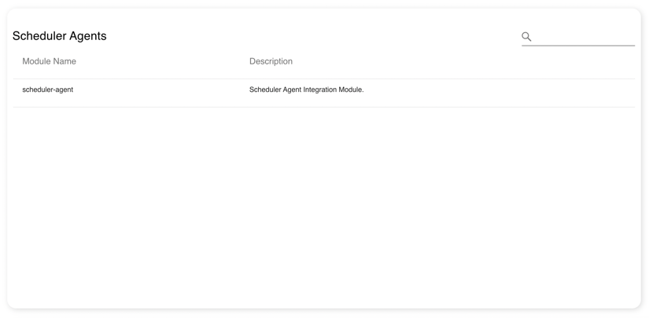
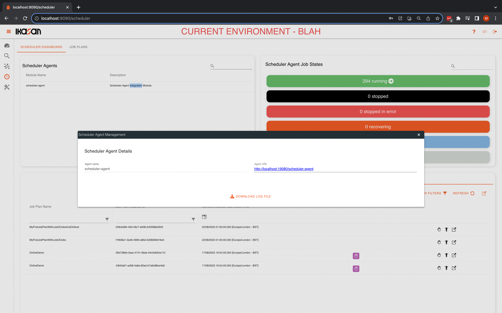
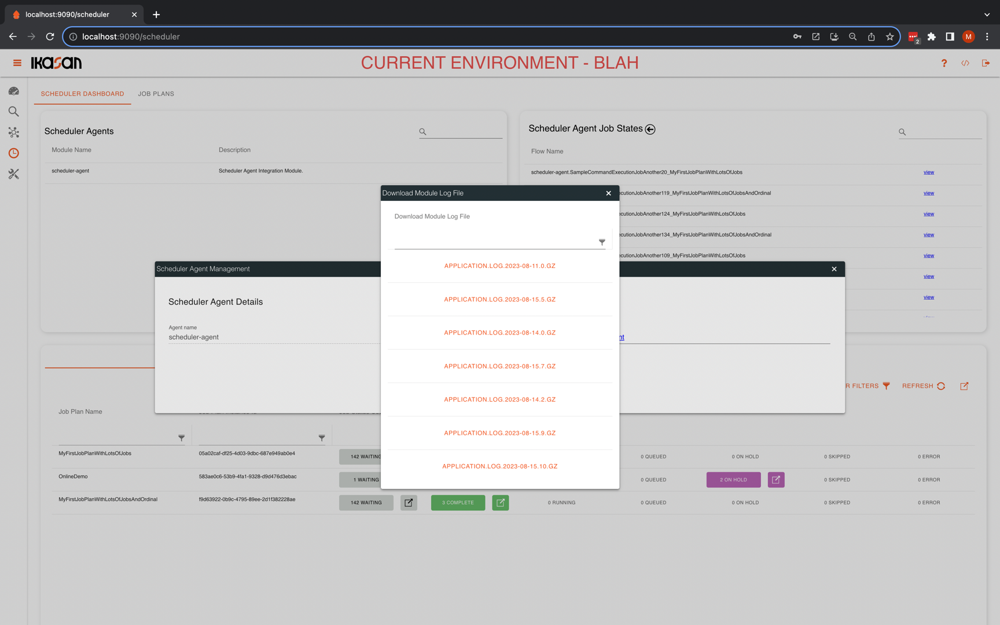
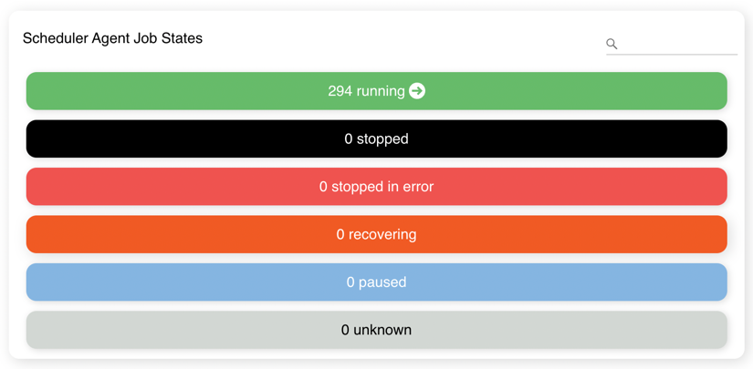
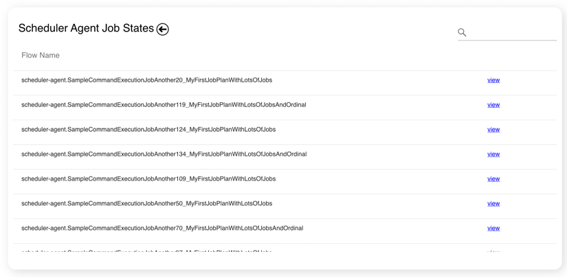
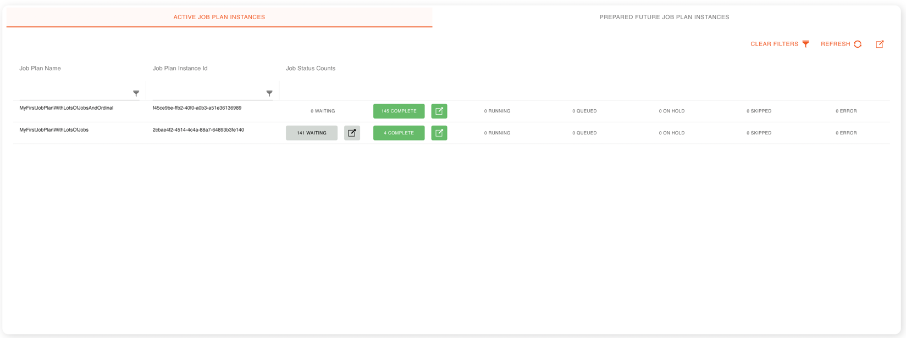
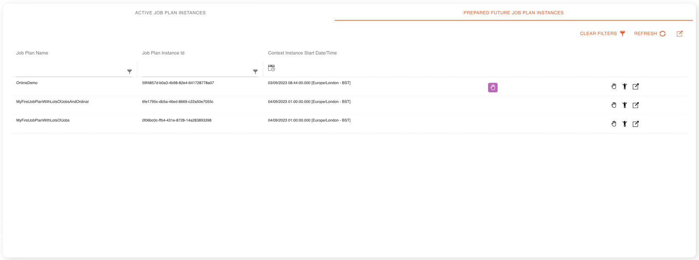

# Ikasan Enterprise Scheduler Dashboard Landing Screen
The `Ikasan Enterprise Scheduler Dashboard Landing Screen` contains two tabs:
- Dashboard Tab
- Job Plan Tab

## Ikasan Enterprise Scheduler Dashboard Landing Screen - Dashboard Tab
The Ikasan Enterprise Scheduler Dashboard provides is a single page view that provides details of all scheduler related activity. 
It comprises the following 3 main sections.
- Scheduler Agents
- Scheduler Agent Jobs States
- Active and Future Job Plans Instances

*Ikasan Enterprise Scheduler Dashboard*

### Scheduler Agents
The Scheduler Agent section provides a list of agents that are associated with the Ikasan Enterprise Scheduler Dashboard. This list can be
filtered using the filter text box in the right top of the section.

*Ikasan Enterprise Scheduler Agents*

Double clicking any of the agents will open the agent dialog. From here the management console can be accessed by clicking on the
agent link on the dialog. It is asle possible to access the logs associated with the agent by clicking on the `Download Log File` button.

*Ikasan Enterprise Scheduler Agent dialog*

After clicking the `Download Log File` button, a dialog containing a list of all available logs is presented. From here select the
file you wish to download.

*Ikasan Enterprise Scheduler Agent log files dialog*

### Scheduler Agent Jobs States

The Ikasan Enterprise Scheduler Agent jobs state card on the Ikasan Enterprise Scheduler Dashboard provides an aggregated view
of the state of all jobs across all agents deployed in that environment.

*Ikasan Enterprise Scheduler Agent jobs state card*

It is possible to drill into the individual jobs by clicking on the arrow to the right of the status count, and use the filtering
text field to find a specific job.

*Ikasan Enterprise Scheduler Agent jobs state card drill down*

### Job Plan Instances
The Job Plan Instances Card on the Ikasan Enterprise Scheduler Dashboard contains two tabs:
- **Active Job Plan Instances Tab**: This tab contains a grid with all currently running job plan instances and displays the states for each job in the plan.
- **Future Planned Job Plan Instances Tab**: This tab contains a prepared instance of each enabled job plan, that is the next instance of that job plan that is due to run in the future.

#### Active Job Plan Instances Tab
The Active Job Plan Instances Tab contains a grid with all currently running job plan instances and displays the states 
for each job in the plan. The grid can be filtered on the `Job Plan Name` and `Job Plan Instance Id`. The `Job Status Counts` 
column contains a status count for all the jobs in the job plan instance, and all of the status icons can be clicked in
order drill into more details of the `Job Plan Instance`. There are also general buttons that clear the grid filters and refresh
the grid contents, as well as a button that opens the Job Plan Instances Card in full screen mode in a new browser tab.

*Active job plan instances*

#### Future Planned Job Plan Instances Tab

The Future Planned Job Plan Instances Tab contains a grid with a prepared instance of each enabled `job plan`, that is the next 
instance of that job plan that is due to run in the future. This allows users to modify the state of the `job plan instance`
prior to the `job plan` becoming active. For example, it may be desirable hold some or all jobs, or skip some of jobs in a `job plan instance`.
The grid can be filtered on the `Job Plan Name` and `Job Plan Instance Id` and sorted based on 
the `Context Instance Start Date/Time`. There are also general buttons that clear the grid filters and refresh
the grid contents, as well as a button that opens the Job Plan Instances Card in full screen mode in a new browser tab.

*Future planned job plan instances*

## Ikasan Enterprise Scheduler Dashboard Landing Screen - Job Plan Tab
The `Ikasan Enterprise Scheduler Dashboard Landing Screen Job Plan Tab` comprises a grid containing all `job plans` that
have been deployed to the dashboard along with the following buttons:
- Refresh Job Parameters - when pressed the job parameters are refreshed from the underlying properties used to populate them.
- New Job Plan - when presses the user is presented with a dialog that allows them to create a new `job plan`.
- Upload Job Plan - when pressed the user is presented with a dialog that allows them to upload a `job plan`.
- Quick Access - allows quick access of all currently running job plan instances.

The `job plan grid` can be filtered based upon the `job plan name` and there is also the opportunity to `disable` and `enable` the 
job plan. There are also a number of [actions](./job-plans/job-plan-actions.md) that can be performed against each job plan.

### Enabling and Disabling Job Plans
When a job plan is `disabled`, the following occurs:
1. Any running instances of the `job plan` are `ended`.
2. An running instances of the `job plan` are de-registered from the relevant agents.
3. All `jobs` associated with the `job plan` are removed from the relevant agents.
4. The `job plan` is marked as disabled and no further instances of it will be created.

When a job plan is `enabled`, the following occurs:
1. All `jobs` associated with the `job plan` are added to the relevant agents.
2. The `job plan` is marked as enabled and instances of it will be created using the schedule associated it.

**Note:** an instance of the enabled `job plan` will not automatically be created until it is next scheduled to run. If 
an instance is required beforehand, it will be necessary to create it manually. 

### New Job Plan
When the `New Job Plan` button is pressed the `New Job Plan Template` is presented to the screen. In order to creat a
`New Job Plan Template` all mandatory fields must be provided:
- **Job Plan Name:** A unique name for the `job plan`.
- **Job Plan Description:** A description for the `job plan`.
- **Time Window Start Cron Expression:** A quartz cron expression defining the schedule upon which the `job plan` will start.
- **Duration Days:** The number of days each instance of the `job plan` will run.
- **Duration Hours:** The number of hours each instance of the `job plan` will run.
- **Duration Minutes:** The number of minutes each instance of the `job plan` will run.
- **Timezone:** The timezone that the `job plan` will run in.
- **Tree View Expand Level:** The default expand level `job plan intance tree` for the job plan.
- **Concurrent:** Flag to indicate if multiple instances of the `job plan` can run concurrently.
- **Alias:** Flag to indicate if job name aliases should be  used for jobs in the`job plan`.

There is also the opportunity to define blackout windows that prevent job plan instances from being created within those time windows.   

