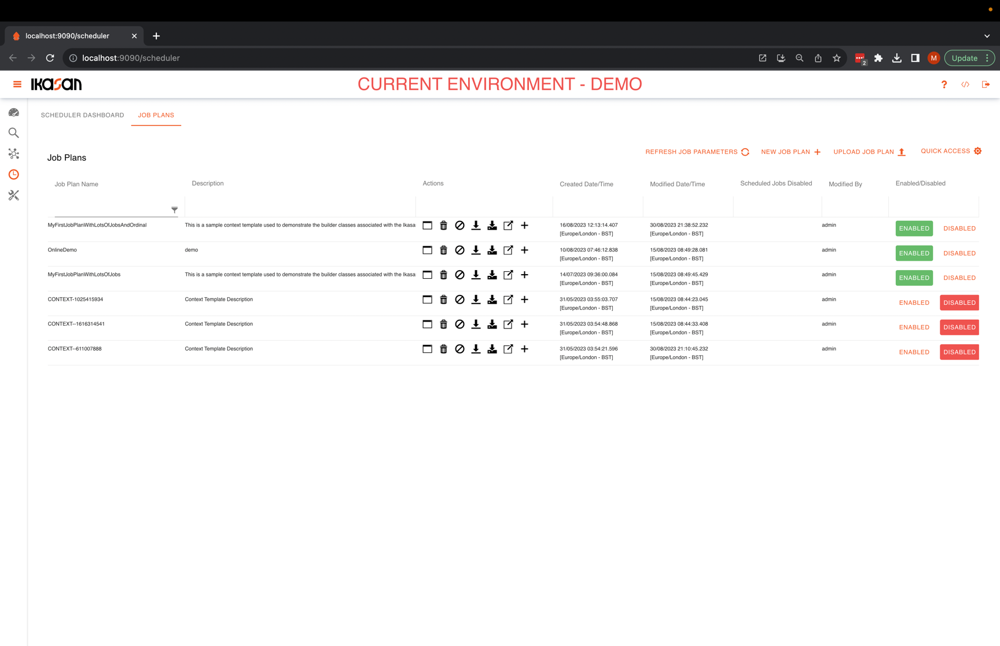
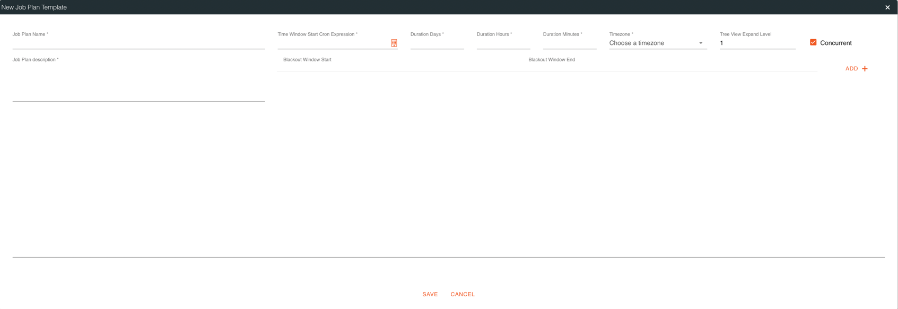
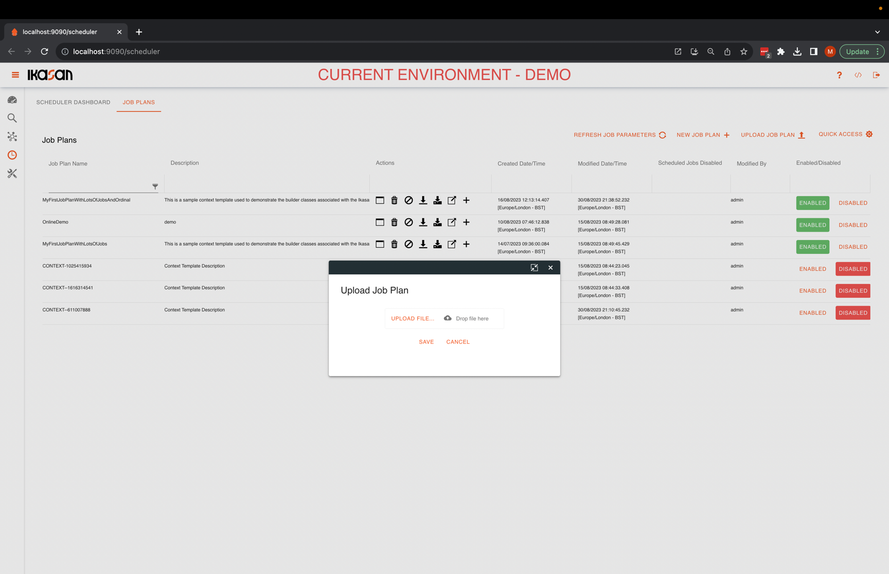

# Ikasan Enterprise Scheduler - Dashboard
The Ikasan Enterprise Scheduler Dashboard provides is a single page view that provides details of all scheduler related activity. 
It comprises the following 3 main sections.
- Scheduler Agents
- Scheduler Agent Jobs States
- Active and Future Job Plans Instances

*Ikasan Enterprise Scheduler Dashboard*

## Scheduler Agents
The Scheduler Agent section provides a list of agents that are associated with the Ikasan Enterprise Scheduler Dashboard. This list can be
filtered using the filter text box in the right top of the section.

*Ikasan Enterprise Scheduler Agents*

Double clicking any of the agents will open the agent dialog. From here the management console can be accessed by clicking on the
agent link on the dialog. It is asle possible to access the logs associated with the agent by clicking on the `Download Log File` button.

*Ikasan Enterprise Scheduler Agent Dialog*

After clicking the `Download Log File` button, a dialog containing a list of all available logs is presented. From here select the
file you wish to download.

*Ikasan Enterprise Scheduler Agent Log Files Dialog*

## Scheduler Agent Jobs States

