# Ikasan Enterprise Scheduler - Developer Guide

# Introduction

## Overview

The Ikasan Enterprise Scheduler Platform (IkasanES) provides a robust and scalable scheduling platform based on open technologies and standards.
IkasanES can be adopted as little or as much as required to meet your scheduling needs.

## About

This guide demonstrates the IkasanES features through a scheduler platform deployment and the construction of a simple job plan.

_NOTE: This is an example to demonstrate a simple developement deployemnt  - it is not intended to produce a production ready solution.

This is part of the documentation suite for the Ikasan Enterprise Scheduler Platform.

## Audience

This guide is targeted at developers wishing to get started and undertake their first development projects with the Ikasan Enterprise Scheduler Platform.

A familiarity with Java and Maven is assumed.

## How to Use This Guide

This guide provides a quick and concise series of steps for getting started with the IkasanES platform. These steps should be followed sequentially. Points to note and other hints/tips are provided as additional information or best practices, however, full details on these aspects are beyond the scope of this document.

On completion of this document the reader should have installed and configured all required software for development and have created and run an Ikasan Scheduled Job Plan.

# Pre-Requisites

[Developer Pre-Requisiites](../../developer/docs/DeveloperPreRequisites.md)

# Problem Definition
This guide will take you through the process of deploying the Ikasan Enterprise Scheduler Dashboard and an Agent in order to 
demonstrate a simple setup. It will then demonstrate the creation of a simle job plan and the deployment of it the Ikasan 
Enterprise Scheduler.

# Design

# Implementation
We will be using Maven, Java and IntelliJ for the rest of this demonstration.

## Ikasan Enterprise Scheduler Agent Dashboard and Agent Deployment

See [ikasan-scheduler-distribution-deployment-demo-maven-plugin](./developer/mvn-archetypes/ikasan-scheduler-distribution-deployment-demo/Readme.md) for 
more details.
```unix
mvn archetype:generate -DarchetypeGroupId=org.ikasan -DarchetypeArtifactId=ikasan-scheduler-distribution-deployment-demo-maven-plugin -DarchetypeVersion=3.3.0-scheduler-SNAPSHOT -DgroupId=com.test -DartifactId=dist-demo1 -Dversion=1.0.0-SNAPSHOT
```

 - Now that the archetype has created the project go the new project directory created.

```unix
cd dist-demo1/
```

 - You'll see a POM:

```unix 
ls -la
-rw-r--r--   1 mick  staff  5140  7 Jun 13:08 pom.xml
```

### Deployment location config parameters
Within the above pom file there are two configurable parameter that define the location that the Ikasan Enterprise Scheduler
Dashboard and Agent will be deployed. These can be any valid location on the file system.

```xml
<scheduler-dashboard-distribution-deploy-directory>.</scheduler-dashboard-distribution-deploy-directory>
<scheduler-agent-distribution-deploy-directory>.</scheduler-agent-distribution-deploy-directory>
```

For the purpose of this demo we'll leave at ```.``` which will deploy the distributions under the project root.

### Build the project
```unix
mvn clean install
```

Here is what is created:
```unix
ls -la
drwxr-xr-x  12 mick  staff   384  7 Jun 13:11 ikasan-dashboard-distrbution-3.3.0-scheduler-SNAPSHOT
-rw-r--r--   1 mick  staff  5140  7 Jun 13:08 pom.xml
drwxr-xr-x  17 mick  staff   544  7 Jun 13:10 scheduler-agent-3.3.0-scheduler-SNAPSHOT
```


### Start the dashboard
```unix
cd ikasan-dashboard-distrbution-3.3.0-scheduler-SNAPSHOT
./ikasan.sh start
```

Logs are written to ```./logs/application.log```. You will know that the Ikasan Enterprise Scheduler Dashboard is running when you see:
```text
2023-06-07 13:11:58.912  INFO 75397 --- [           main] org.ikasan.dashboard.Application         : Started Application in 138.477 seconds (JVM running for 140.449)
```

### Now start the agent

```unix
cd ../scheduler-agent-3.3.0-scheduler-SNAPSHOT
./ikasan-simple.sh start
```

Logs are written to ```./logs/application.log```. You'll know that the Ikasan Enterprise Scheduler Agent is running when you see:
```text
2023-06-07 13:18:08,731 INFO org.springframework.boot.StartupInfoLogger [main] Started Application in 96.876 seconds (JVM running for 99.74)
```

## Job Plan Demo
The Job Plan Demo is based on the archetype `ikasan-job-plan-builder-demo-maven-plugin`. See [ikasan-job-plan-builder-demo-maven-plugin](./developer/mvn-archetypes/ikasan-job-plan-builder-demo/Readme.md) for
more details.

### Creating Archetype Using Intellij

#### Create a Project
In IntelliJ select `File/New/Project...`

Ensure you select JDK 11 as the SDK for this new project.
Select Maven Archetype from the generators.

Add the coordinates of the job plan demo archetype. For this example we will use the Ikasan archetype
based on Ikasan version 3.3.0-scheduler-SNAPSHOT. 

If you are using a different Ikasan version ensure you specify the correct version.

For instance,
- GroupId --> `org.ikasan`
- ArtefactId --> `ikasan-job-plan-builder-demo-maven-plugin`
- Version --> `3.3.0-scheduler-SNAPSHOT`

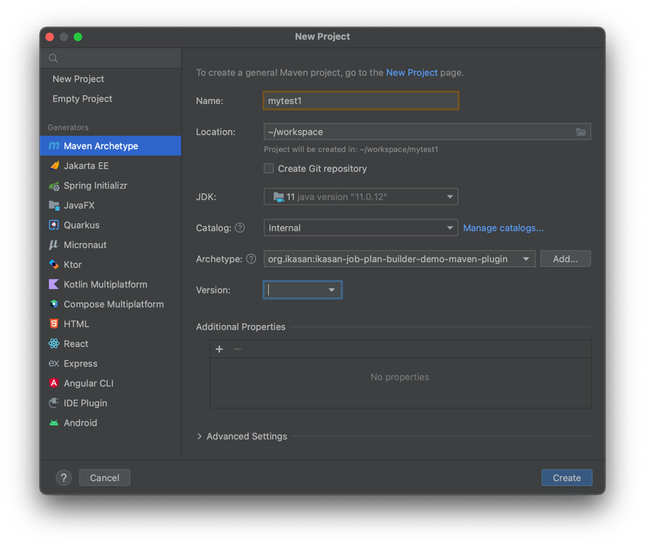

Select Create. 

You will be prompted as to how you wish to open the new project, we recommend selecting ```New Window```.

From here the Maven archetype will be created.

That's it, your project has been created.

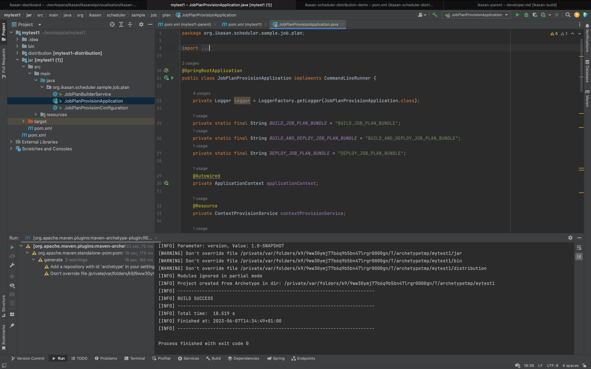

Lets run it!

#### Running the Demo

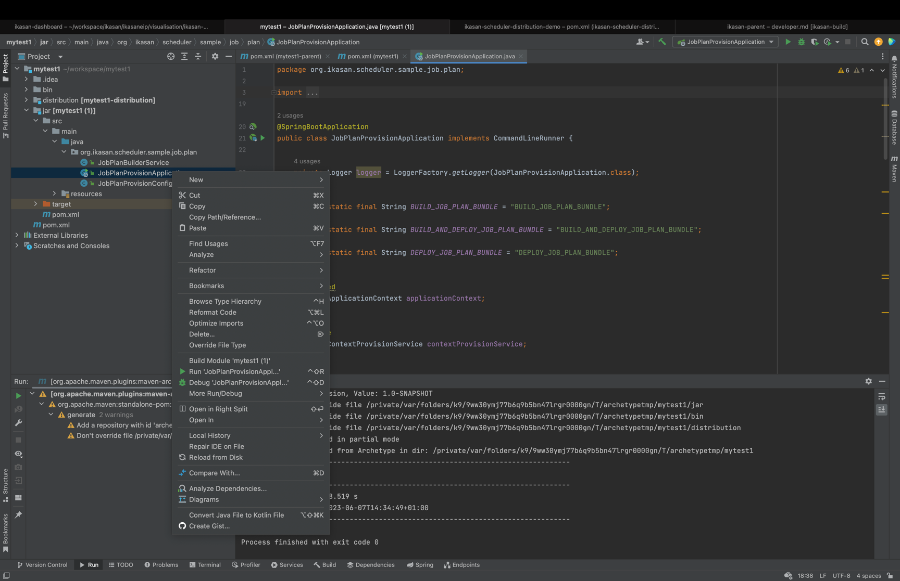

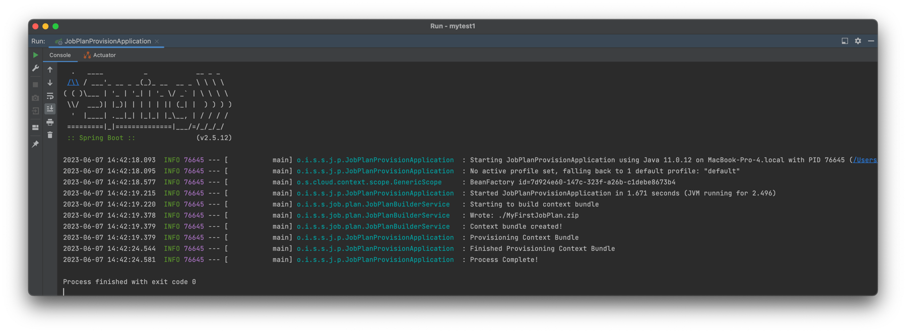

### Creating the Job Plan Demo Archetype Using Command Line
- In a chosen location on your machine, run the following maven command.
```unix
mvn archetype:generate -DarchetypeGroupId=org.ikasan -DarchetypeArtifactId=ikasan-job-plan-builder-demo-maven-plugin -DarchetypeVersion=3.3.0-scheduler-SNAPSHOT -DgroupId=org.test -DartifactId=mytest1 -Dversion=1.0.0-SNAPSHOT
```
- Build the new project created by the archetype.
```unix
cd mytest1
mvn clean package
```
- Navigate to the `distribution/target` directory.
```unix
cd distribution/target/
```
- Unzip the distribution
```unix
unzip mytest1-distribution-1.0.0-SNAPSHOT-dist.zip
Archive:  mytest1-distribution-1.0.0-SNAPSHOT-dist.zip
creating: mytest1-1.0.0-SNAPSHOT/
inflating: mytest1-1.0.0-SNAPSHOT/run.sh  
creating: mytest1-1.0.0-SNAPSHOT/config/
inflating: mytest1-1.0.0-SNAPSHOT/config/application.properties  
creating: mytest1-1.0.0-SNAPSHOT/lib/
inflating: mytest1-1.0.0-SNAPSHOT/lib/mytest1-1.0.0-SNAPSHOT.jar
```    
- Navigate to the unzipped distribution directory.
```unix
cd mytest1-1.0.0-SNAPSHOT/
```
- Run the build and deploy.
```unix
./run.sh
Usage: run.sh <action>
<action>  Specify action name,
'build-bundle | build-bundle-and-deploy | deploy-bundle'.
./run.sh build-bundle-and-deploy
```

The job plan demo logs are written to ```logs/application.logs``` as seen below.

```text
.   ____          _            __ _ _
/\\ / ___'_ __ _ _(_)_ __  __ _ \ \ \ \
( ( )\___ | '_ | '_| | '_ \/ _` | \ \ \ \
\\/  ___)| |_)| | | | | || (_| |  ) ) ) )
'  |____| .__|_| |_|_| |_\__, | / / / /
=========|_|==============|___/=/_/_/_/
:: Spring Boot ::               (v2.5.12)

2023-06-07 13:39:39.928  INFO 76004 --- [           main] o.i.s.s.j.p.JobPlanProvisionApplication  : Starting JobPlanProvisionApplication using Java 11.0.6 on MacBook-Pro-4.local with PID 76004 (/Users/mick/workspace/mytest1/distribution/target/mytest1-1.0.0-SNAPSHOT/lib/mytest1-1.0.0-SNAPSHOT.jar started by mick in /Users/mick/workspace/mytest1/distribution/target/mytest1-1.0.0-SNAPSHOT)
2023-06-07 13:39:39.937  INFO 76004 --- [           main] o.i.s.s.j.p.JobPlanProvisionApplication  : No active profile set, falling back to 1 default profile: "default"
2023-06-07 13:39:41.942  INFO 76004 --- [           main] o.s.cloud.context.scope.GenericScope     : BeanFactory id=c616079d-9428-33fc-8ec2-eba93e03d9dc
2023-06-07 13:39:43.668  INFO 76004 --- [           main] o.i.s.s.j.p.JobPlanProvisionApplication  : Started JobPlanProvisionApplication in 5.868 seconds (JVM running for 7.003)
2023-06-07 13:39:43.681  INFO 76004 --- [           main] o.i.s.s.job.plan.JobPlanBuilderService   : Starting to build context bundle
2023-06-07 13:39:43.960  INFO 76004 --- [           main] o.i.s.s.job.plan.JobPlanBuilderService   : Wrote: ./MyFirstJobPlan.zip
2023-06-07 13:39:43.961  INFO 76004 --- [           main] o.i.s.s.job.plan.JobPlanBuilderService   : Context bundle created!
2023-06-07 13:39:43.961  INFO 76004 --- [           main] o.i.s.s.j.p.JobPlanProvisionApplication  : Provisioning Context Bundle
2023-06-07 13:39:53.371  INFO 76004 --- [           main] o.i.s.s.j.p.JobPlanProvisionApplication  : Finished Provisioning Context Bundle
2023-06-07 13:39:53.503  INFO 76004 --- [           main] o.i.s.s.j.p.JobPlanProvisionApplication  : Process Complete!
```

## Accessing the New Job Plan in the Ikasan Enterprise Scheduler Dashboard

- Open `http://localhost:9090/` in your web browser. Log into the application using `admin/admin`.
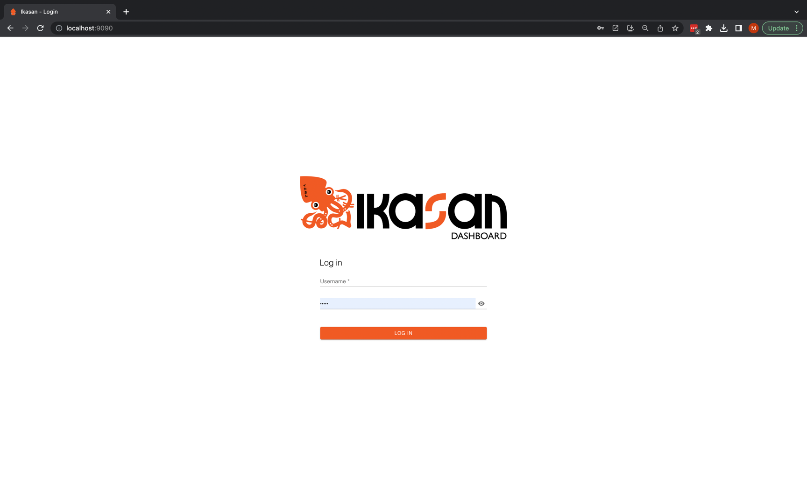
- Navigate to the scheduler dashboard. You will see a `MyFirstJobPlan` active instance.
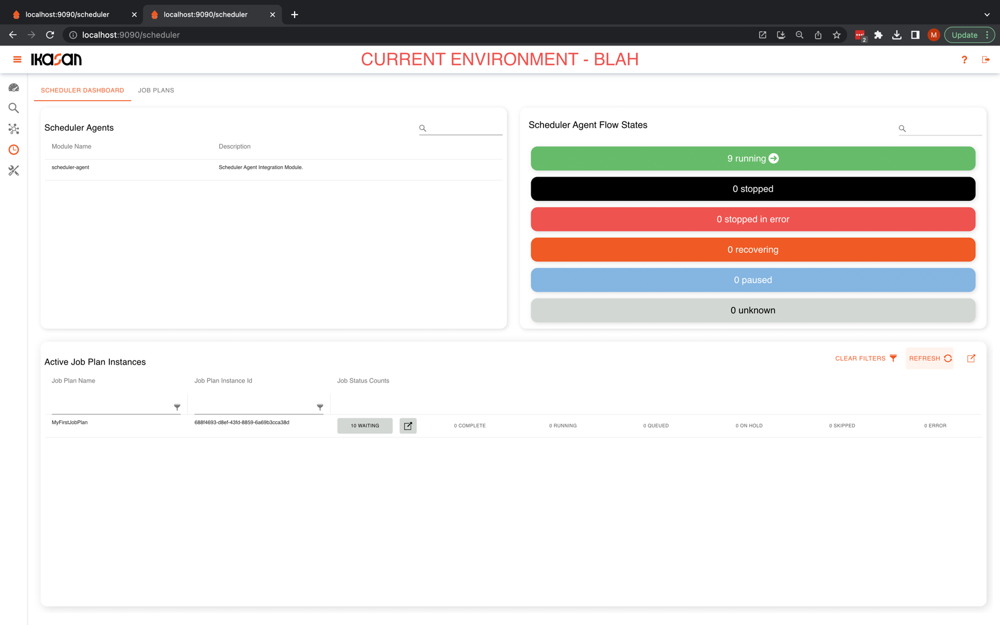
- Select the `Job Plan` tab. You will see the `MyFirstJobPlan` job plan.
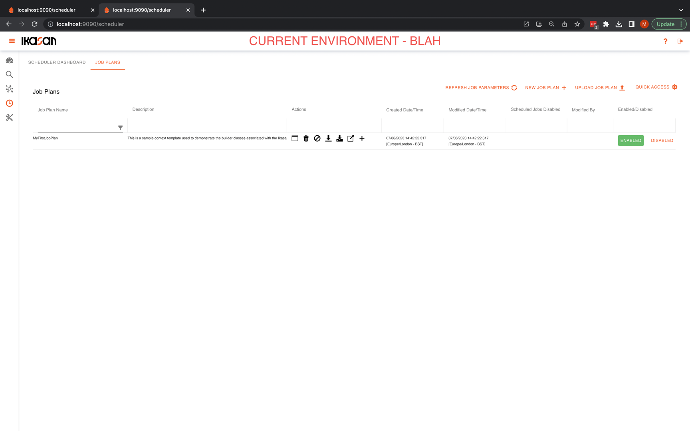
- Use the `Quick Links` button to open the `MyFirstJobPlan` active instance.
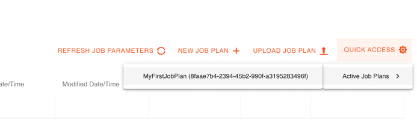
- You will be presented with the job plan instance tree view.

- Click on the paper plane icon    next to the `7amScheduledEvent` job and run the job. You will see it's state change and some other jobs begin to run.
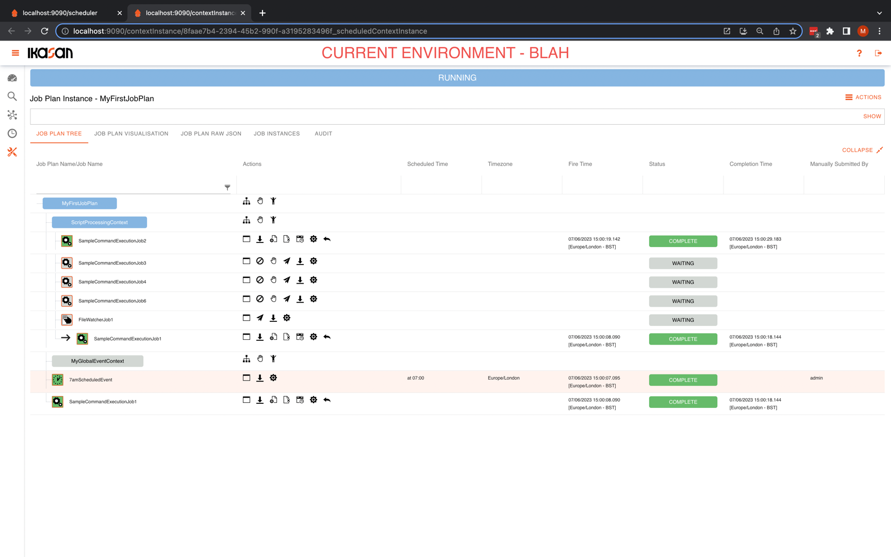
- Click on the paper plane icon    next to the `FileWatcherJob1` job and run the job. You will see it's state change and some other jobs begin to run.
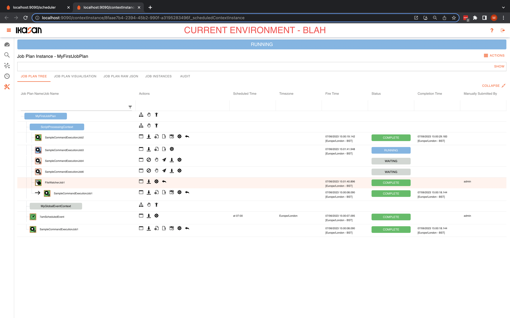
- After a short period all jobs in the plan will complete and you will see the job plan instance in a `Complete` state.
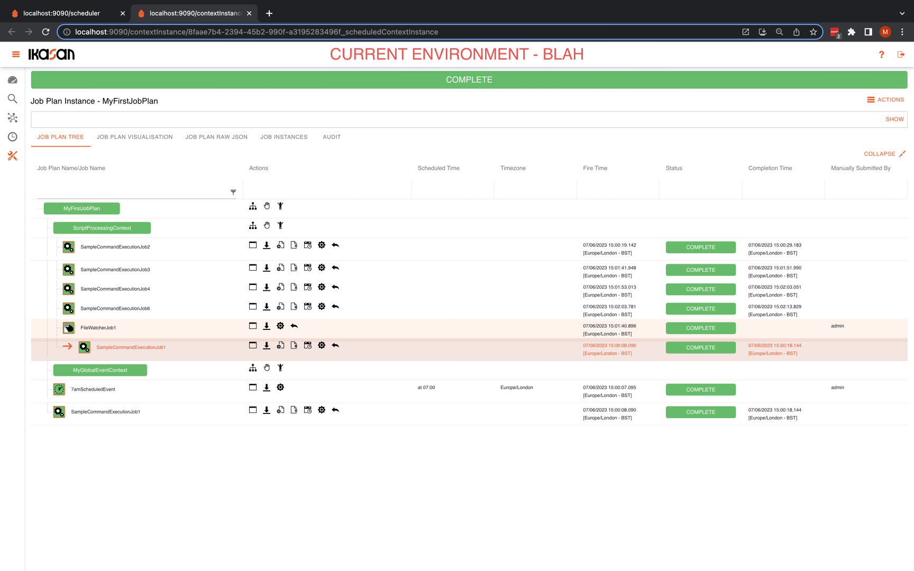


