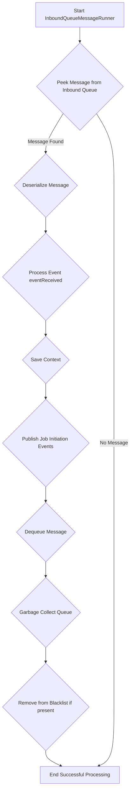
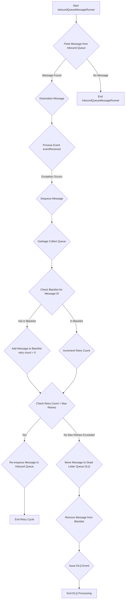

# Context Machine: Retry and Dead Letter Queue (DLQ) Mechanism

The `InboundQueueMessageRunner` class, nested within `ContextMachine.java`, is responsible for consuming messages from an inbound queue, processing them, and handling any failures through a retry mechanism and a Dead Letter Queue (DLQ).

## 1. Successful Message Processing Flow

When a message is successfully processed, it follows a straightforward path:

**Explanation:**

1.  The `InboundQueueMessageRunner` starts and continuously `peek()`s for new messages in the `inboundQueue`.
2.  If a message is found, it's deserialized into a `BigQueueMessage` and then into a `ContextualisedScheduledProcessEvent`.
3.  The `eventReceived()` method is called to process the event, which may generate `SchedulerJobInitiationEvent`s.
4.  The context state is saved.
5.  Any generated `SchedulerJobInitiationEvent`s are published.
6.  The successfully processed message is `dequeue()`d from the `inboundQueue`.
7.  The queue performs garbage collection (`gc()`).
8.  If the message was previously in the `bigQueueMessageBlacklist` (meaning it had failed before but now succeeded), it's removed.

## 2. Retry and Dead Letter Queue (DLQ) Mechanism

If an error occurs during message processing, the `InboundQueueMessageRunner` employs a retry mechanism before ultimately moving the message to a Dead Letter Queue.

**Explanation:**

1.  **Error Detection:** If an `Exception` is caught during the `eventReceived()` or subsequent processing steps, the error handling flow is triggered.
2.  **Dequeue and Blacklist Check:**
    *   The problematic message is immediately `dequeue()`d from the `inboundQueue`.
    *   The `bigQueueMessageBlacklist` is consulted to see if this message ID has failed before.
    *   If it's a new failure, the message ID is added to the `bigQueueMessageBlacklist` with a retry count of 0.
    *   If it's a recurring failure, the retry count for that message ID in the `bigQueueMessageBlacklist` is incremented.
3.  **Retry Decision:**
    *   The current retry count is compared against `blackListedMessageMaxRetries` (a configurable value, default 5). In order to change default number of retries, include `context.machine.blacklisted.message.max.retries` in the properties.
    *   **If `retry count < blackListedMessageMaxRetries`:** The message is re-enqueued to the `inboundQueue`. This allows the message to be re-processed after other messages, giving transient issues a chance to resolve.
    *   **If `retry count >= blackListedMessageMaxRetries`:** The message has exhausted its retries.
        *   It is moved to the `deadLetterQueue`.
        *   It is removed from the `bigQueueMessageBlacklist`.
        *   An event (`issueContextInstanceDlqEvent()`) is issued, likely to notify monitoring systems or other components that a message has been dead-lettered.

This mechanism ensures that transient errors do not halt the entire processing flow and provides a dedicated queue for messages that consistently fail, allowing for manual inspection and resolution.
