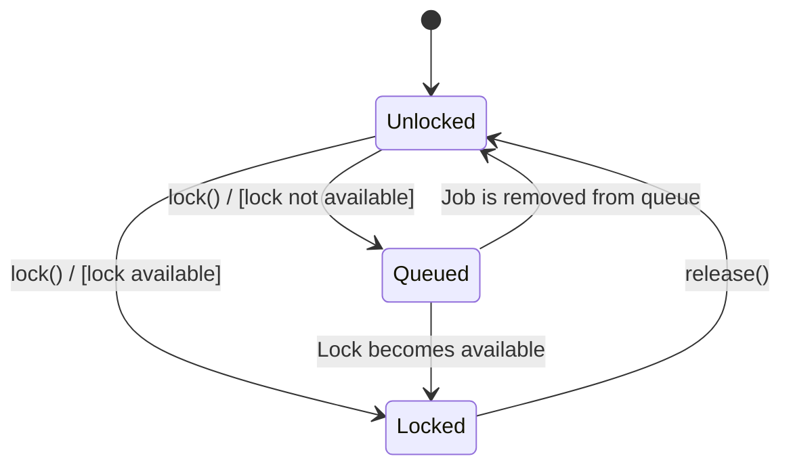
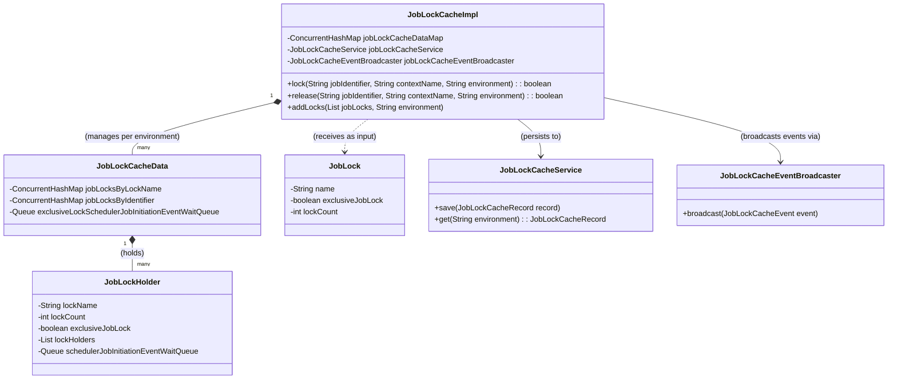

# Ikasan Enterprise Scheduler Job Lock Cache

At the core of the Ikasan Enterprise Scheduler Job Lock Cache is the `JobLockCacheImpl`, a core component of the Ikasan Enterprise Scheduler, providing a robust and distributed job locking mechanism. It ensures that jobs running in an environment do not conflict with each other, maintaining data integrity and preventing race conditions. This document provides a detailed explanation of its functionality, architecture, and usage.

## Core Concepts

### Job Lock

A `JobLock` is a configuration object that defines the properties of a lock. It is a fundamental concept for managing concurrent job executions in a distributed environment. It acts as a semaphore, controlling access to a shared resource or limiting the number of concurrent executions of a job or a group of jobs. This is essential for:

*   **Preventing Race Conditions:** Ensuring that multiple jobs do not attempt to modify the same data simultaneously.
*   **Resource Management:** Limiting the load on a shared resource (e.g., a database, a web service).
*   **Business Rule Enforcement:** Enforcing business rules that restrict the number of concurrent operations.

### Exclusive vs. Non-Exclusive Locks

The `JobLockCacheImpl` supports two distinct locking strategies, configured via the `JobLock` object:

*   **Exclusive Locks:** This is a restrictive lock where only one job can hold the lock at any given time. It is analogous to a `synchronized` block in Java. This type of lock is ideal for jobs that require exclusive access to a resource, such as a file or a database table, to perform a critical operation.

*   **Non-Exclusive Locks:** This is a more flexible lock that allows multiple jobs to hold the lock concurrently, up to a predefined limit. This is useful for scenarios where you want to limit the number of parallel executions of a job to avoid overwhelming a downstream system. For example, you might want to limit the number of concurrent jobs that call a specific API to 5.

### JobLockCacheData

The `JobLockCacheData` is the in-memory representation of the entire job lock cache for a specific environment. It holds all the state related to the locks in that environment, including:

*   A map of `JobLockHolder` objects, keyed by lock name.
*   A map that links a job identifier to a lock name.
*   The wait queue for exclusive locks.

The `JobLockCacheImpl` maintains a map of `JobLockCacheData` objects, with one for each environment.

### JobLockHolder

The `JobLockHolder` is a stateful object that represents a specific lock in the cache. It maintains all the necessary information about the lock, including:

*   `lockName`: A unique identifier for the lock.
*   `lockCount`: The maximum number of jobs that can hold the lock simultaneously (for non-exclusive locks).
*   `exclusiveJobLock`: A boolean flag indicating whether the lock is exclusive.
*   `lockHolders`: A list of identifiers for the jobs that currently hold the lock.
*   `schedulerJobInitiationEventWaitQueue`: A queue of jobs that are waiting to acquire the lock.

### Environments

In a complex enterprise environment, it is common to have multiple deployment environments, such as development, testing, and production. The `JobLockCacheImpl` supports this by partitioning locks by environment. This means that locks in one environment are completely isolated from locks in another. This allows you to have different locking configurations and rules for each environment without any interference.

## How it Works

### State Diagram

The following state diagram illustrates the lifecycle of a job in relation to the job lock.



### Component Diagram



### Initialization

The `JobLockCacheImpl` is a singleton, ensuring that there is only one instance of the cache per application. It is initialized with a set of `JobLock` configurations, typically from a configuration file. These `JobLock` objects define all the locks available in the system.

**Example Configuration:**

```java
// This is a conceptual example. The actual implementation may vary.
JobLock lock1 = new JobLock("exclusiveLock", true, 1);
JobLock lock2 = new JobLock("nonExclusiveLock", false, 5);

List<JobLock> locks = List.of(lock1, lock2);

JobLockCacheImpl.instance().addLocks(locks, "production");
```

When `addLocks` is called, the `JobLockCacheImpl` creates a `JobLockHolder` for each `JobLock` and stores it in the appropriate `JobLockCacheData` object based on the environment.

### Acquiring a Lock

When a job attempts to acquire a lock by calling the `lock()` method, the `JobLockCacheImpl` performs the following steps:

1.  **Identify the Lock:** It first identifies the `JobLockHolder` associated with the job from the `JobLockCacheData` for the given environment.
2.  **Check Lock Type:** It then checks if the lock is exclusive or non-exclusive.
3.  **Exclusive Lock:** If the lock is exclusive, it checks if any other job currently holds the lock. If not, the job acquires the lock. If the lock is already held, the job is placed in the `exclusiveLockSchedulerJobInitiationEventWaitQueue` within the `JobLockCacheData`.
4.  **Non-Exclusive Lock:** If the lock is non-exclusive, it checks if the number of jobs currently holding the lock is less than the configured `lockCount`. If it is, the job acquires the lock. Otherwise, the job is placed in the `schedulerJobInitiationEventWaitQueue` within the specific `JobLockHolder`.

If the job successfully acquires the lock, the `JobLockCacheImpl` updates the `JobLockHolder`, persists the state via the `JobLockCacheService`, and broadcasts a `LOCK_OBTAINED` event.

### Releasing a Lock

When a job finishes its execution, it must release the lock by calling the `release()` method. This is a critical step to ensure that other jobs can acquire the lock. The `release()` method performs the following actions:

1.  **Remove Lock Holder:** It removes the job from the list of lock holders in the `JobLockHolder`.
2.  **Check Wait Queue:** It then checks if there are any jobs in the wait queue for that lock (or the exclusive wait queue).
3.  **Promote Waiting Job:** If there are waiting jobs, it takes the first job from the queue and grants it the lock.
4.  **Persist and Broadcast:** Finally, it persists the new state and broadcasts a `LOCK_RELEASED` event.

### The Wait Queue

If a job cannot acquire a lock, it is not simply rejected. Instead, it is placed in a wait queue. For exclusive locks, there is a single queue in `JobLockCacheData`. For non-exclusive locks, each `JobLockHolder` has its own queue. This ensures a fair, first-in-first-out (FIFO) acquisition of locks.

### Persistence

To ensure durability and consistency across application restarts, the state of the job locks is persisted to a backend data store. This is handled by the `JobLockCacheService`. The `JobLockCacheImpl` calls the `save()` method of the `JobLockCacheService` every time there is a change in the state of a lock (e.g., a lock is acquired, released, or a job is added to the wait queue).

### Event Broadcasting

The `JobLockCacheImpl` provides a mechanism for other parts of the application to listen for lock-related events. It uses a `JobLockCacheEventBroadcaster` to send events such as:

*   `LOCK_OBTAINED`: When a job successfully acquires a lock.
*   `LOCK_RELEASED`: When a job releases a lock.
*   `JOB_ADDED_TO_JOB_LOCK_QUEUE`: When a job is added to the wait queue.
*   `JOB_REMOVED_FROM_JOB_LOCK_QUEUE`: When a job is removed from the wait queue.

These events are broadcast asynchronously, ensuring that the event broadcasting mechanism does not block the main execution thread.

## Configuration

The `JobLockCacheImpl` uses a fixed-size thread pool for its asynchronous operations, such as event broadcasting. The size of this pool is configurable to allow for tuning based on the expected load.
