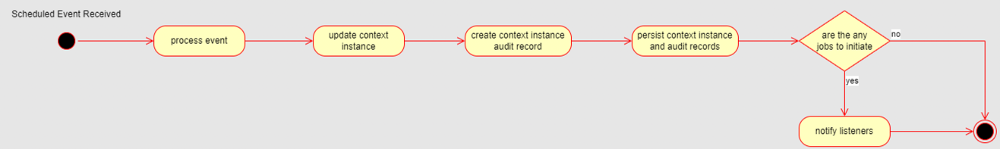
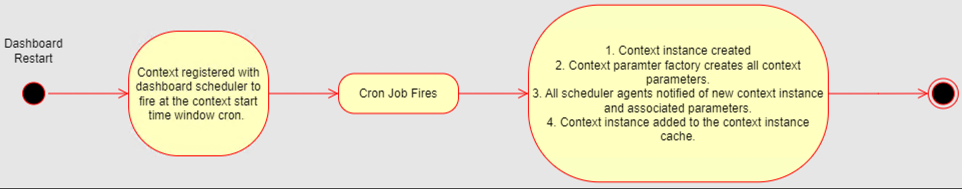
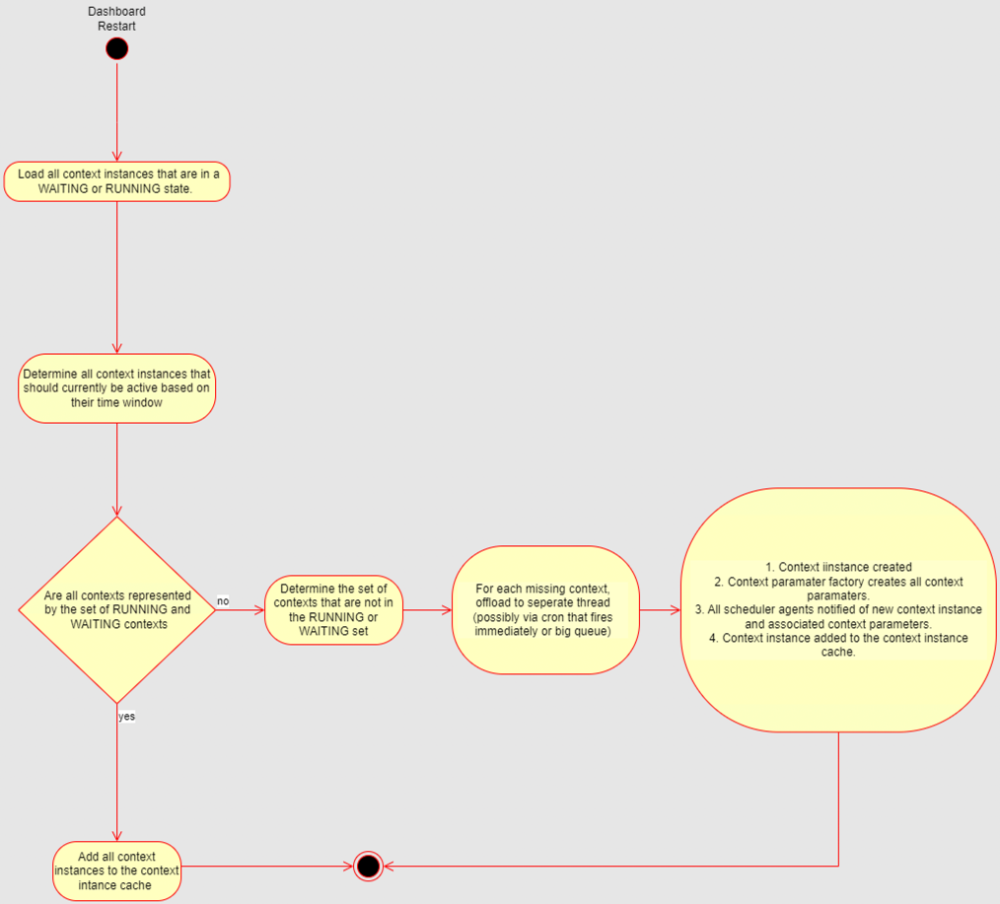
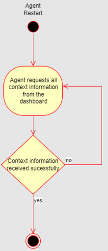

# Ikasan Enterprise Scheduler - Job Plan Lifecycle

## Introduction
This page outlines the life cycle of a job plan in the scheduler dashboard and scheduler agent.

## Core Concepts
There are a number of core concepts relating to the Ikasan Scheduler.

### Job Plan
[Job Plan Data Model](../model/job-plan-data-model.md) outlines how complex job orchestrations are organised.

For further details on the job plan data model see the Ikasan implementation - Ikasan context implementation.

### Job Plan Instance
[Job Plan Instance Data Model](../model/job-plan-instance-data-model.md) outlines what a job plan looks like when it is instantiated.

For further details on the job plan instance data model see the Ikasan implementation - Ikasan context instance implementation.

### Scheduler Jobs
[Scheduler Job Data Model](../model/scheduler-job-data-model.md) outlines the different jobs that are supported by the Ikasan Scheduler.

For further details on the scheduler job data model see the Ikasan implementation - Ikasan scheduler job implementation.

### Context Machine
The ContextMachine is at the core of the Ikasan Scheduler. There is an individual context machine created for each job plan instance. 
The context machine is responsible for managing a job plan instance. It does this by listening for scheduler events and applying logic 
against the job plan instance to determine if there are any jobs that can be initiated as a result of the event received. If there are, 
the context machine notifies any listeners of those job initiations.

As each event is received and a state change occurs against the underlying job plan instance, the job plan instance 
is updated and persisted, as well as there being an audit record created for each transition in order to provide complete transparency 
and auditability of the behaviour of the Ikasan Scheduler. 

## Why is a Job Plan Lifecycle Necessary?
Ikasan employs a distributed micro service architecture, with which comes many benefits such as a highly decoupled system, robustness, 
resiliency, scalability and reliability.

However, a distributed system is also burdened with more complexity due to:

- nodes in the architecture may need to send state to one another
- nodes may need to adhere to certain startup and shut down protocols in order make sure that data integrity is maintaned.

More specifically, the Ikasan Scheduler has some challenges relating to job plan instances and the way that details of a job plan instance
, such as parameters are shared between the dashboard and it's agents. This is even more exaggerated by the fact two of the Ikasan Scheduler 
jobs types, Quartz Driven Jobs and File Received Driven Jobs are completely decoupled from the lifecycle of the underlying job plan within 
which they are being executed. 

## Understanding the Lifecycle
The following table presents a number of use cases that must be fulfilled in order to provide a robust job plan lifecycle, along with 
solutions for each use case. 

The solution is predicated on the following:

File and time based events cannot fire until the agent has been provided with an active job plan instance.

### Dashboard restart occurs prior to job plan start time window or after end time window

### Dashboard restart occurs after context start time window, but prior to job plan end time window

In this case a context instance will already have been created and will exist in solr in either a WAITING or RUNNING state. 

### Agent restart occurs

