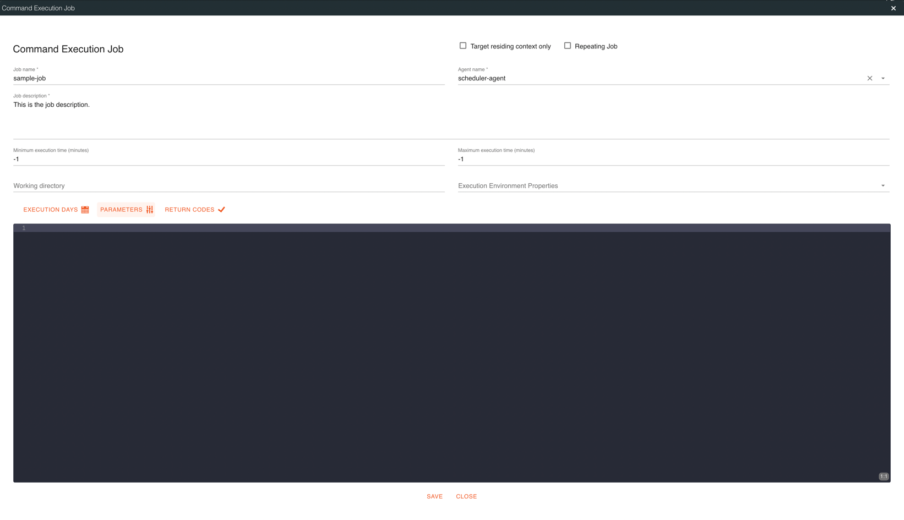
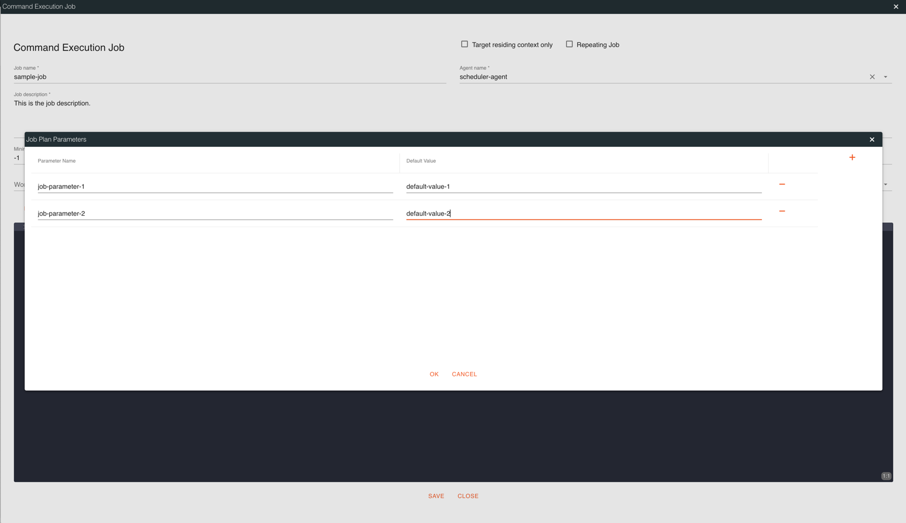
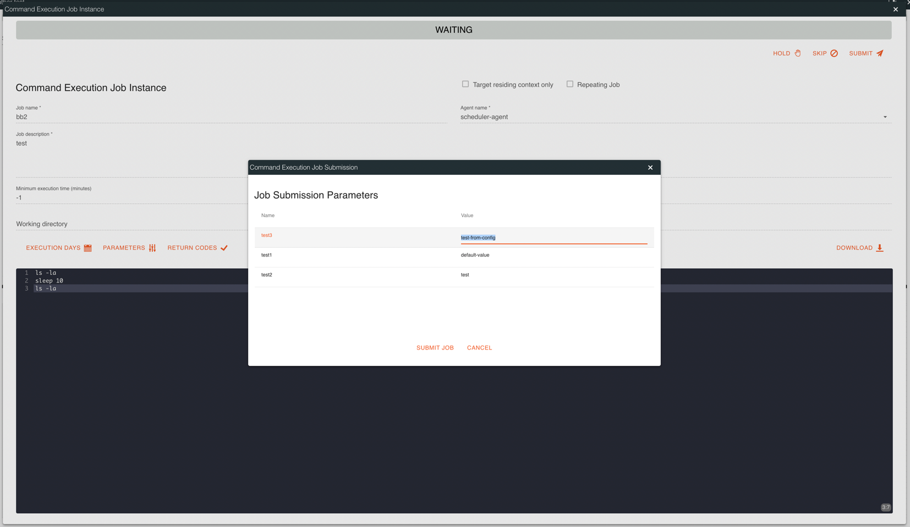
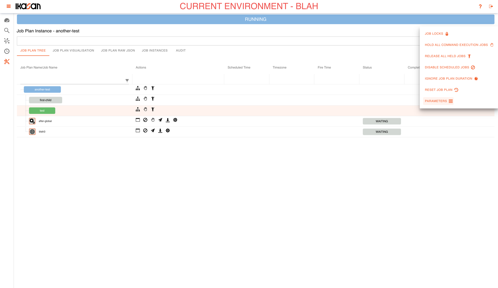
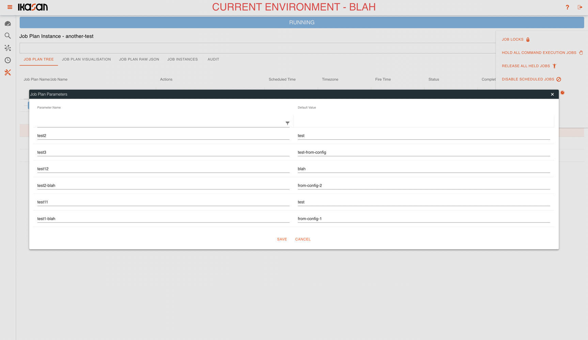

# Ikasan Enterprise Scheduler - Job Plan Parameters

## What are job plan parameters?
Job plan parameters are values that are passed to jobs when jobs are executed. For example a job might require a value such
as a business date, or a file path in order to successfully execute. 

### Defining Job PlanParameters for a Job.

#### Defining Parameters on a Job's JSON
Internal Event Driven Jobs contain an attribute contextParameters containing a list of 
[ContextParameter](../../../../spec/service/scheduled/src/main/java/org/ikasan/spec/scheduled/context/model/ContextParameter.java). 
In order to provide a job plan parameter, a name and default value must be provided.
```json
{
  "agentName": "scheduler-agent",
  "jobName": "sample-job",
  "jobDescription": "This is the job description.",
  "contextName": "sample-context",
  "childContextNames": [
    "sample-child-context"
  ],
  "startupControlType": "AUTOMATIC",
  "skippedContexts": {},
  "heldContexts": {},
  "commandLine": "ls -la\\nsleep 10\\nls -la",
  "minExecutionTime": -1,
  "maxExecutionTime": -1,
  "contextParameters": [
    {
      "name": "job-parameter-1",
      "defaultValue": "default-value-1"
    },
    {
      "name": "job-parameter-2",
      "defaultValue": "default-value-2"
    }
  ],
  "targetResidingContextOnly": false,
  "participatesInLock": false,
  "jobRepeatable": false,
  "identifier": "scheduler-agent-sample-job"
}
```
#### Defining Parameters on a Job Using the Job Builder
It is also possible to provide parameters to a job using the Ikasan Scheduler builder `org.ikasan.job.orchestration.builder.job.InternalEventDrivenJobBuilder` class.
```xml
<dependency>
    <groupId>org.ikasan</groupId>
    <artifactId>ikasan-job-orchestration-builder</artifactId>
    <version>${ikasan.version}</version>
</dependency>
```

```java
InternalEventDrivenJobBuilder internalEventDrivenJobBuilder = new InternalEventDrivenJobBuilder();
internalEventDrivenJobBuilder
    .withCommandLine("ls -la\\nsleep 10\\nls -la")
    .withMaxExecutionTime(-1L)
    .withMinExecutionTime(-1L)
    .withParticipatesInLock(false)
    .withTargetResidingContextOnly(false)
    .addContextParameter(internalEventDrivenJobBuilder.getContextParameterBuilder()
        .withName("job-parameter-1")
        .withDefaultValue("default-value-1")
        .build())
    .addContextParameter(internalEventDrivenJobBuilder.getContextParameterBuilder()
        .withName("job-parameter-2")
        .withDefaultValue("default-value-2")
        .build())
    .withContextName("sample-context")
    .withAgentName("scheduler-agent")
    .addChildContextId("sample-child-context")
    .withDescription("This is the job description.")
    .withJobName("sample-job");
```
#### Defining Parameters on a Job Using the Ikasan Dashboard
Job parameters can also be added to a job using the Ikasan Scheduler Dashboard. Click the `PARAMETERS` button on the 
Command Execution Job screen.


The job parameters and their default values can then be added.


## How are job plan parameters populated and what is their precedence?
Job parameters can be populated and provided to jobs in 4 possible ways with precedence in the following order.

1. Job plan parameter values can be provided by a user when a job is manually submitted by a user. This take precedence over job parameters from any other source.
2. Job plan parameter values can be updated on the job plan instance after the instance is created. These values will take precedence unless a user updates them when manually submitting a job. 
3. Job plan parameter value can be populated via property files that are referenced by the Ikasan Scheduler Dashboard. See the [configuration guide](../../configuration-guide.md) for more details. These parameter values will take precedence unless they are updated on the job plan instance or when a user manually submits a job.
4. Job plan parameter values can be provided with a default value. If there is a default value defined on the parameter this will be used as the value when an instance of the job plan is created. This will take precedence if there is no value provided in a dashboard property file, updated on the job plan instance or when a user manually submits a job.

### Providing job plan parameters when manually submitting a command execution job.
When the submit button is pressed from the command execution instance dialog or from any of the  icons, the user is 
presented with the command execution job submission dialog. User can provide or override the job parameters prior to submitting the job.


### Providing job plan parameters for a job plan instance.
Job plan parameters can be managed on the job plan instance. Select the "PARAMETERS" button on the "ACTIONS" popup in order to open
the job plan instance parameter dialog.


All parameters associated with the job plan instance can be managed from job plan instance management dialog.
