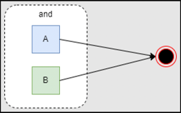
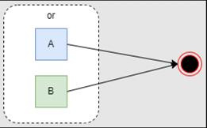
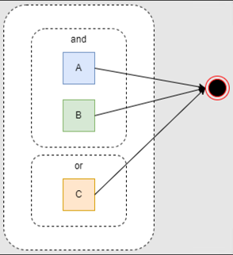
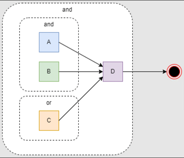
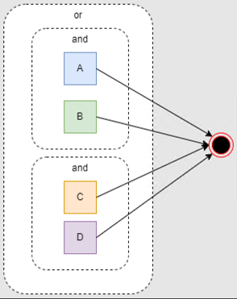
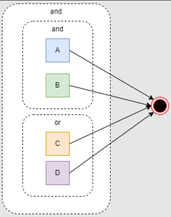
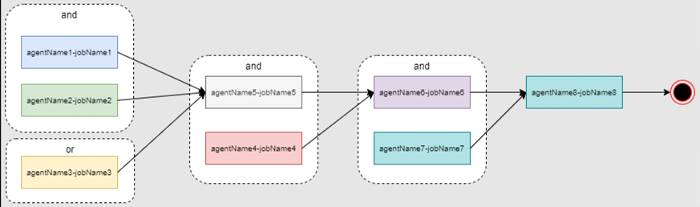
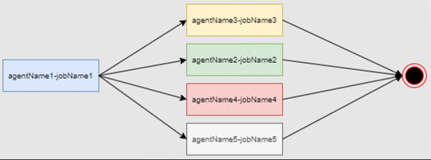
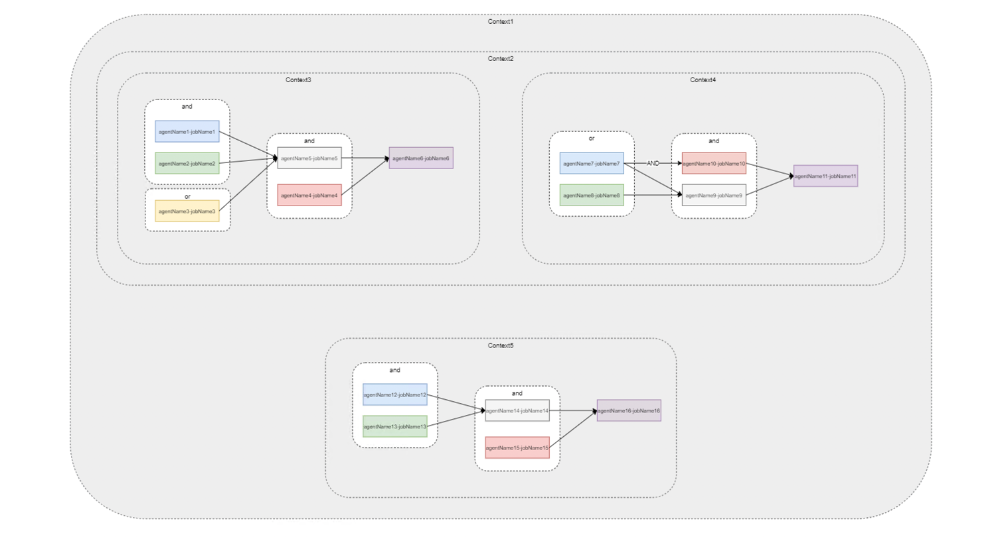

# Ikasan Enterprise Scheduler - Job Plan Data Model

## Introduction
This page describes how a job plan template data model is defined. This represents the scaffolding that defines how job plan 
instantiations will be created, as well as underpinning the scheduler designs that are created within the Ikasan Dashboard.

## Job Plan

A job plan is a JSON document that decribes how a group of jobs and nested job plans relate to one another in order provide the
orchestration of a complex set of business processes. A job plan is module as [ContextTemplate](../../../../spec/service/scheduled/src/main/java/org/ikasan/spec/scheduled/context/model/ContextTemplate.java)
object with parent [Context](../../../../spec/service/scheduled/src/main/java/org/ikasan/spec/scheduled/context/model/Context.java) whose attributes are as follows.

| Field                         | Type            | Description                                                                                           |
|-------------------------------|-----------------|-------------------------------------------------------------------------------------------------------|
| name                          | String          | The job plan name.	                                                                                   |
| description                   | String          | The job plan description.                                                                             |
| timeWindowStart               | String          | A Quartz cron expression used to define the time that a new instance of the job plan will be created. |
| contextTtlMilliseconds        | long            | The length of time that the job plan instance will be active for.                                     |
| timezone                      |                 | The timezone that the job plan operated within.                                                       |
| blackoutWindowCronExpressions | List<String>    | A list of cron expressions that define blackout windows within which the job plan will not run.       |
| blackoutWindowDateTimeRanges  | Map<Long, Long> | A list of ranges in milliseconds since epoch within which the job plan will not run.                  |
| environmentGroup                              | String          | A label to indicate which environment group the job plan is part of.                                  |
| isQuartzScheduleDrivenJobsDisabledForContext                              | boolean         | Flag to indicate if all quartz jobs are to be disabled when instances of the job plan are created.    |
| treeViewExpandLevel                              | int             | Defines the job plan instance tree view is expanded by default.                                       |
| disabled                      | boolean         | Flag to indicate if the job plan is disabled.                                                         |
| ableToRunConcurrently                              | boolean         | Boolean flag to indicate if the job should run concurrently.                                          |


## Context Parameters
The context parameters represents the template that describes any values that are passed to a scheduler context instantiation. 

Array of [ContextParameter](../../../../spec/service/scheduled/src/main/java/org/ikasan/spec/scheduled/context/model/ContextParameter.java)

| Field        | Type   | Description          |
|--------------|--------|----------------------|
| name         | String | The parameter name.	 |
| defaultValue | String | The default value.   |

### Example
```json
"contextParameters": [
  {
    "name": "name1",
    "defaultValue": "defaultValue1"
  },
  {
    "name": "name2",
    "defaultValue": "defaultValue2"
  },
  {
    "name": "name3",
    "defaultValue": "defaultValue3"
  }
]
```
	
## Scheduled Jobs
The scheduledJobs element represents an array of scheduledJob definitions. As scheduled job is defined as seen below.

Array of [SchedulerJob](../../../../spec/service/scheduled/src/main/java/org/ikasan/spec/scheduled/job/model/SchedulerJob.java)

|Field     |Type     |Description     |
|-----|-----|-----|
| identifier    |String     |The unique identifier for the job within the job schedule.     |
|agentName     | String    |The name of the agent that will be managing the scheduled job.     |
|jobName     |String     | The name of the scheduled job running on the agent.    |

### Example
```json
"scheduledJobs": [
  {
    "identifier": "agentName1-jobName1",
    "agentName": "agentName1",
    "jobName": "jobName1"
  },
  {
    "identifier": "agentName2-jobName2",
    "agentName": "agentName2",
    "jobName": "jobName2"
  },
  {
    "identifier": "agentName3-jobName3",
    "agentName": "agentName3",
    "jobName": "jobName3"
  },
  {
    "identifier": "agentName4-jobName4",
    "agentName": "agentName4",
    "jobName": "jobName4"
  },
  {
    "identifier": "agentName5-jobName5",
    "agentName": "agentName5",
    "jobName": "jobName5"
  },
  {
    "identifier": "agentName6-jobName6",
    "agentName": "agentName6",
    "jobName": "jobName6"
  }
]
```

## logicalGrouping
A logicalGrouping allows us to model the types of logical relationships that exists between scheduled jobs who are 
dependant upon one another.

[LogicalGrouping](../../../../spec/service/scheduled/src/main/java/org/ikasan/spec/scheduled/context/model/LogicalGrouping.java)

| Field                                                                                                    |Type     | Description                                                                                                                                                                                                                                                                                                                                                                                                                                                                                                                                                                                                                                                                                                                                                                                   |
|----------------------------------------------------------------------------------------------------------|-----|-----------------------------------------------------------------------------------------------------------------------------------------------------------------------------------------------------------------------------------------------------------------------------------------------------------------------------------------------------------------------------------------------------------------------------------------------------------------------------------------------------------------------------------------------------------------------------------------------------------------------------------------------------------------------------------------------------------------------------------------------------------------------------------------------|
| [and](../../../../spec/service/scheduled/src/main/java/org/ikasan/spec/scheduled/context/model/And.java) |array(Object)     | The and represents an array of jobs that must have all executed sucessfully in order for true to be returned. For example and[job1, job2, job3] represents a construct by which job1, job2 and job3 would be required to have executed sucessfully to return true, thus indicating that any dependent job on the logical statement could progress.<br /><br />The and array can be of 3 different types in order to support complex logic:<br /><ul><li>An and array representing a group of logical objects that must all equate to true in order to return true.</li><li>An or array representing a group of logical objects in which one must equate to true in order to return true.</li><li>A logicalGrouping allowing for more complex nesting of logical constructs.</li></ul>         |
| [or](../../../../spec/service/scheduled/src/main/java/org/ikasan/spec/scheduled/context/model/Or.java)   |array(Object)     | The or represents an array of jobs in which one must have executed sucessfully in order for true to be returned. For example or[job1, job2, job3] represents a construct by which either job1, job2 and job3 would be required to have executed sucessfully to return true, thus indicating that any dependent job on the logical statement could progress.<br /><br />The or array can be of 3 different types in order to support complex logic:<br /><ul><li>An and array representing a group of logical objects that must all equate to true in order to return true.</li><li>An or array representing a group of logical objects in which one must equate to true in order to return true.</li><li>A logicalGrouping allowing for more complex nesting of logical constructs.</li></ul> |
| [logicalGrouping](../../../../spec/service/scheduled/src/main/java/org/ikasan/spec/scheduled/context/model/LogicalGrouping.java)                                                                                        |logicalGrouping    | See [LogicalGrouping](../../../../spec/service/scheduled/src/main/java/org/ikasan/spec/scheduled/context/model/LogicalGrouping.java)                                                                                                                                                                                                                                                                                                                                                                                                                                                                                                                                                                                                                                                                                                                                                                                          |

It is possible for a logicalGrouping to be nested allowing for complex logical constructs to be defined. Some examples are:

### Examples
#### (a and b)	

```json
"logicalGrouping": {
  "and": [
    "a",
    "b"
  ]
}
```

#### (a or b)

```json
"logicalGrouping": {
  "or": [
    "a",
    "b"
  ]
}
```

#### ((a and b) or c)	

```json
"logicalGrouping": {
  "and": [
    "a",
    "b"
  ],
  "or": [
    "c"
  ]
}
```

#### (((a and b) or c) and d)

```json
"logicalGrouping": {
  "logicalGrouping": {
    "and": [
      "a",
      "b"
    ],
    "or": [
      "c"
    ]
  },
  "and": [
    "d"
  ]
}
```

#### (a and b) or (c and d)	

```json
"logicalGrouping": {
    "or":[
        {
            "and": [
                "a",
                "b"
            ]
        }
        ,
        {
            "and": [
                "c",
                "d"
            ]
        }
    ]
}
```

#### (a and b) and (c or d)

```json
"logicalGrouping": {
    "and":[
        {
            "and": [
                "a",
                "b"
            ]
        }
        ,
        {
            "or": [
                "c",
                "d"
            ]
        }
    ]
}
```

## jobDependency
The jobDependency element defines the logical rules required to be fulfilled prior to the job being executed. If there 
is no logicalGrouping element found, the job has no dependencies and can fire as scheduled.

[JobDependency](../../../../spec/service/scheduled/src/main/java/org/ikasan/spec/scheduled/context/model/JobDependency.java)

| Field            | Type   | Description                                                                                        |
|------------------|--------|----------------------------------------------------------------------------------------------------|
| jobIdentifier    | String | The jobIdentifier field contains the job identifier of the job that the dependency is defined for. |
| logicalGrouping  | [LogicalGrouping](../../../../spec/service/scheduled/src/main/java/org/ikasan/spec/scheduled/context/model/LogicalGrouping.java)       | The logicalGrouping field contains logical structure that must equate to true in order for the dependant job to execute. |


## jobDependencies
The jobDependencies array provides the opportunity to logically group a number of jobs and their dependencies that may 
support an individual business function or logically bound set of scheduled jobs, within a given context. 

| Field            | Type                                                                                                                                | Description                                                                                        |
|------------------|-------------------------------------------------------------------------------------------------------------------------------------|----------------------------------------------------------------------------------------------------|
| jobDependencies    | array([JobDependency](../../../../spec/service/scheduled/src/main/java/org/ikasan/spec/scheduled/context/model/JobDependency.java)) | The contains a list of jobDependency objects, each of which define the logical relationships between jobs. |

### Examples

```json
"jobDependencies": [
  {
    "jobDependency": {
      "job": "agentName1-jobName1"
    },
    "jobDependency": {
      "job": "agentName2-jobName2"
    },
    "jobDependency": {
      "job": "agentName3-jobName3"
    },
    "jobDependency": {
      "job": "agentName4-jobName4"
    },
    "jobDependency": {
      "job": "agentName5-jobName5",
      "logicalGrouping": {
        "logicalGrouping": {
          "and": [
            "agentName1-jobName1",
            "agentName2-jobName2"
          ],
          "or": [
            "agentName3-jobName3"
          ]
        },
      }
    },
    "jobDependency": {
      "job": "agentName6-jobName6",
      "logicalGrouping": {
        "and": [
          "agentName5-jobName5",
          "agentName4-jobName4"
        ]
      }
    },
    "jobDependency": {
      "job": "agentName7-jobName7"
    },
    "jobDependency": {
      "job": "agentName8-jobName8",
      "logicalGrouping": {
        "and": [
          "agentName6-jobName6",
          "agentName7-jobName7"
        ]
      }
    }
  }
]
```


```json
{
  "jobDependencies": [
    {
      "jobDependency": {
        "job": "agentName1-jobName1"
      },
      "jobDependency": {
        "job": "agentName2-jobName2",
        "logicalGrouping": {
          "and": [
            "agentName1-jobName1"
          ]
        }
      },
      "jobDependency": {
        "job": "agentName3-jobName3",
        "logicalGrouping": {
          "and":
            "agentName1-jobName1"
          ]
        }
      },
      "jobDependency": {
        "job": "agentName4-jobName4",
        "logicalGrouping": {
          "and": [
            "agentName1-jobName1"
          ]
        }
      },
      "jobDependency": {
        "job": "agentName5-jobName5",
        "logicalGrouping": {
          "and": [
            "agentName1-jobName1"
          ]
        }
      }
    }
  ]
}
```

## contexts
The contexts array allows for the nesting of scheduler contexts.
array([ContextTemplate](../../../../spec/service/scheduled/src/main/java/org/ikasan/spec/scheduled/context/model/ContextTemplate.java))

## Putting It All Together
The example below provides a series of full job schedules along with associated visual representation of the jobs.


```json
{
  "name": "Context1",
  "description": "Context Template Description",
  "timeWindowStart" : "0 0 1 ? * * *",
  "contextTtlMilliseconds" : 86400000,
  "contextParameters": [
    {
      "name": "name",
      "type": "type"
    },
    {
      "name": "name",
      "type": "type"
    },
    {
      "name": "name",
      "type": "type"
    }
  ],
  "scheduledJobs": [
  ],
  "jobDependencies": [
  ],
  "contexts": [
    {
      "name": "Context2",
      "contextParameters": [
        {
          "name": "name",
          "type": "type"
        },
        {
          "name": "name",
          "type": "type"
        },
        {
          "name": "name",
          "type": "type"
        }
      ],
      "scheduledJobs": [
      ],
      "jobDependencies": [
      ],
      "contexts": [
        {
          "name": "Context3",
          "contextParameters": [
            {
              "name": "name",
              "type": "type"
            },
            {
              "name": "name",
              "type": "type"
            },
            {
              "name": "name",
              "type": "type"
            }
          ],
          "scheduledJobs": [
            {
              "identifier": "agentName1-jobName1",
              "agentName": "agentName1",
              "jobName": "jobName1"
            },
            {
              "identifier": "agentName2-jobName2",
              "agentName": "agentName2",
              "jobName": "jobName2"
            },
            {
              "identifier": "agentName3-jobName3",
              "agentName": "agentName3",
              "jobName": "jobName3"
            },
            {
              "identifier": "agentName4-jobName4",
              "agentName": "agentName4",
              "jobName": "jobName4"
            },
            {
              "identifier": "agentName5-jobName5",
              "agentName": "agentName5",
              "jobName": "jobName5"
            },
            {
              "identifier": "agentName6-jobName6",
              "agentName": "agentName6",
              "jobName": "jobName6"
            }
          ],
          "jobDependencies": [
            {
              "jobDependency": {
                "job": "agentName1-jobName1"
              },
              "jobDependency": {
                "job": "agentName2-jobName2"
              },
              "jobDependency": {
                "job": "agentName3-jobName3"
              },
              "jobDependency": {
                "job": "agentName4-jobName4"
              },
              "jobDependency": {
                "job": "agentName5-jobName5",
                "logicalGrouping": {
                  "logicalGrouping": {
                    "and": [
                      "agentName1-jobName1",
                      "agentName2-jobName2"
                    ],
                    "or": [
                      "agentName3-jobName3"
                    ]
                  }
                }
              },
              "jobDependency": {
                "job": "agentName6-jobName6",
                "logicalGrouping": {
                  "and": [
                    "agentName5-jobName4",
                    "agentName5-jobName5"
                  ]
                }
              }
            }
          ],
          "contexts": [
          ]
        },
        {
          "name": "Context4",
          "contextParameters": [
            {
              "name": "name",
              "type": "type"
            },
            {
              "name": "name",
              "type": "type"
            },
            {
              "name": "name",
              "type": "type"
            }
          ],
          "scheduledJobs": [
            {
              "identifier": "agentName7-jobName7",
              "agentName": "agentName7",
              "jobName": "jobName7"
            },
            {
              "identifier": "agentName8-jobName8",
              "agentName": "agentName8",
              "jobName": "jobName8"
            },
            {
              "identifier": "agentName9-jobName9",
              "agentName": "agentName9",
              "jobName": "jobName9"
            },
            {
              "identifier": "agentName10-jobName10",
              "agentName": "agentName10",
              "jobName": "jobName10"
            },
            {
              "identifier": "agentName11-jobName11",
              "agentName": "agentName11",
              "jobName": "jobName11"
            }
          ],
          "jobDependencies": [
            {
              "jobDependency": {
                "job": "agentName7-jobName7"
              },
              "jobDependency": {
                "job": "agentName8-jobName8"
              },
              "jobDependency": {
                "job": "agentName9-jobName9",
                "logicalGrouping": {
                  "or": [
                    "agentName8-jobName8",
                    "agentName7-jobName7"
                  ]
                }
              },
              "jobDependency": {
                "job": "agentName10-jobName10",
                "logicalGrouping": {
                  "and": [
                    "agentName7-jobName7"
                  ]
                }
              },
              "jobDependency": {
                "job": "agentName11-jobName11",
                "logicalGrouping": {
                  "and": [
                    "agentName9-jobName9",
                    "agentName10-jobName10"
                  ]
                }
              }
            }
          ],
          "contexts": [
          ],
          "contextDependencies": [
          ]
        }
      ]
    },
    {
      "name": "Context5",
      "contextParameters": [
        {
          "name": "name",
          "type": "type"
        },
        {
          "name": "name",
          "type": "type"
        },
        {
          "name": "name",
          "type": "type"
        }
      ],
      "scheduledJobs": [
        {
          "identifier": "agentName12-jobName12",
          "agentName": "agentName12",
          "jobName": "jobName12"
        },
        {
          "identifier": "agentName13-jobName13",
          "agentName": "agentName13",
          "jobName": "jobName13"
        },
        {
          "identifier": "agentName14-jobName14",
          "agentName": "agentName14",
          "jobName": "jobName14"
        },
        {
          "identifier": "agentName15-jobName15",
          "agentName": "agentName15",
          "jobName": "jobName15"
        },
        {
          "identifier": "agentName16-jobName16",
          "agentName": "agentName16",
          "jobName": "jobName16"
        }
      ],
      "jobDependencies": [
        {
          "jobDependency": {
            "job": "agentName12-jobName12"
          },
          "jobDependency": {
            "job": "agentName13-jobName13"
          },
          "jobDependency": {
            "job": "agentName14-jobName14",
            "logicalGrouping": {
              "and": [
                "agentName12-jobName12",
                "agentName13-jobName13"
              ]
            }
          },
          "jobDependency": {
            "job": "agentName15-jobName15"
          },
          "jobDependency": {
            "job": "agentName16-jobName16",
            "logicalGrouping": {
              "and": [
                "agentName14-jobName14",
                "agentName15-jobName15"
              ]
            }
          }
        }
      ],
      "contexts": [
      ],
    }
  ]
}
```


