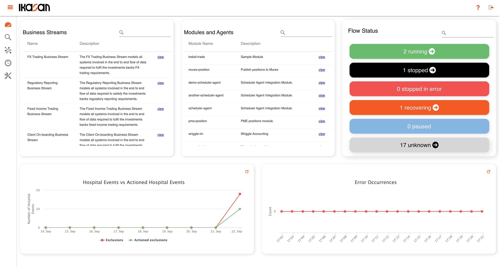
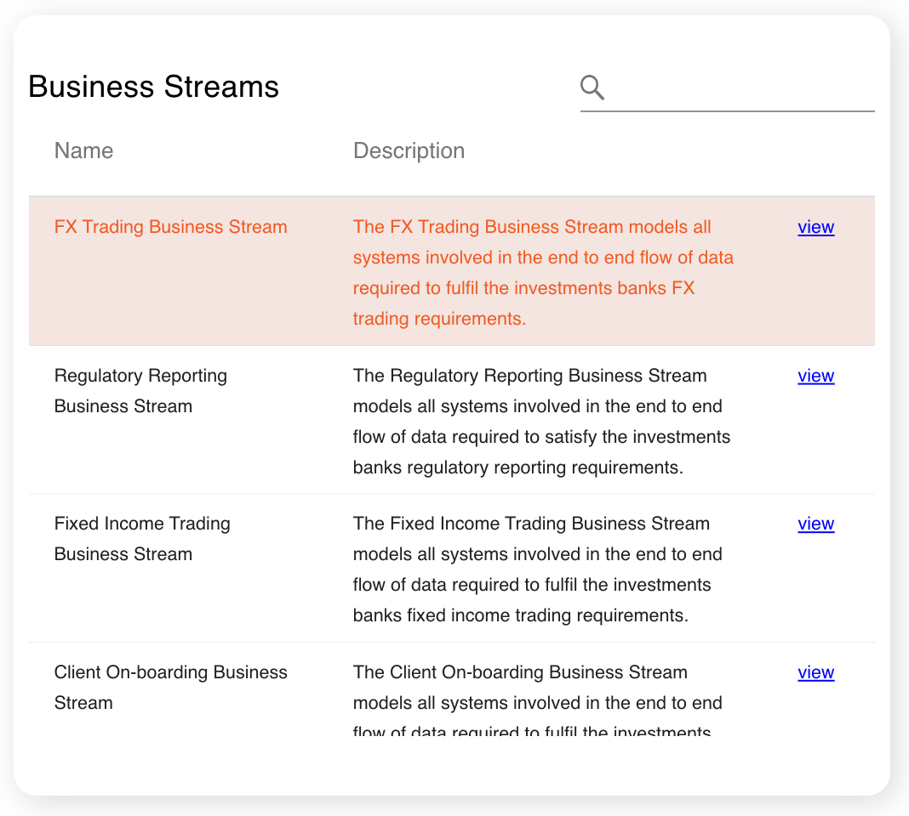
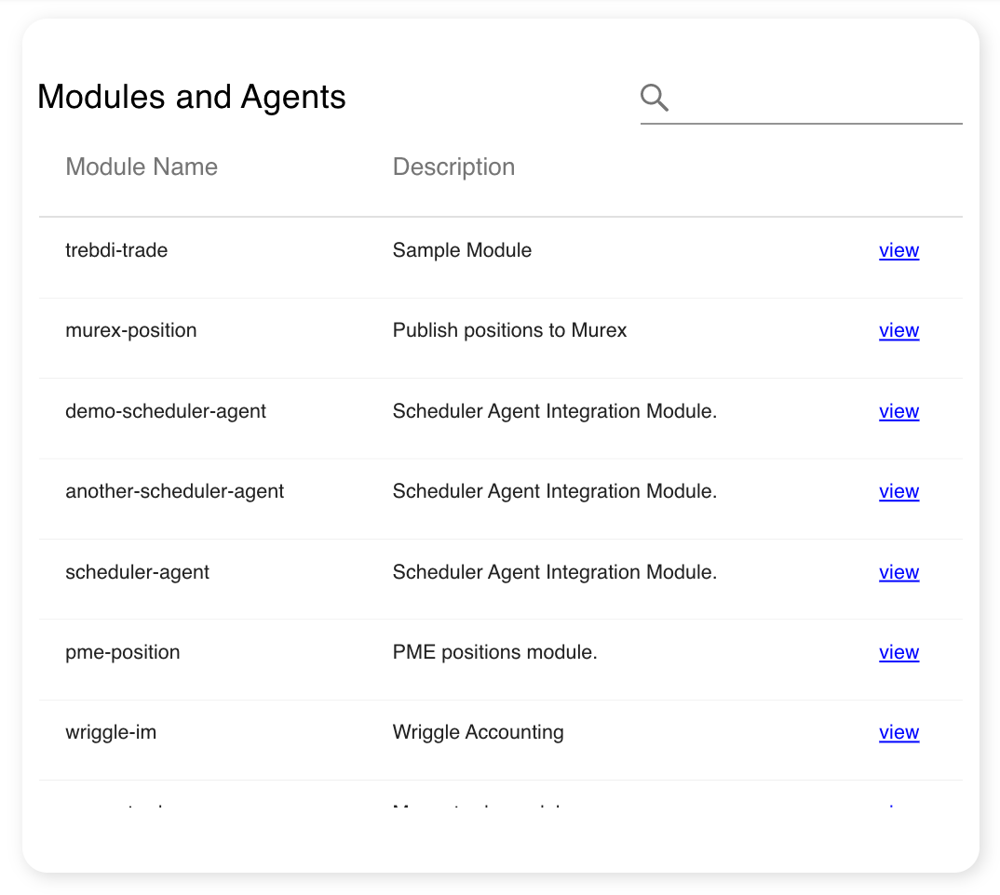
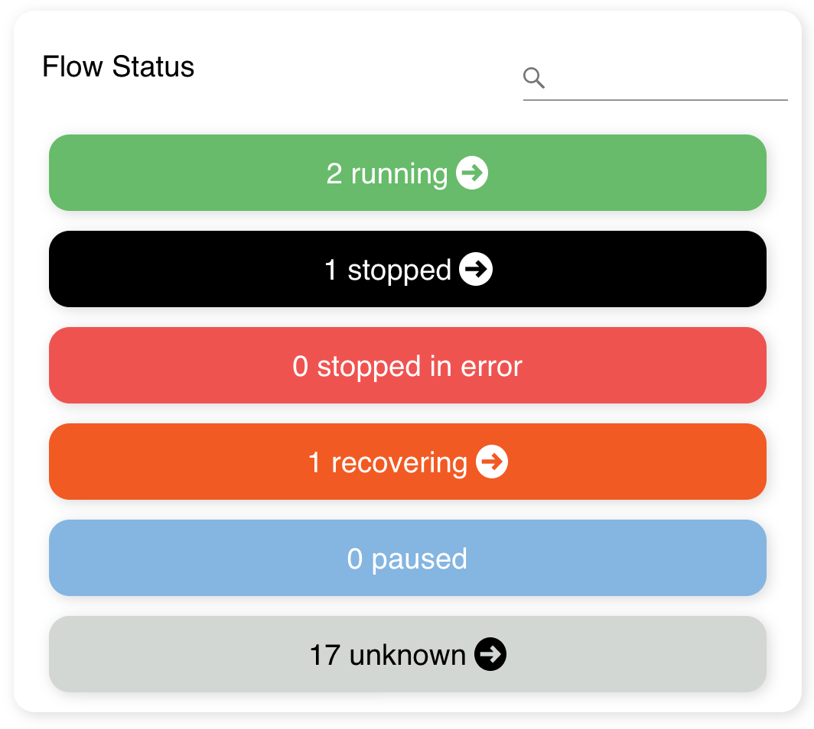
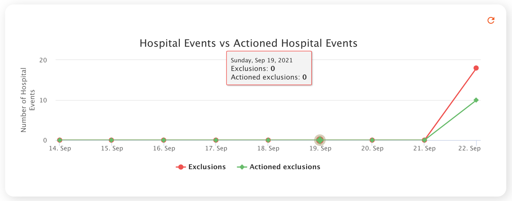
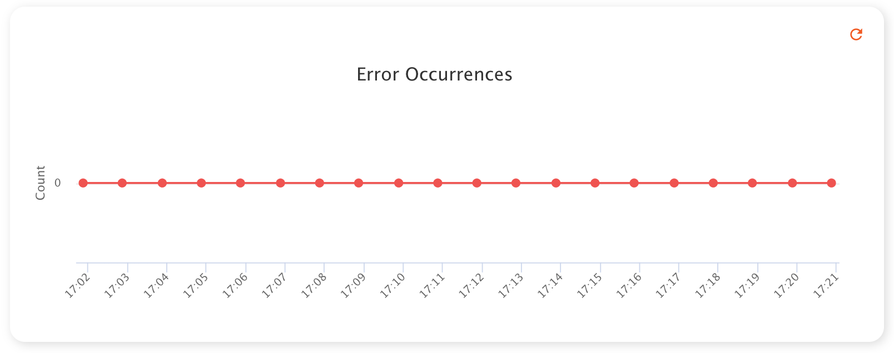

# Ikasan Visualisation Dashboard
The dashboard is the the initial screen that a user is directed to upon logging into the Ikasan Dashboard. The dashboard provides a view onto the 
runtime state on all flows within the Ikasan estate. It also provides visibility of errors and hospital events that have occurred as well as details of
all business streams, modules and agents and the ability to open visualisations of each.

### Business Stream Widget
The business stream widget contains a filterable and sortable grid containing all business streams available to a user. Click the view link to open up the [business stream visualisation](../dashboard/visualisation-screens.md) screen.

### Modules and Agents Widget
The moduls and agents widget contains a filterable and sortable grid containing all modules and agents available to a user. Click the view link to open up the [module visualisation](../dashboard/visualisation-screens.md) screen.

### Flow Status Widget
The flow status widget provides and aggregated view of all flows running with the estate. Each state can be drilled into for a more granular view of each of the flows in a given state.

### Hospital Events Widget
Ikasan manages events that cannot be processed using the [Ikasan Hosptial Service](../../hospital/Readme.md). The hospital events widget plots the number of events that have been excluded and along with details of the number that have been actioned.

### Error Occurrences Widget
Ikasan reports all errors that occur accross the estate. The error occurrece widget plots a rolling view of errors that have occurred.

